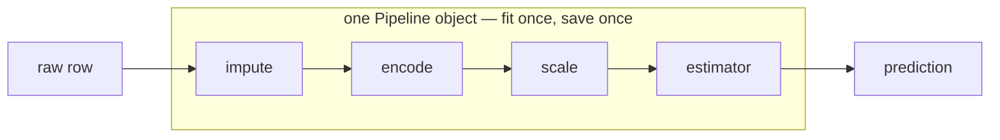

# Lesson 11 — Pipelines and Tuning

**Goal:** package the whole model as one object, then search for its best
settings without lying to yourself.

## What you will learn

- Why a pipeline is the unit of work
- `ColumnTransformer` on a mixed table
- Grid search and random search
- Tuning honestly, and when to stop

---

## The pipeline is the model

A trained estimator is not the model. The imputer, the encoder, the scaler and
the estimator together are the model — because prediction needs every one of
them, in the same order, with the same fitted values.



Three things this buys you:

1. **No leakage.** In cross-validation every step is refitted on the training
   fold only.
2. **One object to save.** `joblib.dump(pipeline, ...)` and deployment is done.
3. **Tunable end to end.** You can grid-search the imputer's strategy and the
   model's depth in the same search.

---

## A mixed table

```python
import pandas as pd
import numpy as np
from sklearn.compose import ColumnTransformer
from sklearn.pipeline import Pipeline
from sklearn.impute import SimpleImputer
from sklearn.preprocessing import StandardScaler, OneHotEncoder, OrdinalEncoder
from sklearn.ensemble import HistGradientBoostingClassifier
from sklearn.model_selection import train_test_split, cross_val_score
from sklearn.metrics import f1_score

rng = np.random.default_rng(0)
n = 800
df = pd.DataFrame({
    "age":      rng.integers(18, 70, n).astype(float),
    "spend":    rng.gamma(3, 60, n),
    "city":     rng.choice(["Cairo", "Giza", "Alex"], n),
    "plan":     rng.choice(["basic", "plus", "pro"], n),
    "visits":   rng.poisson(4, n).astype(float),
})
df.loc[rng.choice(n, 60, replace=False), "age"] = np.nan

y = ((df["spend"] > 180) & (df["visits"] > 3)).astype(int)
flip = rng.choice(n, 100, replace=False)          # 12% label noise, as reality has
y.iloc[flip] = 1 - y.iloc[flip]

numeric = ["age", "spend", "visits"]
nominal = ["city"]
ordinal = ["plan"]

preprocess = ColumnTransformer([
    ("num", Pipeline([("impute", SimpleImputer(strategy="median")),
                      ("scale", StandardScaler())]), numeric),
    ("nom", OneHotEncoder(handle_unknown="ignore"), nominal),
    ("ord", OrdinalEncoder(categories=[["basic", "plus", "pro"]]), ordinal),
])

model = Pipeline([
    ("prep", preprocess),
    ("clf", HistGradientBoostingClassifier(random_state=42)),
])

X_train, X_test, y_train, y_test = train_test_split(
    df, y, test_size=0.2, random_state=42, stratify=y
)

scores = cross_val_score(model, X_train, y_train, cv=5, scoring="f1")
print(f"cv f1: {scores.mean():.3f} ± {scores.std():.3f}")

model.fit(X_train, y_train)
print("test f1:", round(f1_score(y_test, model.predict(X_test)), 3))
```

```text
cv f1: 0.722 ± 0.053
test f1: 0.723
```

The cross-validated estimate (0.722) and the test score (0.723) agree, which
is what you want to see: no leakage, no overfitted search, and a dataset large
enough for the estimate to be stable.

Note what the `ColumnTransformer` did: median-imputed and scaled the numbers,
one-hot encoded the unordered `city`, and ordinal-encoded `plan` with the order
stated explicitly — `basic < plus < pro`. Never let `OrdinalEncoder` guess the
order; pass `categories=` and make it visible.

---

## Grid search

```python
from sklearn.datasets import load_breast_cancer
from sklearn.model_selection import train_test_split, GridSearchCV
from sklearn.pipeline import Pipeline
from sklearn.preprocessing import StandardScaler
from sklearn.svm import SVC

X, y = load_breast_cancer(return_X_y=True)
X_train, X_test, y_train, y_test = train_test_split(
    X, y, test_size=0.2, random_state=42, stratify=y
)

pipeline = Pipeline([("scale", StandardScaler()), ("svm", SVC())])

grid = {
    "svm__C": [0.1, 1, 10, 100],
    "svm__gamma": ["scale", 0.01, 0.1],
    "svm__kernel": ["rbf", "linear"],
}

search = GridSearchCV(pipeline, grid, cv=5, scoring="f1", n_jobs=-1)
search.fit(X_train, y_train)

print("best params:", search.best_params_)
print("best cv f1: ", round(search.best_score_, 3))
print("test f1:    ", round(search.score(X_test, y_test), 3))
```

```text
best params: {'svm__C': 10, 'svm__gamma': 0.01, 'svm__kernel': 'rbf'}
best cv f1:  0.984
test f1:     0.986
```

The `step__parameter` syntax is how you reach inside a pipeline —
`svm__C` means "the `C` of the step named `svm`". Two underscores.

`GridSearchCV` refits the best configuration on the whole training set
automatically, so `search` is itself a usable model.

**Count before you run.** 4 × 3 × 2 = 24 combinations × 5 folds = 120 fits.
Add one more parameter with five values and it is 600.

---

## Random search, for anything larger

```python
from scipy.stats import loguniform, randint
from sklearn.datasets import load_breast_cancer
from sklearn.model_selection import train_test_split, RandomizedSearchCV
from sklearn.ensemble import HistGradientBoostingClassifier

X, y = load_breast_cancer(return_X_y=True)
X_train, X_test, y_train, y_test = train_test_split(
    X, y, test_size=0.2, random_state=42, stratify=y
)

distributions = {
    "learning_rate": loguniform(0.01, 0.3),
    "max_iter": randint(100, 600),
    "max_leaf_nodes": randint(10, 60),
    "min_samples_leaf": randint(5, 50),
    "l2_regularization": loguniform(1e-4, 1.0),
}

search = RandomizedSearchCV(
    HistGradientBoostingClassifier(random_state=42),
    distributions, n_iter=30, cv=5, scoring="f1", random_state=42, n_jobs=-1,
).fit(X_train, y_train)

print("best cv f1:", round(search.best_score_, 3))
print("test f1:   ", round(search.score(X_test, y_test), 3))
print("learning_rate:", round(search.best_params_["learning_rate"], 4))
```

```text
best cv f1: 0.983
test f1:    0.973
learning_rate: 0.1377
```

Thirty fits instead of thousands. With five parameters, random search covers
the space far better per unit of compute than a grid — a grid spends its budget
on many values of parameters that do not matter.

Use `loguniform` for anything you would tune on a log scale: learning rates,
regularisation strengths, `C`.

---

## Tuning the preprocessing too

```python
grid = {
    "prep__num__impute__strategy": ["mean", "median"],
    "clf__max_leaf_nodes": [15, 31, 63],
    "clf__learning_rate": [0.05, 0.1],
}
```

Three levels deep: step `prep`, its sub-transformer `num`, its step `impute`,
its parameter `strategy`. Anything inside the pipeline is reachable, and the
search will tell you whether the mean or the median imputer suits your data —
a question you cannot answer by reasoning.

---

## Honest tuning


Rules:

1. Tune with cross-validation **inside the training set**. Never with the test
   set.
2. Look at the test set once, at the end, and report that number.
3. If you tune again after seeing the test score, the test set has become a
   validation set. Say so when you report.
4. Compare `best_score_` (cross-validated) with the test score. A large gap
   means you overfitted the search itself — usually from too many
   configurations on too little data.

For small datasets, that risk is real enough to need **nested
cross-validation**: an inner loop tunes, an outer loop scores.

```python
from sklearn.datasets import load_breast_cancer
from sklearn.model_selection import GridSearchCV, cross_val_score, StratifiedKFold
from sklearn.pipeline import Pipeline
from sklearn.preprocessing import StandardScaler
from sklearn.svm import SVC

X, y = load_breast_cancer(return_X_y=True)

pipeline = Pipeline([("scale", StandardScaler()), ("svm", SVC())])
inner = GridSearchCV(pipeline, {"svm__C": [0.1, 1, 10]}, cv=3, scoring="f1", n_jobs=-1)

nested = cross_val_score(inner, X, y, cv=StratifiedKFold(5, shuffle=True, random_state=0),
                         scoring="f1")
print(f"nested f1: {nested.mean():.3f} ± {nested.std():.3f}")
```

```text
nested f1: 0.982 ± 0.006
```

Expensive — 5 outer × 3 inner × 3 values = 45 fits for one honest number — and
worth it whenever a decision rests on the estimate.

---

## When to stop tuning

Stop when the gains fall below the noise. If cross-validation says
0.983 ± 0.012, then 0.985 is not an improvement — it is inside the error bars.

The order of return on your time is almost always:

1. More or better data
2. Better features
3. The right model family
4. Hyperparameters

Tuning is last on that list for a reason. It is also the most fun, which is
why people do it first.

---

## Common mistakes

| Mistake | What happens |
|---|---|
| Preprocessing outside the pipeline | Leakage in every fold |
| One underscore in `svm_C` | `ValueError: Invalid parameter` |
| Grid-searching six parameters | Thousands of fits for nothing |
| Tuning on the test set | The score will not survive production |
| Chasing differences inside the std | You are fitting noise |
| Saving the estimator without the preprocessing | It breaks in production |

---

## Exercises

1. Build a `ColumnTransformer` for a table with numeric, nominal and ordinal
   columns, and cross-validate it.
2. Grid-search two parameters; report best params, cv score and test score.
3. Convert that to `RandomizedSearchCV` with `n_iter=20` and compare the cost.
4. Tune an imputer strategy together with a model parameter in one search.
