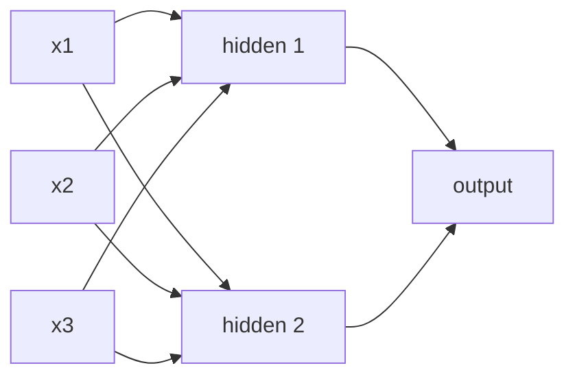

# Lesson 12 — Neural Networks, the Idea

**Goal:** understand what a network is, and know when it is the wrong tool.

## What you will learn

- A neuron, and why layers
- `MLPClassifier` — a network without leaving scikit-learn
- Where networks genuinely win
- The honest comparison on tabular data

---

## A neuron

One neuron is logistic regression from lesson 05: a weighted sum, then a
squashing function.

```text
output = activation(w₁x₁ + w₂x₂ + ... + b)
```

Stack neurons into a layer, stack layers, and each layer learns features built
from the layer below.



The point is the **activation function**. Without it, stacking linear layers
gives you one linear layer — a hundred layers of matrix multiplication collapse
into a single matrix. `ReLU` (`max(0, x)`) bends the function, and bends are
what let a network fit shapes a line cannot.

---

## A network in scikit-learn

```python
from sklearn.datasets import make_moons
from sklearn.model_selection import train_test_split
from sklearn.neural_network import MLPClassifier
from sklearn.linear_model import LogisticRegression
from sklearn.preprocessing import StandardScaler
from sklearn.pipeline import make_pipeline

X, y = make_moons(n_samples=1000, noise=0.2, random_state=42)
X_train, X_test, y_train, y_test = train_test_split(
    X, y, test_size=0.2, random_state=42, stratify=y
)

linear = make_pipeline(StandardScaler(), LogisticRegression()).fit(X_train, y_train)
network = make_pipeline(
    StandardScaler(),
    MLPClassifier(hidden_layer_sizes=(32, 16), max_iter=2000, random_state=42),
).fit(X_train, y_train)

print("logistic regression:", round(linear.score(X_test, y_test), 3))
print("neural network:     ", round(network.score(X_test, y_test), 3))
```

```text
logistic regression: 0.92
neural network:      0.99
```

Two crescents again. The linear model draws one straight line and loses; the
network bends around them. `hidden_layer_sizes=(32, 16)` means two hidden
layers, 32 neurons then 16.

**Scaling is required.** Unscaled inputs make the gradients wildly different
in size, and training either crawls or diverges.

---

## The knobs

```python
from sklearn.datasets import load_breast_cancer
from sklearn.model_selection import cross_val_score
from sklearn.neural_network import MLPClassifier
from sklearn.preprocessing import StandardScaler
from sklearn.pipeline import make_pipeline

X, y = load_breast_cancer(return_X_y=True)

for layers in [(8,), (64,), (64, 32)]:
    for alpha in [1e-4, 1.0]:
        model = make_pipeline(
            StandardScaler(),
            MLPClassifier(hidden_layer_sizes=layers, alpha=alpha,
                          max_iter=3000, random_state=42),
        )
        score = cross_val_score(model, X, y, cv=5, scoring="f1").mean()
        print(f"layers={str(layers):<10} alpha={alpha:<7} f1 {score:.3f}")
```

```text
layers=(8,)       alpha=0.0001  f1 0.978
layers=(8,)       alpha=1.0     f1 0.983
layers=(64,)      alpha=0.0001  f1 0.976
layers=(64,)      alpha=1.0     f1 0.983
layers=(64, 32)   alpha=0.0001  f1 0.982
layers=(64, 32)   alpha=1.0     f1 0.978
```

Six architectures, and the whole spread is seven thousandths — inside the
noise of a 569-row dataset. The eight-neuron network matches the two-layer
one. On tabular data of this size, a bigger network buys nothing, and that is
the real lesson of the table.

| Parameter | Meaning |
|---|---|
| `hidden_layer_sizes` | Width and depth |
| `alpha` | L2 penalty — raise it when overfitting |
| `learning_rate_init` | Step size, default 0.001 |
| `max_iter` | Passes over the data; too low gives `ConvergenceWarning` |
| `early_stopping=True` | Holds out 10% and stops when it stops improving |

---

## The honest comparison on tabular data

```python
from sklearn.datasets import fetch_california_housing
from sklearn.model_selection import train_test_split
from sklearn.neural_network import MLPRegressor
from sklearn.ensemble import HistGradientBoostingRegressor
from sklearn.linear_model import LinearRegression
from sklearn.preprocessing import StandardScaler
from sklearn.pipeline import make_pipeline
from sklearn.metrics import mean_absolute_error
import time

data = fetch_california_housing()
X_train, X_test, y_train, y_test = train_test_split(
    data.data, data.target, test_size=0.2, random_state=42
)

models = {
    "linear regression": make_pipeline(StandardScaler(), LinearRegression()),
    "gradient boosting": HistGradientBoostingRegressor(random_state=42),
    "neural network":    make_pipeline(
        StandardScaler(),
        MLPRegressor(hidden_layer_sizes=(64, 32), max_iter=300, random_state=42),
    ),
}

for name, model in models.items():
    start = time.perf_counter()
    model.fit(X_train, y_train)
    elapsed = time.perf_counter() - start
    mae = mean_absolute_error(y_test, model.predict(X_test))
    print(f"{name:<19} MAE {mae:.3f}   {elapsed:5.1f}s")
```

```text
linear regression   MAE 0.533     0.0s
gradient boosting   MAE 0.310     1.0s
neural network      MAE 0.351    18.6s
```

Gradient boosting wins, in one second against nineteen, with no scaling and no
architecture to choose. This is the normal result on tabular data, and it is
worth internalising before you reach for a network out of enthusiasm.

---

## Where networks actually win

| Data | Use |
|---|---|
| Images | CNN, or a pretrained vision model |
| Text | Transformers — see the Python course's [transformers lesson](../../Python/Basic-Python/libraries/09-transformers.md) |
| Audio, video | Networks, always |
| Sequences with long dependencies | Transformers, LSTMs |
| **Tabular rows and columns** | **Gradient boosting** |

The pattern: networks win where the raw input is high-dimensional and
structured — pixels next to pixels, words in order — and where a model can
learn its own features. On a table of thirty hand-made columns, there is
nothing to discover and boosting is better at what remains.

Networks also need data. Rules of thumb: a few thousand rows is enough for
boosting; a network wants tens of thousands before it repays the cost.

---

## Going further

This lesson is the idea. The mechanics — tensors, autograd, the training loop,
GPUs — are in the Python course:

- [PyTorch](../../Python/Basic-Python/libraries/08-pytorch.md) — tensors,
  autograd, and the five-line training loop
- [transformers](../../Python/Basic-Python/libraries/09-transformers.md) —
  pretrained models, tokenizers, embeddings

Do those two after this lesson, in that order.

---

## Common mistakes

| Mistake | What happens |
|---|---|
| Not scaling the inputs | Training crawls or diverges |
| A network on 500 tabular rows | Overfits; boosting or ridge is better |
| `max_iter` too low | `ConvergenceWarning` and a half-trained model |
| Adding layers to fix underfitting | Usually the features, not the depth |
| Comparing without a boosting baseline | You cannot tell whether it was worth it |
| No `random_state` | Different results every run |

---

## Exercises

1. Compare logistic regression and `MLPClassifier` on `make_moons`. Plot both
   decision boundaries.
2. Vary `hidden_layer_sizes` over four options and report cross-validated F1.
3. Benchmark an MLP against `HistGradientBoosting` on any tabular dataset —
   score and training time.
4. In three sentences: for your own problem, would a network be worth it?
