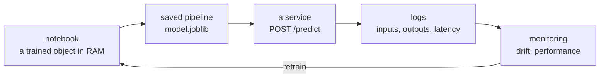

# Lesson 13 — From Model to Product

**Goal:** a model other people can use, and that you will notice when it breaks.

## What you will learn

- Saving the whole pipeline
- A prediction service
- What to log, and what drift looks like
- The model card

---

## A notebook is not a deliverable



Everything after the first box is the part beginners skip, and the part that
decides whether the work was worth anything.

---

## Save the pipeline, not the estimator

```python
import joblib
from sklearn.datasets import load_breast_cancer
from sklearn.model_selection import train_test_split
from sklearn.pipeline import Pipeline
from sklearn.preprocessing import StandardScaler
from sklearn.ensemble import HistGradientBoostingClassifier

X, y = load_breast_cancer(return_X_y=True)
X_train, X_test, y_train, y_test = train_test_split(
    X, y, test_size=0.2, random_state=42, stratify=y
)

model = Pipeline([
    ("scale", StandardScaler()),
    ("clf", HistGradientBoostingClassifier(random_state=42)),
]).fit(X_train, y_train)

joblib.dump(model, "model.joblib")

loaded = joblib.load("model.joblib")
print("same predictions:", (loaded.predict(X_test) == model.predict(X_test)).all())
print("test accuracy:", round(loaded.score(X_test, y_test), 3))
```

```text
same predictions: True
test accuracy: 0.974
```

The scaler is part of the model. Saving the estimator alone gives you a file
that produces confident nonsense on raw inputs — and nothing will warn you.

Save alongside it, in a small JSON: the training date, the data version, the
library versions, the metrics, and the feature names in order. A `.joblib`
loaded a year later with a different scikit-learn can break or, worse, behave
differently.

```python
import json
import sklearn
from datetime import date

metadata = {
    "trained_on": str(date.today()),
    "sklearn_version": sklearn.__version__,
    "features": ["mean radius", "mean texture"],
    "metrics": {"test_accuracy": 0.974},
    "threshold": 0.5,
}
print(json.dumps(metadata, indent=2)[:120])
```

```text
{
  "trained_on": "2026-09-23",
  "sklearn_version": "1.8.0",
  "features": [
```

---

## The prediction function

Write the function before the web framework. It is the thing you can test.

```python
import numpy as np

def predict(model, records, threshold=0.5):
    """Score records and return label, probability, and the threshold used.

    Args:
        model: a fitted pipeline that implements predict_proba.
        records: a 2-D array-like, one row per item, columns in training order.
        threshold: probability above which the positive class is returned.

    Returns:
        A list of dicts, one per record.
    """
    features = np.asarray(records, dtype=float)
    if features.ndim != 2:
        raise ValueError(f"expected a 2-D array, got shape {features.shape}")

    probabilities = model.predict_proba(features)[:, 1]
    return [
        {"label": int(p >= threshold), "probability": round(float(p), 4),
         "threshold": threshold}
        for p in probabilities
    ]

print(predict(loaded, X_test[:2]))
```

```text
[{'label': 0, 'probability': 0.0001, 'threshold': 0.5}, {'label': 1, 'probability': 1.0, 'threshold': 0.5}]
```

Three decisions in that function worth keeping:

- **It returns the probability, not only the label.** Downstream systems
  usually need the confidence, and you cannot recover it later.
- **The threshold is an argument, not a constant.** Lesson 05 — it is a
  business setting, and it will change without retraining.
- **It validates its input.** A shape error caught here is a clear message; the
  same error caught inside the model is a traceback nobody can read.

---

## A minimal service

```python
# service.py — run with: uvicorn service:app --reload
from fastapi import FastAPI, HTTPException
from pydantic import BaseModel
import joblib
import numpy as np

app = FastAPI(title="Prediction service")
model = joblib.load("model.joblib")
N_FEATURES = model.n_features_in_

class Request(BaseModel):
    features: list[list[float]]

@app.get("/health")
def health():
    return {"status": "ok", "n_features": N_FEATURES}

@app.post("/predict")
def predict_endpoint(request: Request):
    features = np.asarray(request.features, dtype=float)
    if features.ndim != 2 or features.shape[1] != N_FEATURES:
        raise HTTPException(422, f"expected (n, {N_FEATURES}), got {features.shape}")

    probabilities = model.predict_proba(features)[:, 1]
    return {"predictions": [
        {"label": int(p >= 0.5), "probability": round(float(p), 4)}
        for p in probabilities
    ]}
```

```bash
curl -X POST localhost:8000/predict \
  -H "Content-Type: application/json" \
  -d '{"features": [[17.99, 10.38, 122.8, 1001.0]]}'
```

The model loads **once**, at import — not per request. Loading a model inside
the handler is the most common performance bug in ML services.

A `/health` endpoint is not decoration: it is how your orchestrator knows the
container is alive and the model actually loaded.

---

## Batch scoring

Not everything needs an API. If predictions are consumed daily, a scheduled
job is simpler, cheaper, and easier to debug:

```python
import pandas as pd
import joblib

def score_daily(input_path, output_path, model_path="model.joblib"):
    """Score a day's rows and write the results with their probabilities."""
    model = joblib.load(model_path)
    frame = pd.read_parquet(input_path)

    frame["probability"] = model.predict_proba(frame[model.feature_names_in_])[:, 1]
    frame["label"] = (frame["probability"] >= 0.5).astype(int)
    frame["scored_at"] = pd.Timestamp.utcnow()

    frame.to_parquet(output_path, index=False)
    return len(frame)
```

Choose a service when predictions must be immediate. Choose a batch job
whenever you can.

---

## Monitoring

A model is the only part of your system that can fail while every test passes
and every request returns 200. The world moves; the model does not.

Log for every prediction: a timestamp, the input feature values, the
probability, the model version, and the latency. Then watch three things.

**1. Data drift** — the inputs stop looking like the training data.

```python
import numpy as np
from scipy.stats import ks_2samp

rng = np.random.default_rng(0)
training = rng.normal(50, 10, 1000)
this_week = rng.normal(58, 10, 1000)          # the population shifted

statistic, p_value = ks_2samp(training, this_week)
print(f"KS statistic {statistic:.3f}, p-value {p_value:.2e}")
print("drift detected:", p_value < 0.01)
```

```text
KS statistic 0.336, p-value 2.14e-50
drift detected: True
```

Run that per feature, weekly. A tiny p-value means the distribution has moved,
and a model trained on the old one is quietly extrapolating.

**2. Prediction drift** — the share of positive predictions changes. Cheap to
compute, and it needs no labels, which is why it is usually your earliest
warning.

**3. Performance** — the real answer, once labels arrive. It may take days or
months, which is exactly why the first two exist.

Set thresholds in advance and alert on them. "We will look at the dashboard"
is not monitoring.

---

## The model card

A page shipped with the model. Without it, in six months nobody — including
you — will know what it was trained on or what it may be used for.

```markdown
# Model: churn-classifier v1.3

## What it does
Predicts whether a customer will stop ordering in the next 30 days.

## Intended use
Ranking customers for the retention team's daily call list.

## NOT for
Pricing, credit decisions, or any automated action without human review.

## Training data
142,000 orders, Jan 2025 – Jun 2026, Cairo and Giza branches only.

## Performance (held-out test set)
- ROC-AUC 0.84, average precision 0.51
- Recall at threshold 0.3: 0.72 | Precision: 0.39
- Baseline (always predict "stays"): AP 0.11

## Known limits
- Trained only on two cities; unvalidated elsewhere.
- Customers with under 3 orders are predicted poorly (recall 0.41).
- Degrades during Ramadan — ordering patterns differ from the training period.

## Retraining
Monthly, or when weekly AP falls below 0.45.

## Owner
Data team — name, contact
```

The **NOT for** and **Known limits** sections are the valuable ones. They are
what stops someone using your call-list ranker to decide who gets credit.

---

## Before you call it done

- [ ] The whole pipeline is saved, not just the estimator
- [ ] Library versions are pinned and recorded
- [ ] The prediction function validates its input and returns probabilities
- [ ] The threshold is configurable, not hard-coded
- [ ] Predictions and inputs are logged with a model version
- [ ] Drift checks run on a schedule with an alert threshold
- [ ] A model card exists, with limits stated
- [ ] There is a documented way to roll back to the previous model

---

## Common mistakes

| Mistake | What happens |
|---|---|
| Saving the estimator without the preprocessing | Nonsense predictions on raw input |
| Loading the model inside the request handler | Slow endpoint, wasted memory |
| No input validation | Cryptic tracebacks in production |
| Threshold hard-coded at 0.5 | A code change for a business decision |
| No logging of inputs | Drift is undetectable and bugs are unreproducible |
| Unpinned library versions | Silent behaviour changes on rebuild |
| No model card | Misuse, confidently |

---

## Exercises

1. Save a pipeline with `joblib`, reload it in a fresh process, and prove the
   predictions match.
2. Write a `predict()` function with validation and three tests, including a
   wrong-shape input.
3. Run the FastAPI service and call `/predict` with `curl`.
4. Write the model card for your Project 3 model — including the limits.
