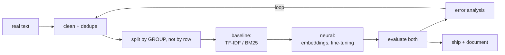

# Project 6 — A Text System That Earns Its Complexity

**Do this after the twelve lessons.**

You build a working NLP system on real text, and you prove — with numbers —
that each layer of complexity you added was worth it.

Project 3 asked whether you can be trusted with a model. This one asks whether
you can be trusted with **text**, where the baseline is strong, the
preprocessing decides the outcome, and the evaluation is easy to fake.

---

## Pick one track

| Track | Build | Core metric |
|---|---|---|
| **A — Classification** | Route, tag or rate documents | Macro F1, per-class recall |
| **B — Search / RAG** | Answer questions over your documents | Recall@k, MRR, grounding |
| **C — Extraction** | Pull structured fields from text | Entity-level F1 |

Arabic data in any track earns a bonus, and lesson 12 is then required
reading.

---

## The pipeline



The mandatory shape of this project: **baseline first, neural second, and a
table comparing them.**

---

## Requirements

### 1. Real text, and honest splitting

- **At least 2,000 documents** of real text: tickets, reviews, articles,
  transcripts, your own messages. Not a toy dataset from a tutorial.
- **Deduplicate before splitting**, and report how many duplicates you found.
- **Split by group** — user, thread, document, or time — not by row. State the
  grouping and why.
- Report length statistics: characters, words, and **tokens** under your
  chosen tokeniser.

### 2. Preprocessing as a measured decision

Build a `clean()` function with flags, and produce a table:

| Setting | Metric | Vocabulary |
|---|---|---|
| raw | | |
| + lowercase | | |
| + stopwords removed | | |
| + min_df | | |
| + your domain rule | | |

Lesson 02 found stopword removal *helping* by 2.9 points on topic
classification and *destroying* sentiment. You cannot reason your way to the
right answer — run the table.

### 3. The baseline (mandatory)

- **Track A:** TF-IDF + `LinearSVC`, with the top features per class printed
  and read
- **Track B:** BM25, with recall@k and MRR on labelled queries
- **Track C:** rules or a feature-based tagger, scored at the entity level

This baseline is not a formality. It is the number the rest of the project
must beat, and it may win.

### 4. The neural system

At least two of:

- Frozen embeddings + a classical head
- A fine-tuned encoder (`distilbert`, AraBERT, MARBERT)
- An embedding retriever (a retrieval-trained model, not a raw BERT)
- An LLM prompt with a strict output format and a refusal path

For each: the metric, the training time, the inference latency, and the cost
per 1,000 calls.

### 5. Evaluation that cannot be faked

- The metric your task deserves — macro F1 for imbalanced classes, recall@k
  and MRR for search, entity F1 for extraction
- A **confusion matrix** (A/C) or a **per-query result table** (B)
- **Threshold or top-k sweep**, and the operating point you chose, with the
  reason
- For track B: at least **ten questions with no answer in the corpus**, and the
  refusal rate on them
- Variance: re-run with two more seeds and report the spread

### 6. Error analysis — read the text

- The **20 most confident wrong** predictions, printed in full
- Group them: ambiguous labels, missing context, preprocessing damage,
  vocabulary gaps, dialect
- **How many are label errors rather than model errors?** Report the number.
- One fixable cause identified, fixed, and re-measured

Three findings, each with a number.

### 7. Ship it

- A `predict()` or `search()` function: input validation, batching,
  probabilities or scores, a documented threshold
- The saved artefacts: vectoriser or tokeniser **and** model, with the class
  order recorded
- A latency benchmark at batch 1 and batch 32
- A model card (ML lesson 13's template) naming the languages, dialects and
  domains it was validated on — and the ones it was not

---

## Deliverables

```text
project-6/
├── README.md              question, results table, error analysis, limits
├── MODEL_CARD.md
├── notebooks/
│   ├── 01-explore.ipynb   length stats, duplicates, class balance, reading
│   └── 02-model.ipynb     baseline, neural, comparison
├── src/
│   ├── clean.py           preprocessing with flags, tested
│   ├── baseline.py
│   ├── model.py
│   └── predict.py
├── tests/                 at least 8 pytest tests, including Unicode cases
├── models/
└── data/
    ├── raw/               read-only
    └── processed/
```

---

## Marking

| Weight | Criterion |
|---|---|
| 15% | Real data, deduplicated, split by group, described |
| 15% | Preprocessing measured rather than assumed |
| 20% | Baseline built properly and compared fairly |
| 20% | Neural system, with cost as well as score |
| 15% | Evaluation: right metric, operating point, variance, refusals |
| 10% | Error analysis with numbered findings from reading the text |
| 5% | Shipping: predict function, artefacts, model card |

Automatic deductions: no baseline; splitting by row when rows are grouped;
duplicates not checked; accuracy reported on imbalanced classes; a track B
project with no unanswerable questions; a notebook that does not run.

---

## Milestones

| Day | Done by end of day |
|---|---|
| 1 | Data collected, deduplicated, split, read by hand |
| 2 | Preprocessing table; baseline built and scored |
| 3 | First neural approach, compared with the baseline |
| 4 | Second neural approach; cost and latency measured |
| 5 | Evaluation: sweeps, variance, refusals |
| 6 | Error analysis, one fix, re-measurement |
| 7 | Ship, model card, README |

---

## Before you submit

- [ ] Duplicate count reported, and removed before splitting
- [ ] The split is by group, and the grouping is justified
- [ ] The preprocessing table exists, with numbers
- [ ] The baseline score is in the results table
- [ ] Every neural result has a cost and a latency beside it
- [ ] The operating point was chosen on validation, not test
- [ ] Twenty errors were read, and their causes counted
- [ ] The model card names the languages and dialects validated
- [ ] If the baseline won, the README says so in the first paragraph
