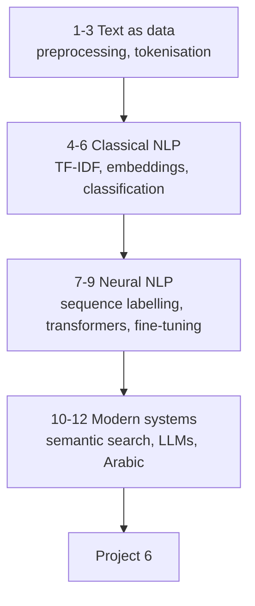

# Natural Language Processing — Tayel AI Labs

The fifth course. Text is the most common data in the world and the least
structured. This course takes you from counting words to fine-tuning a
transformer, and it treats Arabic as a first-class case rather than a footnote.

**Prerequisites**

- [`../Python`](../Python) and [`../Machine-Learning`](../Machine-Learning)
- [`../Deep-Learning`](../Deep-Learning) from lesson 10 onward

---

## The road



---

## Lessons

| # | Lesson | You will be able to |
|---|---|---|
| 01 | [What NLP Is](lessons/01-what-is-nlp.md) | Frame a text problem and pick a baseline |
| 02 | [Text Preprocessing](lessons/02-text-preprocessing.md) | Normalise text without destroying signal |
| 03 | [Tokenisation](lessons/03-tokenisation.md) | Split text the way models actually do |
| 04 | [Bag of Words and TF-IDF](lessons/04-bow-and-tfidf.md) | Build a strong classical baseline |
| 05 | [Word Embeddings](lessons/05-word-embeddings.md) | Represent meaning as vectors |
| 06 | [Text Classification](lessons/06-text-classification.md) | Ship a classifier with honest metrics |
| 07 | [Sequence Labelling and NER](lessons/07-sequence-labelling.md) | Tag entities, and score them properly |
| 08 | [Transformers for NLP](lessons/08-transformers-for-nlp.md) | Use pretrained models correctly |
| 09 | [Fine-Tuning](lessons/09-fine-tuning.md) | Adapt a model to your labels |
| 10 | [Semantic Search](lessons/10-semantic-search.md) | Search by meaning, and evaluate it |
| 11 | [LLMs, Prompting and RAG](lessons/11-llms-prompting-rag.md) | Build and evaluate an LLM system |
| 12 | [Arabic NLP](lessons/12-arabic-nlp.md) | Handle Arabic without pretending it is English |

## Then

- [`Project-6/`](Project-6/) — a complete text system, evaluated honestly

---

## Setup

```bash
python3 -m venv .venv
source .venv/bin/activate
pip install -r requirements.txt
```

---

## Two things that stay true across the course

1. **TF-IDF plus logistic regression is a serious baseline.** It takes five
   minutes, it is interpretable, and on many real problems a fine-tuned
   transformer beats it by two points at a hundred times the cost. Always run
   it first.
2. **Your tokeniser decides what your model can see.** More text bugs come
   from preprocessing than from modelling — a stripped diacritic, a dropped
   negation, an `[UNK]` on every capitalised word.
