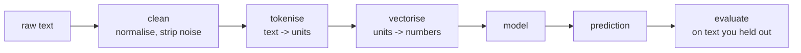

# Lesson 01 — What NLP Is

**Goal:** frame a text problem, and know the baseline before you build.

## What you will learn

- The task families
- Why text is harder than a table
- The pipeline
- Choosing a starting point

---

## The task families

Almost every text problem is one of these:

| Family | Question | Example |
|---|---|---|
| **Classification** | Which category? | Spam, sentiment, ticket routing |
| **Sequence labelling** | What is each token? | Names, places, dates in a document |
| **Similarity / search** | How close are these? | Duplicate detection, semantic search |
| **Generation** | What text comes next? | Summaries, replies, translation |
| **Extraction** | What are the facts? | Price and date from an invoice |
| **Question answering** | What does this text say about X? | Support bot over your documents |

The first job on any new problem is naming which of these it is. "Build a
chatbot" is not a task; "route an incoming ticket to one of six teams" is.

---

## Why text is hard

A table has columns with types. Text has none of that.

```python
examples = [
    "The coffee was not bad at all",           # negation flips the meaning
    "Yeah, great service. Waited 45 minutes.", # sarcasm
    "I ordered a Latte. It was cold.",         # the subject is in the previous sentence
    "علي راح المطعم",                           # Arabic: no vowels, rich morphology
    "the bank by the river vs the bank closed", # the same word, two meanings
]
for text in examples:
    print(f"{len(text):>3} chars  {len(text.split()):>2} words  {text}")
```

```text
 29 chars   7 words  The coffee was not bad at all
 39 chars   6 words  Yeah, great service. Waited 45 minutes.
 31 chars   7 words  I ordered a Latte. It was cold.
 14 chars   3 words  علي راح المطعم
 40 chars   9 words  the bank by the river vs the bank closed
```

Four properties make text different from the tabular data of the ML course:

1. **Variable length.** Every row is a different size; models need fixed shapes.
2. **Order matters.** "dog bites man" and "man bites dog" contain the same
   words.
3. **Context decides meaning.** The same token means different things in
   different sentences.
4. **It is high-dimensional and sparse.** A 50,000-word vocabulary, and each
   document contains fifteen of them.

---

## The pipeline



Lessons 02–05 are the middle three boxes. Everything after lesson 06 changes
only what "vectorise" and "model" mean.

---

## Start with the boring baseline

```python
from sklearn.datasets import fetch_20newsgroups
from sklearn.feature_extraction.text import TfidfVectorizer
from sklearn.linear_model import LogisticRegression
from sklearn.pipeline import make_pipeline
from sklearn.metrics import accuracy_score

categories = ["rec.sport.hockey", "sci.space", "talk.politics.mideast", "comp.graphics"]
train = fetch_20newsgroups(subset="train", categories=categories,
                           remove=("headers", "footers", "quotes"))
test = fetch_20newsgroups(subset="test", categories=categories,
                          remove=("headers", "footers", "quotes"))

print("train docs:", len(train.data), "test docs:", len(test.data),
      "classes:", len(train.target_names))

model = make_pipeline(TfidfVectorizer(), LogisticRegression(max_iter=1000))
model.fit(train.data, train.target)

print("accuracy:", round(accuracy_score(test.target, model.predict(test.data)), 4))
```

```text
train docs: 2341 test docs: 1558 classes: 4
accuracy: 0.8832
```

Four newsgroups, 2,341 real training documents, two lines of modelling —
**88.3%**. Note `remove=("headers", "footers", "quotes")`: without it the
email headers leak the category and the score jumps to the high nineties for
reasons that have nothing to do with language.

**Run this before anything else, on every text problem.** It costs five
minutes, and it tells you three things: whether the task is learnable, what
"good" looks like, and the number a transformer has to beat to be worth its
cost.

---

## What to reach for

| Situation | Start with |
|---|---|
| Thousands of labelled examples, clear categories | TF-IDF + linear model |
| Same, and you need the last few points | Fine-tuned transformer (lesson 09) |
| No labels, but you can describe the classes | Zero-shot classification (lesson 11) |
| Finding similar documents | Embeddings + cosine (lesson 10) |
| Extracting entities | NER — fine-tuned or rule-based (lesson 07) |
| Open-ended answers over your documents | RAG (lesson 11) |
| Arabic anything | Lesson 12 first, then the above |

---

## The evaluation trap

Text data repeats itself. The same complaint appears in fifty tickets with
three words changed.

```python
from sklearn.model_selection import train_test_split

documents = ["cold coffee", "cold coffee", "cold coffee!", "great service"] * 25
labels = [0, 0, 0, 1] * 25

train_texts, test_texts, _, _ = train_test_split(
    documents, labels, test_size=0.3, random_state=0)

overlap = len(set(train_texts) & set(test_texts))
print(f"distinct test documents also in train: {overlap} of {len(set(test_texts))}")
```

```text
distinct test documents also in train: 3 of 3
```

Every distinct test document also appears in training. The model can memorise
and will score beautifully on a test set that measures nothing.

**Deduplicate before splitting**, and when several rows come from the same
user, thread or document, split by that group — not by row.

---

## Common mistakes

| Mistake | What happens |
|---|---|
| Starting with a transformer | Weeks of work to beat a five-minute baseline by two points |
| No deduplication | Inflated scores that collapse in production |
| Splitting rows instead of groups | The same conversation in train and test |
| Treating Arabic as English with different letters | Quietly poor results — lesson 12 |
| No human reading of the data | You model a problem you have not looked at |

---

## Exercises

1. Take 20 rows of real text from your work. Which task family is it?
2. Run the TF-IDF baseline on any labelled text dataset and report the score.
3. Check your dataset for duplicates. How many, and what do they do to your
   split?
4. Find three examples where word order alone changes the label.
