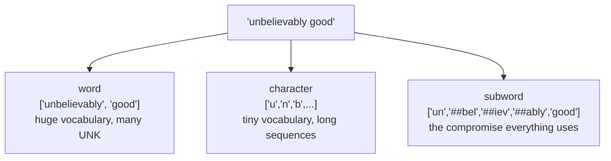

# Lesson 03 — Tokenisation

**Goal:** split text into units, the way models actually do it.

## What you will learn

- Word, character and subword tokenisation
- BPE and WordPiece
- Vocabulary size, sequence length and cost
- Special tokens

---

## Three levels



```python
text = "unbelievably overpriced macchiato"

words = text.split()
characters = list(text)

print(f"words:      {len(words):>3} tokens  {words}")
print(f"characters: {len(characters):>3} tokens  {characters[:12]} ...")
```

```text
words:        3 tokens  ['unbelievably', 'overpriced', 'macchiato']
characters:  33 tokens  ['u', 'n', 'b', 'e', 'l', 'i', 'e', 'v', 'a', 'b', 'l', 'y'] ...
```

| | Vocabulary | Sequence length | Unknown words |
|---|---|---|---|
| Word | 100k–1M | Short | Common — every typo and rare word |
| Character | ~100 | Very long | None |
| **Subword** | 30k–100k | Moderate | **None** |

Word tokenisation cannot handle a word it has not seen. Character
tokenisation handles everything but makes sequences 5× longer, and attention
costs grow with the square of that. Subword is the compromise, and it is what
every modern model uses.

---

## Subword in practice

```python
from transformers import AutoTokenizer

tokenizer = AutoTokenizer.from_pretrained("prajjwal1/bert-tiny")

for text in ["coffee", "macchiato", "unbelievably", "tokenisation", "COVID-19"]:
    tokens = tokenizer.tokenize(text)
    print(f"{text:<14} {len(tokens)} tokens  {tokens}")
```

```text
coffee         1 tokens  ['coffee']
macchiato      3 tokens  ['mac', '##chia', '##to']
unbelievably   5 tokens  ['un', '##bel', '##ie', '##va', '##bly']
tokenisation   2 tokens  ['token', '##isation']
COVID-19       3 tokens  ['[UNK]', '-', '19']
```

Common words stay whole. Rare words split into pieces that exist in the
vocabulary. `##` marks "this continues the previous token".

Now look at the last row. `COVID` became **`[UNK]`** — this tokeniser's
vocabulary is uncased and `COVID` in capitals is not in it, so the word was
not split into pieces, it was *lost*. Subword tokenisation only saves you
inside the alphabet the tokeniser knows; uppercase text against an uncased
vocabulary, or Arabic against an English one, still produces `[UNK]`.

With that caveat, **an in-alphabet word is never out-of-vocabulary** — the
worst case is that it costs five tokens instead of one. That matters in two places: your sequence length
limit, and your bill when you pay per token.

---

## How BPE builds a vocabulary

Byte-Pair Encoding starts from characters and repeatedly merges the most
frequent adjacent pair.

```python
from collections import Counter

def learn_merges(words, num_merges=6):
    """A miniature BPE: return the merges learned from a word list."""
    vocabulary = {" ".join(word) + " </w>": count for word, count in words.items()}
    merges = []

    for _ in range(num_merges):
        pairs = Counter()
        for word, count in vocabulary.items():
            symbols = word.split()
            for i in range(len(symbols) - 1):
                pairs[(symbols[i], symbols[i + 1])] += count
        if not pairs:
            break
        best = pairs.most_common(1)[0][0]
        merges.append(best)
        merged = "".join(best)
        vocabulary = {word.replace(" ".join(best), merged): count
                      for word, count in vocabulary.items()}
    return merges, vocabulary

words = Counter({"low": 5, "lower": 2, "newest": 6, "widest": 3})
merges, final = learn_merges(words)

print("merges learned, in order:")
for pair in merges:
    print("  ", pair)
print("\nfinal segmentation:")
for word in final:
    print("  ", word)
```

```text
merges learned, in order:
   ('e', 's')
   ('es', 't')
   ('est', '</w>')
   ('l', 'o')
   ('lo', 'w')
   ('n', 'e')

final segmentation:
   low </w>: 5
   low e r </w>: 2
   ne w est</w>: 6
   w i d est</w>: 3
```

The algorithm discovered `est</w>` — the English superlative suffix — purely
from frequency, with no linguistic knowledge. That is the whole trick: common
sequences become single tokens, rare ones stay split.

Real tokenisers run tens of thousands of merges over billions of words.
WordPiece (BERT) and SentencePiece (T5, LLaMA) differ in the merge criterion
and in whether they operate on raw bytes, but the idea is this.

---

## Special tokens

```python
from transformers import AutoTokenizer

tokenizer = AutoTokenizer.from_pretrained("prajjwal1/bert-tiny")
encoded = tokenizer("first sentence", "second sentence")

print(tokenizer.convert_ids_to_tokens(encoded["input_ids"]))
print("token_type_ids:", encoded["token_type_ids"])
print("special tokens:", {
    "cls": tokenizer.cls_token, "sep": tokenizer.sep_token,
    "pad": tokenizer.pad_token, "unk": tokenizer.unk_token,
    "mask": tokenizer.mask_token,
})
```

```text
['[CLS]', 'first', 'sentence', '[SEP]', 'second', 'sentence', '[SEP]']
token_type_ids: [0, 0, 0, 0, 1, 1, 1]
special tokens: {'cls': '[CLS]', 'sep': '[SEP]', 'pad': '[PAD]', 'unk': '[UNK]', 'mask': '[MASK]'}
```

| Token | Purpose |
|---|---|
| `[CLS]` | Position the classification head reads |
| `[SEP]` | Separates two segments, and ends the sequence |
| `[PAD]` | Filler, masked out by `attention_mask` |
| `[UNK]` | A character the tokeniser cannot encode at all |
| `[MASK]` | Hidden during pretraining |

`token_type_ids` marks which segment each token belongs to — that is how a
model does question-and-passage or sentence-pair tasks.

---

## Length, cost and truncation

```python
from transformers import AutoTokenizer

tokenizer = AutoTokenizer.from_pretrained("prajjwal1/bert-tiny")

document = "The coffee was excellent and the service was fast. " * 40
tokens = tokenizer(document)["input_ids"]
truncated = tokenizer(document, truncation=True, max_length=128)["input_ids"]

print(f"characters:      {len(document):,}")
print(f"tokens:          {len(tokens):,}")
print(f"chars per token: {len(document) / len(tokens):.2f}")
print(f"after truncation to 128: {len(truncated)} tokens, "
      f"{100 * (1 - len(truncated) / len(tokens)):.0f}% discarded")
```

```text
characters:      2,040
tokens:          402
chars per token: 5.07
after truncation to 128: 128 tokens, 68% discarded
```

Roughly **5 characters per token** for English — a useful number for
estimating cost and whether a document fits.

`truncation=True` silently threw away 68% of this document. That is often the
right thing and it is never something you should be unaware of: log the
truncation rate, and if it is high, chunk the document instead of cutting it.

Rough guidance by language:

| Language | Characters per token | Note |
|---|---|---|
| English | 4–5 | What the vocabularies were built for |
| Code | 3–4 | Symbols and identifiers |
| Arabic (multilingual model) | 2–3 | **Two to three times the tokens** |
| Arabic (Arabic-specific model) | 4–5 | Why lesson 12 matters |

---

## Common mistakes

| Mistake | What happens |
|---|---|
| Tokenizer from a different checkpoint | Confident nonsense, no error |
| `.split()` for a transformer | The ids mean nothing to the model |
| No `truncation=True` | Crash on the first long document |
| Truncating without measuring the rate | Silent data loss |
| Estimating cost from word counts | Off by 2–3× for Arabic |
| Adding special tokens by hand | The tokeniser already does it |

---

## Exercises

1. Tokenise ten sentences of your own; find the word that splits most.
2. Run the miniature BPE on your own word frequencies. What suffix does it
   find?
3. Compare token counts for the same paragraph in English and Arabic.
4. Measure your corpus's truncation rate at `max_length` 128, 256 and 512.
