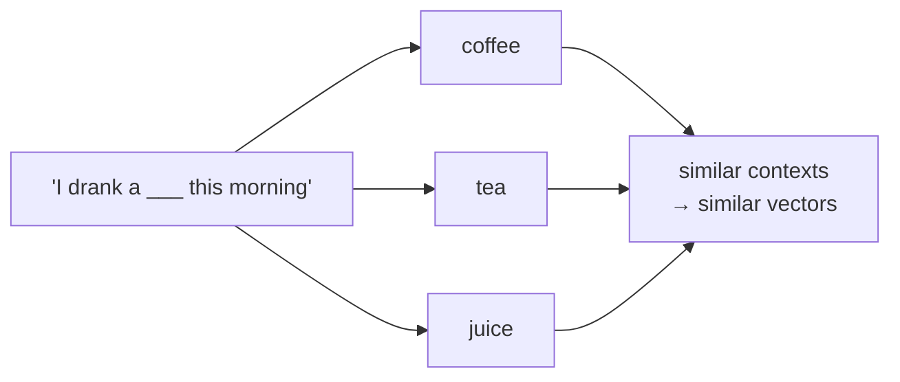

# Lesson 05 — Word Embeddings

**Goal:** represent words as vectors where distance means similarity.

## What you will learn

- Why one-hot fails and embeddings work
- word2vec's idea, in one sentence
- Static versus contextual embeddings
- Using embeddings as features

---

## The problem with counting

In TF-IDF every word is its own column. "excellent" and "superb" are as
unrelated as "excellent" and "parking".

```python
from sklearn.feature_extraction.text import TfidfVectorizer
from sklearn.metrics.pairwise import cosine_similarity

documents = ["excellent", "superb", "parking",
             "the coffee was excellent", "the coffee was superb"]
similarity = cosine_similarity(TfidfVectorizer().fit_transform(documents))

print("excellent vs superb :", round(similarity[0, 1], 3))
print("excellent vs parking:", round(similarity[0, 2], 3))
print("full sentences      :", round(similarity[3, 4], 3))
```

```text
excellent vs superb : 0.0
excellent vs parking: 0.0
full sentences      : 0.75
```

Two words that mean the same thing score **exactly zero** — the same as two
unrelated words. TF-IDF never sees words, only columns, and two different
columns share nothing by construction.

The third line shows where the illusion comes from: the full sentences score
0.75, and every point of it is "the", "coffee" and "was". Remove the shared
words and the similarity vanishes. TF-IDF cannot represent synonymy at all.

---

## The idea

> A word is defined by the company it keeps.

Words that appear in similar contexts get similar vectors. That is word2vec,
GloVe and fastText in one sentence — they differ in how they turn that
observation into an optimisation problem.



```python
import torch
import torch.nn as nn

embedding = nn.Embedding(num_embeddings=10_000, embedding_dim=100)

print("table shape:", embedding.weight.shape)
print("parameters:", embedding.weight.numel())
print("one word:", embedding(torch.tensor([42])).shape)
```

```text
table shape: torch.Size([10000, 100])
parameters: 1000000
one word: torch.Size([1, 100])
```

Ten thousand words in 100 dimensions instead of 10,000 — dense, and the
geometry carries meaning.

---

## Training one, small

Word vectors emerge from predicting context. Here is that, on a toy corpus, in
a form you can read:

```python
import torch
import torch.nn as nn

corpus = [
    "i drank coffee this morning", "i drank tea this morning",
    "i drank juice this morning", "she drank coffee at work",
    "he drank tea at work", "they drank juice at work",
    "i drove a car to work", "she drove a truck to work",
]

words = sorted({word for sentence in corpus for word in sentence.split()})
index = {word: i for i, word in enumerate(words)}

pairs = []
for sentence in corpus:                      # (centre, context) within a window of 2
    tokens = sentence.split()
    for i, token in enumerate(tokens):
        for j in range(max(0, i - 2), min(len(tokens), i + 3)):
            if i != j:
                pairs.append((index[token], index[tokens[j]]))

centres = torch.tensor([p[0] for p in pairs])
contexts = torch.tensor([p[1] for p in pairs])

torch.manual_seed(0)
model = nn.Sequential(nn.Embedding(len(words), 16), nn.Linear(16, len(words)))
optimiser = torch.optim.AdamW(model.parameters(), lr=0.01)
loss_fn = nn.CrossEntropyLoss()

for _ in range(300):
    optimiser.zero_grad()
    loss_fn(model(centres), contexts).backward()
    optimiser.step()

vectors = model[0].weight.detach()
vectors = vectors / vectors.norm(dim=1, keepdim=True)

def nearest(word, k=3):
    scores = vectors @ vectors[index[word]]
    best = scores.argsort(descending=True)[1 : k + 1]
    return [(words[i], round(scores[i].item(), 3)) for i in best]

for word in ["coffee", "drank", "work"]:
    print(f"{word:<8} -> {nearest(word)}")
```

```text
coffee   -> [('tea', 0.352), ('they', 0.295), ('juice', 0.293)]
drank    -> [('morning', 0.454), ('drove', -0.014), ('they', -0.035)]
work     -> [('truck', 0.272), ('drove', 0.2), ('a', 0.16)]
```

Eight sentences, 300 steps, and `coffee` has found `tea` (0.352) and `juice`
(0.293) — the model was never told they are drinks, only that they appear in
the same slots. `drank` sits near `morning`, the word that follows it most
often.

Notice also `they` sitting between the drinks at 0.295: with eight sentences
the signal is weak and the noise is loud. This is the right lesson about
embeddings — **they need a lot of text.** word2vec was trained on billions of
words, and the clean analogies people quote come from that scale, not from
the mechanism alone.

The mechanism, though, is exactly what you just ran.

---

## Static embeddings and their ceiling

word2vec, GloVe and fastText give **one vector per word**, whatever the
context.

```python
sentences = [
    "I sat on the river bank",
    "I deposited money at the bank",
]
```

`bank` has one vector, so both sentences pull it towards the average of two
unrelated meanings. No amount of training data fixes that — it is the
representation, not the fit.

| Property | Static (word2vec) | Contextual (BERT) |
|---|---|---|
| Vectors per word | One | One per occurrence |
| Polysemy | Cannot handle | Handles it |
| Cost | Tiny, a lookup | A forward pass |
| Out-of-vocabulary | Fails (fastText: subwords) | Subwords, always works |
| Still used for | Fast similarity, features, retrieval seeds | Nearly everything |

fastText is the one static model worth keeping in mind: it builds word vectors
from character n-grams, so it handles unseen words and morphology — which
makes it genuinely useful for Arabic.

---

## Contextual embeddings

```python
import torch
from transformers import AutoTokenizer, AutoModel

tokenizer = AutoTokenizer.from_pretrained("prajjwal1/bert-tiny")
model = AutoModel.from_pretrained("prajjwal1/bert-tiny").eval()

sentences = ["i sat on the river bank", "i deposited money at the bank"]

vectors = []
for sentence in sentences:
    encoded = tokenizer(sentence, return_tensors="pt")
    with torch.no_grad():
        hidden = model(**encoded).last_hidden_state[0]
    tokens = tokenizer.convert_ids_to_tokens(encoded["input_ids"][0])
    position = tokens.index("bank")
    vector = hidden[position]
    vectors.append(vector / vector.norm())

print("tokens:", tokens)
print("similarity of the two 'bank' vectors:",
      round(float(vectors[0] @ vectors[1]), 3))
```

```text
tokens: ['[CLS]', 'i', 'deposited', 'money', 'at', 'the', 'bank', '[SEP]']
similarity of the two 'bank' vectors: 0.893
```

Two occurrences of the same word, two different vectors — 0.893 similar
rather than identical. The model moved the token based on its neighbours,
which is exactly what a static embedding cannot do.

0.893 is high, and honestly so: `bert-tiny` has two layers and 128 dimensions,
so it separates the senses only slightly. A full BERT pushes the same pair well
below 0.7. The mechanism is the point; the magnitude is a function of model
size.

---

## Embeddings as features

The practical use: turn each document into one vector, then use any classical
model.

```python
import torch
from transformers import AutoTokenizer, AutoModel
from sklearn.linear_model import LogisticRegression
from sklearn.model_selection import cross_val_score
from sklearn.datasets import fetch_20newsgroups

tokenizer = AutoTokenizer.from_pretrained("prajjwal1/bert-tiny")
encoder = AutoModel.from_pretrained("prajjwal1/bert-tiny").eval()

categories = ["rec.sport.hockey", "sci.space"]
data = fetch_20newsgroups(subset="train", categories=categories,
                          remove=("headers", "footers", "quotes"))
texts, labels = data.data[:400], data.target[:400]

vectors = []
for start in range(0, len(texts), 32):
    batch = tokenizer(texts[start : start + 32], padding=True, truncation=True,
                      max_length=128, return_tensors="pt")
    with torch.no_grad():
        hidden = encoder(**batch).last_hidden_state
    mask = batch["attention_mask"].unsqueeze(-1)
    pooled = (hidden * mask).sum(1) / mask.sum(1)
    vectors.append(pooled)

features = torch.cat(vectors).numpy()
scores = cross_val_score(LogisticRegression(max_iter=1000), features, labels, cv=5)

print("feature shape:", features.shape)
print(f"accuracy on frozen embeddings: {scores.mean():.4f}")
```

```text
feature shape: (400, 128)
accuracy on frozen embeddings: 0.9050
```

128 dense features instead of 30,000 sparse ones, no fine-tuning, and **90.5%**
on a two-class split — from a 4-million-parameter model with the gradients
switched off.

That is the cheapest way to use a pretrained model, and it is the baseline to
beat before you spend an afternoon fine-tuning (lesson 09).

**Mean-pool with the mask**, as here. Averaging over padding drags short
documents towards zero — the bug from Deep Learning lesson 10.

---

## Common mistakes

| Mistake | What happens |
|---|---|
| Averaging static vectors for a document | Order and negation vanish |
| Pooling without the attention mask | Short documents are corrupted |
| Expecting word2vec to handle polysemy | One vector per word, by construction |
| Using a general model on a specialist domain | Legal or medical terms are `[UNK]`-like |
| Comparing vectors without normalising | Cosine similarity becomes a dot product of lengths |
| Embedding before deduplicating | You pay to embed the same text repeatedly |

---

## Exercises

1. Show the TF-IDF failure above on a pair of synonyms from your domain.
2. Train the toy word2vec on a corpus of yours and inspect the neighbours.
3. Find a polysemous word and compare its contextual vectors in two sentences.
4. Compare TF-IDF against frozen embeddings as features on the same task.
