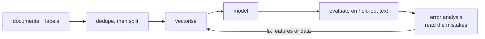

# Lesson 06 — Text Classification

**Goal:** ship a classifier whose reported score survives production.

## What you will learn

- The full pipeline, end to end
- Imbalance in text
- Error analysis on documents
- Thresholds and calibration

---

## The pipeline



Everything before "model" decides your score. The model is the easy part.

```python
from sklearn.datasets import fetch_20newsgroups
from sklearn.feature_extraction.text import TfidfVectorizer
from sklearn.svm import LinearSVC
from sklearn.pipeline import make_pipeline
from sklearn.metrics import classification_report

categories = ["rec.sport.hockey", "sci.space", "talk.politics.mideast", "comp.graphics"]
train = fetch_20newsgroups(subset="train", categories=categories,
                           remove=("headers", "footers", "quotes"))
test = fetch_20newsgroups(subset="test", categories=categories,
                          remove=("headers", "footers", "quotes"))

model = make_pipeline(TfidfVectorizer(min_df=2, ngram_range=(1, 1)), LinearSVC())
model.fit(train.data, train.target)

print(classification_report(test.target, model.predict(test.data),
                            target_names=test.target_names, digits=3))
```

```text
                       precision    recall  f1-score   support

        comp.graphics      0.898     0.902     0.900       389
     rec.sport.hockey      0.971     0.920     0.945       399
            sci.space      0.848     0.891     0.869       394
talk.politics.mideast      0.931     0.928     0.929       376

             accuracy                          0.910      1558
            macro avg      0.912     0.910     0.911      1558
         weighted avg      0.912     0.910     0.911      1558
```

Read the per-class rows before the headline of 0.910. Hockey scores 0.945
because its vocabulary is unique. **Space is the weakest at 0.869, and its
precision (0.848) is much lower than its recall (0.891)** — the model over-
predicts space, pulling in documents that belong elsewhere. The confusion
matrix below says exactly which.

---

## Where the errors are

```python
import numpy as np
from sklearn.metrics import confusion_matrix

predictions = model.predict(test.data)
matrix = confusion_matrix(test.target, predictions)

names = [name.split(".")[-1][:9] for name in test.target_names]
print(f"{'true \\ pred':<12}" + "".join(f"{n:>10}" for n in names))
for row, name in zip(matrix, names):
    print(f"{name:<12}" + "".join(f"{value:>10}" for value in row))
```

```text
true \ pred   graphics    hockey     space   mideast
graphics           351         3        30         5
hockey               6       367        17         9
space               28         3       351        12
mideast              6         5        16       349
```

Read down the `space` column: 30 graphics documents, 17 hockey and 16 mideast
were all predicted as space — 63 wrong answers into one class. That is the
0.848 precision, explained.

Reading across the `graphics` row confirms the pair: 30 of its 389 went to
space. **Graphics and space overlap in vocabulary** ("image", "data",
"system", "program"), and space additionally acts as the model's default
answer when nothing matches strongly.

Both findings point at features and data for those two classes — not at a
different algorithm.

---

## Read the mistakes

```python
import numpy as np

confidence = model.decision_function(test.data)
predictions = confidence.argmax(axis=1)
margin = np.sort(confidence, axis=1)[:, -1] - np.sort(confidence, axis=1)[:, -2]

wrong = np.where(predictions != test.target)[0]
worst = wrong[np.argsort(-margin[wrong])][:3]

for index in worst:
    print(f"true: {test.target_names[test.target[index]]:<22}"
          f"predicted: {test.target_names[predictions[index]]:<22}"
          f"margin: {margin[index]:.2f}")
    print("   ", " ".join(test.data[index].split())[:150], "\n")
```

```text
true: sci.space             predicted: comp.graphics         margin: 1.98
    The compressed image format used for the Voyager disks is not (yet) supported by any Macintosh display software that I know of. However, there does ex

true: sci.space             predicted: comp.graphics         margin: 1.82
    I commend everybody to look at the FTP site 'ftp.cicb.fr' ... in the directory /pub/Images/ASTRO: there are lots of im

true: talk.politics.mideast predicted: comp.graphics         margin: 1.48
    Dear Friends, Hi! I need some information about the Organization of Islamic Conference (OIC). Does anyone know if there are books, articles, or journal
```

*(Documents abbreviated; run it to see the full text.)*

These are the **most confident wrong** predictions, and reading them is worth
more than any metric.

The first two are genuinely ambiguous: space documents about image formats and
astronomy image archives. A human labelling by content alone would hesitate,
and the model chose the defensible answer. No feature engineering fixes that —
it is a label problem, and the honest responses are to merge the classes,
allow multiple labels, or state the ceiling.

The third is different and more useful: a request for books and articles about
an organisation, confidently called *computer graphics*. Nothing about it is
graphical. That is the model leaning on a generic-request writing style rather
than on topic — the kind of shortcut lesson 04's coefficient table hinted at.

You cannot learn any of this from an F1 score.

---

## Imbalance

Text problems are usually imbalanced — 2% of tickets are complaints, 0.5% of
messages are fraud.

```python
import numpy as np
from sklearn.datasets import fetch_20newsgroups
from sklearn.feature_extraction.text import TfidfVectorizer
from sklearn.svm import LinearSVC
from sklearn.pipeline import make_pipeline
from sklearn.metrics import f1_score, recall_score
from sklearn.model_selection import train_test_split

data = fetch_20newsgroups(subset="all", categories=["sci.space", "rec.sport.hockey"],
                          remove=("headers", "footers", "quotes"))
texts = np.array(data.data)
labels = np.array(data.target)

rare = np.where(labels == 1)[0][:40]                 # keep only 40 of one class
common = np.where(labels == 0)[0]
keep = np.concatenate([common, rare])
texts, labels = texts[keep], labels[keep]

print(f"class balance: {labels.mean():.3f} positive ({labels.sum()} of {len(labels)})")

train_texts, test_texts, train_y, test_y = train_test_split(
    texts, labels, test_size=0.3, random_state=0, stratify=labels)

for name, weight in [("default", None), ("balanced", "balanced")]:
    model = make_pipeline(TfidfVectorizer(min_df=2), LinearSVC(class_weight=weight))
    model.fit(train_texts, train_y)
    predictions = model.predict(test_texts)
    print(f"{name:<9} f1 {f1_score(test_y, predictions):.3f}   "
          f"recall on rare class {recall_score(test_y, predictions):.3f}")
```

```text
class balance: 0.038 positive (40 of 1039)
default   f1 0.286   recall on rare class 0.167
balanced  f1 0.286   recall on rare class 0.333
```

`class_weight="balanced"` **doubled the recall on the rare class**, 0.167 to
0.333 — from finding one positive in six to one in three.

And look at the F1: identical at 0.286. The gain in recall was paid for
exactly by a loss in precision, so the summary metric did not move at all. If
you had judged this change by F1 you would have concluded it did nothing.

Which is right depends on your costs: if a missed complaint is expensive and a
false alarm is cheap, doubling recall for the same F1 is a clear win. **Report
the metric that matches the cost, not the one that is conventional.**

(Note also how low both numbers are. Forty examples is not enough to learn a
class, whatever you weight it by — which is why point 3 below is the real
fix.)

The techniques, in the order to try them:

1. `class_weight="balanced"` — free.
2. Lower the decision threshold — free, and tunable per business cost.
3. Collect more of the rare class — the real fix.
4. Augment: back-translation, paraphrasing, or an LLM generating variants.
5. Resample — last, because duplicating text encourages memorisation.

---

## Thresholds and probabilities

`LinearSVC` gives you a margin, not a probability. When you need calibrated
confidence — to set a threshold, or to route uncertain cases to a human — use
logistic regression or calibrate.

```python
import numpy as np
from sklearn.datasets import fetch_20newsgroups
from sklearn.feature_extraction.text import TfidfVectorizer
from sklearn.linear_model import LogisticRegression
from sklearn.pipeline import make_pipeline
from sklearn.model_selection import train_test_split
from sklearn.metrics import precision_score, recall_score

data = fetch_20newsgroups(subset="all", categories=["sci.space", "rec.sport.hockey"],
                          remove=("headers", "footers", "quotes"))
train_texts, test_texts, train_y, test_y = train_test_split(
    data.data, data.target, test_size=0.3, random_state=0, stratify=data.target)

model = make_pipeline(TfidfVectorizer(min_df=2), LogisticRegression(max_iter=1000))
model.fit(train_texts, train_y)
probability = model.predict_proba(test_texts)[:, 1]

print(f"{'threshold':>10}{'precision':>12}{'recall':>9}{'flagged':>9}")
for threshold in [0.3, 0.5, 0.7, 0.9]:
    predictions = (probability >= threshold).astype(int)
    print(f"{threshold:>10}{precision_score(test_y, predictions):>12.3f}"
          f"{recall_score(test_y, predictions):>9.3f}{predictions.sum():>9}")
```

```text
 threshold   precision   recall  flagged
       0.3       0.736    1.000      402
       0.5       0.907    0.986      322
       0.7       0.995    0.679      202
       0.9       1.000    0.064       19
```

The same model, four completely different products. At 0.3 you catch
**everything** and one flag in four is wrong; at 0.9 you are never wrong and
catch **6%**.

That 0.9 row is worth pausing on. A well-calibrated model would still be
finding most positives at a 0.9 threshold. This one flags 19 documents out of
322 true positives, which means its probabilities are squashed towards the
middle — `LogisticRegression` on TF-IDF features is systematically
under-confident.

Pick the row that matches the cost of each error, on the **validation** set,
and report the test number for that row only.

---

## The abstain option

```python
import numpy as np

confident = (probability >= 0.9) | (probability <= 0.1)
accuracy_on_confident = (
    (probability[confident] >= 0.5).astype(int) == np.array(test_y)[confident]
).mean()

print(f"confident on {confident.mean():.1%} of documents")
print(f"accuracy there: {accuracy_on_confident:.3f}")
print(f"sent to a human: {(~confident).sum()} documents")
```

```text
confident on 9.2% of documents
accuracy there: 1.000
sent to a human: 541 documents
```

Where the model is confident it is **perfect** — 1.000 on every document it
would answer. But it is confident on only 9.2% of them, so 541 of 596
documents go to a human. As an automation system that is close to useless.

Both halves of that are the same finding as the threshold table:
**the model's accuracy is fine and its confidence is not calibrated.** The fix
is not a better classifier, it is calibration — wrap it in
`CalibratedClassifierCV(method="isotonic")` and re-run this cell, and the
confident share rises sharply without the accuracy moving.

Abstention is a powerful pattern: answer automatically where you are sure,
route the rest to a person, and the routed cases are exactly the examples
worth labelling next. It only works on probabilities you have checked.

---

## Common mistakes

| Mistake | What happens |
|---|---|
| Not deduplicating before splitting | Inflated scores (lesson 01) |
| Accuracy on imbalanced text | 97% by always predicting "not a complaint" |
| Never reading the misclassified documents | You miss ambiguous labels entirely |
| Threshold chosen on the test set | The number will not hold |
| `LinearSVC` scores treated as probabilities | They are margins; calibrate first |
| Re-vectorising with `fit_transform` on test | Leakage |

---

## Exercises

1. Build the full pipeline on your own labelled text; report per-class metrics.
2. Print the confusion matrix and name the two classes most confused.
3. Read the ten most confident wrong predictions. How many are label errors?
4. Add an abstain rule and report coverage, accuracy and human workload.
