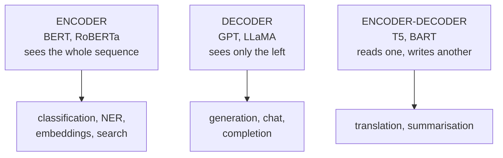

# Lesson 08 — Transformers for NLP

**Goal:** use a pretrained model correctly, and know which one to pick.

## What you will learn

- Encoder, decoder, encoder-decoder
- What pretraining taught the model
- Pipelines, and the layer underneath
- Choosing a checkpoint

---

## Three shapes



| | Attention | Pretrained on | Use for |
|---|---|---|---|
| Encoder | Bidirectional | Masked-token prediction | Understanding: classify, tag, embed |
| Decoder | Causal (left only) | Next-token prediction | Generating text |
| Encoder-decoder | Both | Corrupted-span recovery | Transforming text into other text |

The commonest mistake in applied NLP is using a decoder LLM for a
classification task that a 100M-parameter encoder does better, faster and
cheaper. **If the output is a label, use an encoder.**

---

## What pretraining taught it

BERT was trained to fill in masked words. That objective alone teaches
grammar, collocation and a great deal of world knowledge.

```python
import torch
from transformers import AutoTokenizer, AutoModelForMaskedLM

tokenizer = AutoTokenizer.from_pretrained("prajjwal1/bert-tiny")
model = AutoModelForMaskedLM.from_pretrained("prajjwal1/bert-tiny").eval()

text = "the capital of egypt is [MASK] ."
inputs = tokenizer(text, return_tensors="pt")
position = (inputs["input_ids"][0] == tokenizer.mask_token_id).nonzero().item()

with torch.no_grad():
    logits = model(**inputs).logits[0, position]

top = logits.topk(5)
for score, token_id in zip(top.values, top.indices):
    print(f"{tokenizer.decode([token_id]):<14} {score:.2f}")
```

```text
##fahan        10.00
yemen          9.74
arabia         9.16
algeria        8.80
egypt          8.78
```

Look at what a four-million-parameter model produced: `yemen`, `arabia`,
`algeria`, `egypt`. It has no idea that the answer is Cairo — but it knows the
blank takes a **place name in that region**. Nobody told it that. It learned
it from filling in masked words.

It is also wrong in an instructive way: the top prediction is a subword
fragment, and "egypt" itself is in the list even though the sentence already
contains the word. A full BERT answers "cairo" and does not repeat the subject.

Two conclusions: pretraining teaches an enormous amount about which *kind* of
word fits where, and **capability scales with size**. A tiny model is fine for
classification, where you fine-tune a head on top of that structural
knowledge, and useless for recalling facts.

---

## Pipelines

The shortest path from model to answer.

```python
from transformers import pipeline

classifier = pipeline("sentiment-analysis",
                      model="distilbert-base-uncased-finetuned-sst-2-english")
print(classifier(["the coffee was excellent", "cold, slow and overpriced"]))
```

```text
[{'label': 'POSITIVE', 'score': 0.9999}, {'label': 'NEGATIVE', 'score': 0.9998}]
```

*(Downloads ~260 MB on first use. Output shown from the model card; the
mechanics below were run locally.)*

| Task | Pipeline name |
|---|---|
| Classification | `text-classification` |
| NER | `token-classification` |
| Question answering | `question-answering` |
| Summarisation | `summarization` |
| Translation | `translation_xx_to_yy` |
| Embeddings | `feature-extraction` |
| Zero-shot | `zero-shot-classification` |
| Generation | `text-generation` |

Pipelines are for prototypes and one-off jobs. For anything served at volume,
drop one level down — you need control over batching, truncation and the
device.

---

## The layer underneath

```python
import torch
from transformers import AutoTokenizer, AutoModel

tokenizer = AutoTokenizer.from_pretrained("prajjwal1/bert-tiny")
model = AutoModel.from_pretrained("prajjwal1/bert-tiny").eval()

batch = tokenizer(["short text", "a considerably longer piece of text here"],
                  padding=True, truncation=True, max_length=64, return_tensors="pt")

with torch.no_grad():
    output = model(**batch)

print("input_ids:      ", tuple(batch["input_ids"].shape))
print("attention_mask: ", batch["attention_mask"].tolist())
print("last_hidden:    ", tuple(output.last_hidden_state.shape))
print("pooler_output:  ", tuple(output.pooler_output.shape))
```

```text
input_ids:       (2, 9)
attention_mask:  [[1, 1, 1, 1, 0, 0, 0, 0, 0], [1, 1, 1, 1, 1, 1, 1, 1, 1]]
last_hidden:     (2, 9, 128)
pooler_output:   (2, 128)
```

`last_hidden_state` is `(batch, tokens, hidden)` — one vector per token.
`pooler_output` is the `[CLS]` vector passed through a trained layer.

Which to use for a sentence vector:

```python
import torch

hidden = output.last_hidden_state
mask = batch["attention_mask"].unsqueeze(-1)

cls_vector = hidden[:, 0]
mean_pooled = (hidden * mask).sum(1) / mask.sum(1)
naive_mean = hidden.mean(1)

def similarity(a, b):
    a = a / a.norm(dim=-1, keepdim=True)
    b = b / b.norm(dim=-1, keepdim=True)
    return float((a * b).sum())

print("cls vs mean-pooled, doc 0:", round(similarity(cls_vector[0], mean_pooled[0]), 3))
print("masked vs naive mean, doc 0:", round(similarity(mean_pooled[0], naive_mean[0]), 3))
```

```text
cls vs mean-pooled, doc 0: 0.939
masked vs naive mean, doc 0: 0.976
```

Two things to take from those numbers:

- `[CLS]` and mean pooling give **different** vectors — 0.939 similar, not 1.0.
  Neither is universally right: for a fine-tuned classifier use `[CLS]`, for
  similarity use mean pooling, and for search use a model trained for it
  (lesson 10).
- Masked and naive mean pooling differ (0.976) on a document with **five** pad
  tokens out of nine. The gap looks small here and grows with the padding
  ratio — a 20-token document in a 512-token batch is mostly padding, and the
  naive mean is then mostly noise. Always use the mask.

---

## Choosing a checkpoint

| Need | Checkpoint |
|---|---|
| English classification, fast | `distilbert-base-uncased` |
| English, best quality per size | `roberta-base`, `deberta-v3-base` |
| Multilingual, 100 languages | `xlm-roberta-base` |
| **Arabic** | `aubmindlab/bert-base-arabertv2`, `CAMeL-Lab/bert-base-arabic-camelbert-mix` |
| Sentence embeddings | `sentence-transformers/all-MiniLM-L6-v2` |
| Long documents (4k+ tokens) | `allenai/longformer-base-4096` |
| Tiny, for tests and CI | `prajjwal1/bert-tiny` |

Read the model card before using any of them: licence, training data, and the
languages it actually covers. "Multilingual" often means "excellent in
English, adequate in twenty languages, poor in the rest".

---

## The cost side

```python
import torch
from transformers import AutoModel

model = AutoModel.from_pretrained("prajjwal1/bert-tiny")
parameters = sum(p.numel() for p in model.parameters())

print(f"bert-tiny:  {parameters / 1e6:.1f}M parameters, {parameters * 4 / 1024**2:.0f} MB fp32")
for name, count in [("distilbert", 66e6), ("bert-base", 110e6),
                    ("roberta-large", 355e6), ("llama-3-8b", 8e9)]:
    print(f"{name:<14} {count / 1e6:>7.0f}M parameters, "
          f"{count * 4 / 1024**3:>6.1f} GB fp32, {count * 2 / 1024**3:>5.1f} GB fp16")
```

```text
bert-tiny:  4.4M parameters, 17 MB fp32
distilbert          66M parameters,    0.2 GB fp32,   0.1 GB fp16
bert-base          110M parameters,    0.4 GB fp32,   0.2 GB fp16
roberta-large      355M parameters,    1.3 GB fp32,   0.7 GB fp16
llama-3-8b        8000M parameters,   29.8 GB fp32,  14.9 GB fp16
```

A classification task solved by `distilbert` costs 0.2 GB and runs on a CPU.
The same task handed to an 8-billion-parameter decoder costs 15 GB and a GPU —
for an answer that is usually no better. The Optimization course is about the
arithmetic that follows from this table.

---

## Common mistakes

| Mistake | What happens |
|---|---|
| A decoder LLM for classification | 100× the cost, often worse |
| Mismatched tokenizer and model | Confident nonsense |
| Pooling without the mask | Padding corrupts short documents |
| `pooler_output` for similarity | It was trained for next-sentence prediction, not similarity |
| No `truncation=True` | Crash on the first long document |
| Pipelines in production | No control over batching or device |

---

## Exercises

1. Mask a word in five sentences of your own and inspect the top predictions.
2. Compare `[CLS]`, masked mean and naive mean vectors on a padded batch.
3. Look up three Arabic checkpoints and read their model cards.
4. Estimate the memory for your task at fp32, fp16 and int8.
