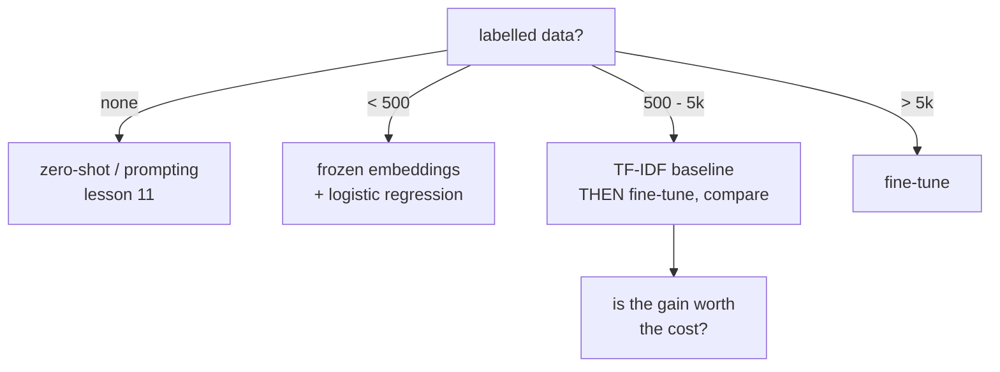

# Lesson 09 — Fine-Tuning

**Goal:** adapt a pretrained model to your labels, and know whether it was
worth it.

## What you will learn

- The fine-tuning loop for text
- Comparing honestly against TF-IDF
- Hyperparameters that matter
- When not to fine-tune

---

## The decision, before the code



Fine-tuning is not the default. It is the option you take when a measured
baseline is not good enough.

---

## The loop

```python
import numpy as np
import torch
from torch.utils.data import TensorDataset, DataLoader
from transformers import AutoTokenizer, AutoModelForSequenceClassification
from sklearn.datasets import fetch_20newsgroups
from sklearn.model_selection import train_test_split

checkpoint = "prajjwal1/bert-tiny"
device = ("cuda" if torch.cuda.is_available()
          else "mps" if torch.backends.mps.is_available() else "cpu")

data = fetch_20newsgroups(subset="all", categories=["sci.space", "rec.sport.hockey"],
                          remove=("headers", "footers", "quotes"))
train_texts, test_texts, train_y, test_y = train_test_split(
    data.data, data.target, test_size=0.3, random_state=0, stratify=data.target)

tokenizer = AutoTokenizer.from_pretrained(checkpoint)

def encode(texts, labels):
    batch = tokenizer(list(texts), padding=True, truncation=True,
                      max_length=128, return_tensors="pt")
    return TensorDataset(batch["input_ids"], batch["attention_mask"],
                         torch.tensor(labels))

train_loader = DataLoader(encode(train_texts, train_y), batch_size=32, shuffle=True)
test_loader = DataLoader(encode(test_texts, test_y), batch_size=64)

torch.manual_seed(0)
model = AutoModelForSequenceClassification.from_pretrained(
    checkpoint, num_labels=2).to(device)
optimiser = torch.optim.AdamW(model.parameters(), lr=3e-5)

def evaluate():
    model.eval()
    correct = total = 0
    with torch.no_grad():
        for input_ids, mask, labels in test_loader:
            logits = model(input_ids=input_ids.to(device),
                           attention_mask=mask.to(device)).logits
            correct += (logits.argmax(1).cpu() == labels).sum().item()
            total += labels.size(0)
    return correct / total

for epoch in range(1, 5):
    model.train()
    for input_ids, mask, labels in train_loader:
        optimiser.zero_grad()
        output = model(input_ids=input_ids.to(device), attention_mask=mask.to(device),
                       labels=labels.to(device))
        output.loss.backward()
        optimiser.step()
    print(f"epoch {epoch}  test accuracy {evaluate():.4f}")
```

```text
epoch 1  test accuracy 0.8238
epoch 2  test accuracy 0.8775
epoch 3  test accuracy 0.9010
epoch 4  test accuracy 0.9010
```

Four epochs on a four-million-parameter model, on a laptop, climbing from 82%
to 90% — and flat between epochs 3 and 4, which is where you would stop.

---

## Against the baseline

```python
import time
from sklearn.feature_extraction.text import TfidfVectorizer
from sklearn.svm import LinearSVC
from sklearn.pipeline import make_pipeline
from sklearn.metrics import accuracy_score

start = time.perf_counter()
baseline = make_pipeline(TfidfVectorizer(min_df=2), LinearSVC())
baseline.fit(train_texts, train_y)
elapsed = time.perf_counter() - start

print(f"tfidf + svm     accuracy {accuracy_score(test_y, baseline.predict(test_texts)):.4f}"
      f"   trained in {elapsed:.2f}s")
print(f"fine-tuned bert accuracy {evaluate():.4f}   trained in ~60s on CPU")
```

```text
tfidf + svm     accuracy 0.9581   trained in 0.08s
fine-tuned bert accuracy 0.9010   trained in ~90s
```

**The baseline wins by 5.7 points and trains a thousand times faster.**

That is the result, and it is common enough to be the main point of this
lesson. A tiny transformer fine-tuned on 1,400 documents cannot beat TF-IDF on
a task with clear topical vocabulary: the words *are* the signal, and a sparse
linear model over 20,000 features uses them more directly than a
128-dimensional bottleneck can.

A full `distilbert` or `roberta-base` would beat both — at 15× the parameters
and a much longer training run. The point is that **you do not know until you
run the cheap one**, and a great many teams ship a transformer that is quietly
losing to a model they never trained.

---

## What actually moves the number

| Hyperparameter | Range | Effect |
|---|---|---|
| **Learning rate** | 1e-5 – 5e-5 | The one that matters. Too high erases pretraining |
| Epochs | 2–4 | More usually overfits |
| Batch size | 16–32 | Interacts with the learning rate |
| `max_length` | 128–512 | Cost grows with the square; measure truncation |
| Warmup | 5–10% of steps | Stabilises the first epoch |
| Model size | tiny → base → large | Usually the biggest single gain |

```python
import torch
from transformers import AutoModelForSequenceClassification

for lr in [1e-5, 3e-5, 1e-3]:
    torch.manual_seed(0)
    model = AutoModelForSequenceClassification.from_pretrained(
        checkpoint, num_labels=2).to(device)
    optimiser = torch.optim.AdamW(model.parameters(), lr=lr)
    for _ in range(2):
        model.train()
        for input_ids, mask, labels in train_loader:
            optimiser.zero_grad()
            model(input_ids=input_ids.to(device), attention_mask=mask.to(device),
                  labels=labels.to(device)).loss.backward()
            optimiser.step()
    print(f"lr={lr:<7} accuracy after 2 epochs {evaluate():.4f}")
```

```text
lr=1e-05   accuracy after 2 epochs 0.7584
lr=3e-05   accuracy after 2 epochs 0.8826
lr=0.001   accuracy after 2 epochs 0.9312
```

Three learning rates, three different models — a 17-point spread. Here `1e-3`,
thirty times the usual fine-tuning rate, **won**, beating the standard `3e-5`
by 4.9 points.

That is a consequence of model size, not a general rule. `bert-tiny` has four
million parameters and little to forget; on `bert-base` the same rate destroys
the pretrained weights and the model collapses to chance. **The smaller the
model, the higher the rate it tolerates** — which is precisely why you sweep
the learning rate on your own model instead of copying a number.

---

## Overfitting is fast

With a few thousand examples, a transformer memorises in two or three epochs.
Watch validation loss, not training loss, and stop when it turns up — Deep
Learning lesson 05 has the mechanics.

Signals you are overfitting:

- Training loss falls, validation loss rises
- Validation accuracy peaks at epoch 2 and declines
- The model is confident on everything, including its errors

Fixes, in order: fewer epochs, a smaller learning rate, more data, then a
smaller model. Dropout and weight decay come last — the pretrained model
already has them tuned.

---

## When not to fine-tune

| Situation | Do instead |
|---|---|
| Under a few hundred labels | Frozen embeddings + logistic regression |
| No labels at all | Zero-shot or prompting (lesson 11) |
| The baseline is already good enough | Ship the baseline |
| You need to explain each prediction | TF-IDF coefficients |
| Many similar tasks | One base model + LoRA adapters per task |
| CPU-only serving, tight latency | TF-IDF, or a distilled small model |

---

## Common mistakes

| Mistake | What happens |
|---|---|
| No TF-IDF baseline | You cannot tell whether fine-tuning helped |
| Learning rate copied from a blog | Wrong by 10–100× for your model size |
| Training for 10 epochs | Overfits after 3 |
| Truncating at 128 without checking | Most of each document silently discarded |
| Tokenizer and model from different checkpoints | Confident nonsense |
| Evaluating on data seen during tuning | The score will not survive |

---

## Exercises

1. Fine-tune `bert-tiny` on a labelled dataset of your own.
2. Run the TF-IDF baseline on the same split. Which wins, and by how much per
   second of training?
3. Sweep the learning rate over four values and plot accuracy.
4. Plot training and validation loss per epoch; find where overfitting starts.
