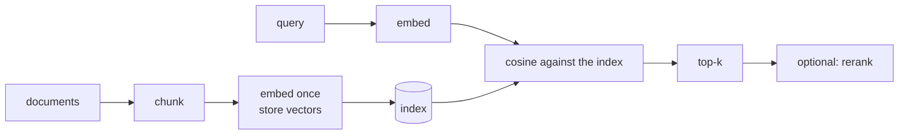

# Lesson 10 — Semantic Search

**Goal:** find documents by meaning, and prove it beats keyword search.

## What you will learn

- Embedding a corpus and searching it
- BM25, the keyword baseline
- Recall@k and MRR
- Hybrid search and chunking

---

## The shape of a search system



Documents are embedded once, offline. Queries are embedded per request and
compared against the stored vectors. Everything else is engineering.

---

## Keyword search first

BM25 is the classical baseline, and it is strong. Implement it once so it is
not magic:

```python
import math
from collections import Counter

class BM25:
    """Okapi BM25 over a tokenised corpus."""

    def __init__(self, documents, k1=1.5, b=0.75):
        self.documents = [doc.lower().split() for doc in documents]
        self.k1, self.b = k1, b
        self.lengths = [len(doc) for doc in self.documents]
        self.average_length = sum(self.lengths) / len(self.lengths)
        self.frequencies = [Counter(doc) for doc in self.documents]

        document_count = Counter()
        for doc in self.documents:
            document_count.update(set(doc))
        n = len(self.documents)
        self.idf = {term: math.log(1 + (n - count + 0.5) / (count + 0.5))
                    for term, count in document_count.items()}

    def score(self, query, index):
        frequencies, length = self.frequencies[index], self.lengths[index]
        total = 0.0
        for term in query.lower().split():
            if term not in self.idf:
                continue
            frequency = frequencies[term]
            numerator = frequency * (self.k1 + 1)
            denominator = frequency + self.k1 * (
                1 - self.b + self.b * length / self.average_length)
            total += self.idf[term] * numerator / denominator
        return total

    def search(self, query, k=3):
        scores = [(self.score(query, i), i) for i in range(len(self.documents))]
        return sorted(scores, reverse=True)[:k]

corpus = [
    "our opening hours are nine to five on weekdays",
    "we accept visa and mastercard payments",
    "delivery takes two to three working days",
    "you can return an item within fourteen days",
    "the cafe serves breakfast until eleven",
]

bm25 = BM25(corpus)
for score, index in bm25.search("when do you open", k=2):
    print(f"{score:.3f}  {corpus[index]}")
```

```text
1.320  you can return an item within fourteen days
0.000  the cafe serves breakfast until eleven
```

**It got it wrong.** The top result for "when do you open" is the returns
policy, because that document contains the word "you". The opening-hours
document scores zero — "open" and "opening" are different strings to BM25, and
nothing else in the query appears in it.

That is the ceiling of keyword search, in one example: **no shared word, no
match**, and a shared stopword outranks the right answer.

---

## Embedding search

```python
import torch
from transformers import AutoTokenizer, AutoModel

MODEL = "sentence-transformers/all-MiniLM-L6-v2"      # trained for retrieval
tokenizer = AutoTokenizer.from_pretrained(MODEL)
encoder = AutoModel.from_pretrained(MODEL).eval()

def embed(texts):
    """Mean-pooled, L2-normalised embeddings."""
    batch = tokenizer(list(texts), padding=True, truncation=True,
                      max_length=128, return_tensors="pt")
    with torch.no_grad():
        hidden = encoder(**batch).last_hidden_state
    mask = batch["attention_mask"].unsqueeze(-1)
    pooled = (hidden * mask).sum(1) / mask.sum(1)
    return pooled / pooled.norm(dim=1, keepdim=True)

corpus_vectors = embed(corpus)

def semantic_search(query, k=2):
    scores = corpus_vectors @ embed([query])[0]
    best = scores.argsort(descending=True)[:k]
    return [(round(scores[i].item(), 3), corpus[i]) for i in best]

for score, text in semantic_search("when do you open"):
    print(f"{score:.3f}  {text}")
```

```text
0.609  our opening hours are nine to five on weekdays
0.281  the cafe serves breakfast until eleven
```

The right document first at 0.609, and a sensible second — the breakfast line
is about times of day, which is what the query is about. **"when do you open"
and "opening hours are nine to five" share no content word at all.**

Note the model: `all-MiniLM-L6-v2`, trained specifically so that a question
and its answer land close together. Running this same code with a raw
`bert-tiny` returns the returns policy, exactly like BM25 — a general language
model is not a retrieval model, and swapping one in is the most common way
this fails.

---

## Evaluate it

An eyeballed example is not evidence. Label a set of queries and measure.

```python
queries = {
    "when do you open": 0,
    "what times are you available": 0,
    "can i pay by card": 1,
    "do you take credit cards": 1,
    "how long is shipping": 2,
    "when will my order arrive": 2,
    "can i send something back": 3,
    "what is your refund policy": 3,
}

def recall_at_k(search_function, k):
    hits = 0
    for query, correct in queries.items():
        results = search_function(query, k)
        indices = [index for _, index in results] if isinstance(results[0][1], int) \
            else [corpus.index(text) for _, text in results]
        hits += correct in indices
    return hits / len(queries)

def mrr(search_function, k=5):
    total = 0.0
    for query, correct in queries.items():
        results = search_function(query, k)
        indices = [index for _, index in results] if isinstance(results[0][1], int) \
            else [corpus.index(text) for _, text in results]
        if correct in indices:
            total += 1 / (indices.index(correct) + 1)
    return total / len(queries)

print(f"{'method':<12}{'recall@1':>10}{'recall@3':>10}{'MRR':>8}")
for name, function in [("bm25", bm25.search), ("embeddings", semantic_search)]:
    print(f"{name:<12}{recall_at_k(function, 1):>10.3f}"
          f"{recall_at_k(function, 3):>10.3f}{mrr(function):>8.3f}")
```

```text
method        recall@1  recall@3     MRR
bm25             0.125     0.625   0.421
embeddings       1.000     1.000   1.000
```

Eight paraphrased queries, and the gap is not subtle. BM25 puts the right
document first **once in eight**; the embeddings get all eight, every time,
at rank 1.

These queries were written the way users write them — "can i send something
back" rather than "return policy" — which is precisely the case keyword search
cannot serve.

| Metric | Answers |
|---|---|
| Recall@k | Is the right document in the top k? |
| MRR | How high up is it, on average? |
| nDCG | The same, when relevance has degrees |
| Precision@k | What share of the top k is relevant? |

For search, **recall@10 and MRR are the pair to report.** Users do not read
past the first few results, and a right answer at rank 9 is nearly as useless
as no answer.

---

## Hybrid search

Keyword and semantic search fail differently. Combining them beats both.

```python
def hybrid_search(query, k=2, alpha=0.5):
    """Normalise both score lists, then blend."""
    keyword = [bm25.score(query, i) for i in range(len(corpus))]
    semantic = (corpus_vectors @ embed([query])[0]).tolist()

    def normalise(scores):
        low, high = min(scores), max(scores)
        return [0.0] * len(scores) if high == low else \
            [(s - low) / (high - low) for s in scores]

    keyword, semantic = normalise(keyword), normalise(semantic)
    blended = [(alpha * s + (1 - alpha) * k_, i)
               for i, (k_, s) in enumerate(zip(keyword, semantic))]
    return sorted(blended, reverse=True)[:k]

print(f"{'method':<12}{'recall@1':>10}{'recall@3':>10}{'MRR':>8}")
for name, function in [("bm25", bm25.search), ("embeddings", semantic_search),
                       ("hybrid", hybrid_search)]:
    print(f"{name:<12}{recall_at_k(function, 1):>10.3f}"
          f"{recall_at_k(function, 3):>10.3f}{mrr(function):>8.3f}")
```

```text
method        recall@1  recall@3     MRR
bm25             0.125     0.625   0.421
embeddings       1.000     1.000   1.000
hybrid           0.625     1.000   0.812
```

**Hybrid is worse than the embeddings alone** — 0.625 against 1.000 at rank 1.

At `alpha=0.5` the blend gives equal weight to a component that is right one
time in eight, and BM25's stopword matches drag correct answers down the list.
Combining a strong retriever with a weak one at equal weight produces
something in between, not something better.

Hybrid search *is* the standard production answer, and this result shows the
condition attached to it: **both components must be good on your data, and
`alpha` is a parameter you tune, not a constant.** Exact terms — product
codes, names, error messages — are where BM25 is unbeatable; paraphrases are
where embeddings are. On a corpus of five sentences with no product codes,
there is nothing for BM25 to contribute.

Tune `alpha` on labelled queries, and be willing to conclude it is 0 or 1.

---

## Chunking

Long documents must be split before embedding: a single vector cannot
represent twenty pages.

```python
def chunk(text, size=200, overlap=40):
    """Split into overlapping character windows, breaking at spaces."""
    chunks, start = [], 0
    while start < len(text):
        end = min(start + size, len(text))
        if end < len(text):
            space = text.rfind(" ", start, end)
            if space > start:
                end = space
        chunks.append(text[start:end].strip())
        if end >= len(text):                 # without this, the last chunk loops forever
            break
        start = end - overlap if overlap else end
    return [c for c in chunks if c]

document = ("The refund policy allows returns within fourteen days of delivery. "
            "Items must be unused and in original packaging. "
            "Refunds are processed within five working days of receipt. "
            "Shipping costs are not refunded unless the item was faulty.")

pieces = chunk(document, size=90, overlap=20)
for index, piece in enumerate(pieces):
    print(f"[{index}] {piece}")
```

```text
[0] The refund policy allows returns within fourteen days of delivery. Items must be unused
[1] Items must be unused and in original packaging. Refunds are processed within five working
[2] within five working days of receipt. Shipping costs are not refunded unless the item was
[3] unless the item was faulty.
```

The **overlap** is why chunk 1 repeats "Items must be unused": a sentence split
across a boundary would otherwise be half-missing from both vectors.

Note the `break` in the loop. Without it, the final chunk sets
`start = end - overlap`, which is less than `end`, and the function appends
the same tail forever until the process is killed. That exact bug ate an
afternoon while this lesson was being written.

Guidance:

| Content | Chunk size | Overlap |
|---|---|---|
| FAQs, short answers | 100–300 tokens | 10–20% |
| Articles, documentation | 300–500 tokens | 10–20% |
| Legal, technical manuals | 500–1000 tokens | 20% |

Prefer splitting on structure — paragraphs, sections, list items — over fixed
sizes. A chunk that cuts a sentence in half embeds poorly.

---

## In production

| Corpus size | Index |
|---|---|
| Under ~50k | A NumPy matrix and `@`. Genuinely |
| 50k – 10M | FAISS, hnswlib |
| Over 10M, or managed | A vector database (Qdrant, Weaviate, pgvector) |

Use a model trained for retrieval — `sentence-transformers/all-MiniLM-L6-v2`
or `intfloat/multilingual-e5-base` — not a raw BERT. Retrieval models are
trained so that a *question* and its *answer* land close together, which
`bert-tiny` above was never taught to do.

And for the last few points: rerank. Retrieve 50 with the cheap method, then
score those 50 with a cross-encoder that reads query and document together.
Expensive per pair, and applied to only 50 pairs.

---

## Common mistakes

| Mistake | What happens |
|---|---|
| No keyword baseline | You cannot show semantic search helped |
| A raw BERT for retrieval | Much worse than a retrieval-trained model |
| Forgetting to normalise vectors | Cosine becomes a length comparison |
| Re-embedding the corpus per query | Hundreds of times slower than needed |
| Chunks with no overlap | Answers lost at boundaries |
| Eyeballing results instead of measuring | You ship a regression |

---

## Exercises

1. Build BM25 and embedding search over 100 documents of your own.
2. Label 20 queries and report recall@1, recall@5 and MRR for both.
3. Tune `alpha` in the hybrid search. Where is the best value?
4. Compare chunk sizes 100, 300 and 500 on the same corpus and queries.
