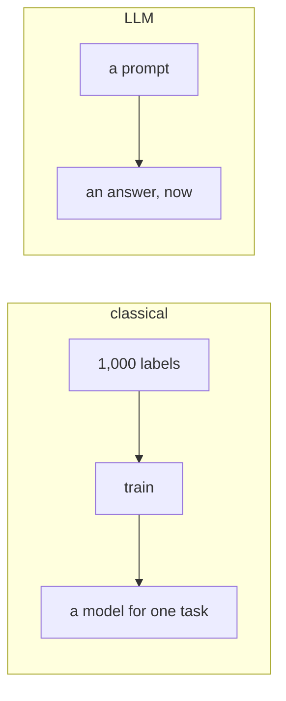
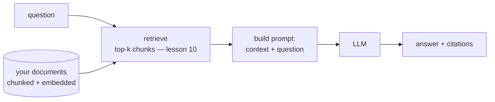

# Lesson 11 — LLMs, Prompting and RAG

**Goal:** build a system around a language model, and evaluate it.

## What you will learn

- When an LLM is the right tool, and when it is not
- Prompting that survives contact with real inputs
- RAG, and why retrieval quality dominates
- Evaluating a generative system

---

## What changed

Everything before this lesson learns a task from labelled examples. An
instruction-following LLM does a task **described in words**, with no training
at all.



That is a genuine change, and it is not free:

| | Fine-tuned encoder | LLM prompt |
|---|---|---|
| Labels needed | Hundreds to thousands | None |
| Time to first result | Days | Minutes |
| Cost per 1,000 calls | ~$0.001 (your CPU) | $0.50 – $30 |
| Latency | 5–50 ms | 500–5,000 ms |
| Consistency | Deterministic | Varies per call |
| Explainability | Coefficients or attributions | A story it generated |

**Use an LLM when you have no labels, the task is open-ended, or you need a
prototype today.** Move to a fine-tuned encoder once the task is stable and
the volume is real — 100× cheaper and 100× faster for classification.

---

## Prompting, concretely

A prompt is an interface. Write it like one.

```python
PROMPT = """You are a support ticket classifier for a coffee shop.

Classify the ticket into exactly one category:
- BILLING: payments, refunds, invoices
- DELIVERY: late, missing or damaged orders
- PRODUCT: complaints about the coffee or food itself
- OTHER: anything else

Rules:
- Answer with the category name only. No explanation.
- If the ticket mentions several issues, choose the primary one.
- If you cannot tell, answer OTHER.

Ticket: {ticket}
Category:"""

print(PROMPT.format(ticket="my latte arrived cold and two hours late"))
```

```text
You are a support ticket classifier for a coffee shop.

Classify the ticket into exactly one category:
- BILLING: payments, refunds, invoices
- DELIVERY: late, missing or damaged orders
- PRODUCT: complaints about the coffee or food itself
- OTHER: anything else

Rules:
- Answer with the category name only. No explanation.
- If the ticket mentions several issues, choose the primary one.
- If you cannot tell, answer OTHER.

Ticket: my latte arrived cold and two hours late
Category:
```

Six things make that prompt work, and all six are missing from most prompts:

1. **A role**, so the model knows the domain.
2. **A closed set of outputs**, defined explicitly.
3. **A definition per category** — not just a name.
4. **A format instruction**: the answer only.
5. **A tie-break rule** for multi-issue inputs.
6. **An escape hatch** (`OTHER`), so it does not invent a category.

Without 4, you get "Sure! This is a DELIVERY issue because...". Without 6, an
ambiguous ticket gets a confident wrong label.

**Few-shot** examples raise accuracy further, and are usually worth their
tokens:

```python
FEW_SHOT = """Ticket: I was charged twice for one order
Category: BILLING

Ticket: the cappuccino tasted burnt
Category: PRODUCT

Ticket: {ticket}
Category:"""
```

Three to five examples, covering the boundaries you care about. Include one
hard case — the model copies your judgement on it.

---

## Parsing the output

A model returns text. Your system needs a value.

```python
VALID = {"BILLING", "DELIVERY", "PRODUCT", "OTHER"}

def parse_category(raw, valid=VALID, default="OTHER"):
    """Extract a valid category from a model response, or fall back."""
    cleaned = raw.strip().upper()
    for candidate in valid:                       # exact, then contained
        if cleaned == candidate:
            return candidate, "exact"
    for candidate in valid:
        if candidate in cleaned:
            return candidate, "contained"
    return default, "fallback"

for response in ["DELIVERY", "  delivery  ", "Category: DELIVERY",
                 "This is a DELIVERY issue because the order was late",
                 "I'm not sure about this one"]:
    print(f"{response[:45]:<47} -> {parse_category(response)}")
```

```text
DELIVERY                                        -> ('DELIVERY', 'exact')
  delivery                                      -> ('DELIVERY', 'exact')
Category: DELIVERY                              -> ('DELIVERY', 'contained')
This is a DELIVERY issue because the order wa   -> ('DELIVERY', 'contained')
I'm not sure about this one                     -> ('OTHER', 'fallback')
```

**Log the parse mode.** A rising `fallback` rate is the earliest signal that a
model update has changed the output format — and it will, without warning.

Where the API supports it, constrain the output instead: JSON mode, function
calling, or a grammar. Parsing free text is a fallback, not a plan.

---

## RAG

An LLM knows nothing about your documents, and it will confidently invent
facts about them. Retrieval-augmented generation fixes that by putting the
relevant text **into the prompt**.



```python
def build_rag_prompt(question, chunks):
    """Context-grounded prompt with citations and an explicit refusal path."""
    context = "\n\n".join(f"[{i + 1}] {chunk}" for i, chunk in enumerate(chunks))
    return f"""Answer the question using ONLY the context below.

Rules:
- If the context does not contain the answer, reply exactly: NOT_IN_CONTEXT
- Cite the sources you used as [1], [2] after each claim.
- Do not use knowledge from outside the context.

Context:
{context}

Question: {question}
Answer:"""

chunks = [
    "Refunds are processed within five working days of receipt.",
    "Returns are accepted within fourteen days of delivery.",
]
print(build_rag_prompt("how long do refunds take?", chunks))
```

```text
Answer the question using ONLY the context below.

Rules:
- If the context does not contain the answer, reply exactly: NOT_IN_CONTEXT
- Cite the sources you used as [1], [2] after each claim.
- Do not use knowledge from outside the context.

Context:
[1] Refunds are processed within five working days of receipt.
[2] Returns are accepted within fourteen days of delivery.

Question: how long do refunds take?
Answer:
```

Three elements carry the weight:

- **"ONLY the context"** — the instruction that suppresses invented answers.
- **`NOT_IN_CONTEXT`** — a machine-checkable refusal. Without an explicit way
  to say "I don't know", the model will guess.
- **Citations** — so a human can verify, and so you can measure grounding.

**Retrieval quality is the whole system.** If the right chunk is not in the
top-k, no prompt engineering recovers it — the model cannot cite what it
cannot see. Lesson 10's recall@k *is* your RAG ceiling, and it is where the
effort belongs.

---

## The cost arithmetic

```python
def call_cost(input_tokens, output_tokens, input_price, output_price):
    """Cost per 1,000 calls, given prices per million tokens."""
    return ((input_tokens * input_price + output_tokens * output_price)
            / 1_000_000 * 1000)

scenarios = [
    ("classification, short prompt", 150, 5),
    ("classification, few-shot", 600, 5),
    ("RAG, 5 chunks", 2_000, 200),
    ("RAG, 20 chunks", 8_000, 400),
]

print(f"{'scenario':<30}{'in':>7}{'out':>6}{'$/1k calls':>12}")
for name, input_tokens, output_tokens in scenarios:
    cost = call_cost(input_tokens, output_tokens, input_price=0.50, output_price=1.50)
    print(f"{name:<30}{input_tokens:>7}{output_tokens:>6}{cost:>12.3f}")
```

```text
scenario                           in   out  $/1k calls
classification, short prompt      150     5       0.083
classification, few-shot          600     5       0.307
RAG, 5 chunks                    2000   200       1.300
RAG, 20 chunks                   8000   400       4.600
```

*(Prices are an illustrative $0.50/$1.50 per million tokens; use your
provider's.)*

Retrieving 20 chunks instead of 5 costs **3.5× more per call** and is often
worse — irrelevant context distracts the model. Retrieve fewer, better chunks;
that is a retrieval problem, and it is cheaper to fix there.

At a million calls a month, the first row is $83 and the last is $4,600. The
choice between them is an engineering decision worth making deliberately.

---

## Evaluating a generative system

This is where most LLM projects fail. "It looks good" is not a result.

| Question | Measure |
|---|---|
| Is the answer correct? | Human labels on a fixed set, or an LLM judge with rubric |
| Is it grounded in the context? | Every claim traceable to a cited chunk |
| Does it refuse when it should? | Answer rate on questions with no answer in the corpus |
| Is retrieval finding the answer? | Recall@k — lesson 10 |
| Is it stable? | Same input, several runs — how often does the answer change? |

```python
def evaluate_rag(system, test_cases):
    """test_cases: (question, expected_substring or None for unanswerable)."""
    results = {"answered": 0, "correct": 0, "correct_refusals": 0,
               "hallucinated": 0, "total": len(test_cases)}

    for question, expected in test_cases:
        answer = system(question)
        refused = answer.strip() == "NOT_IN_CONTEXT"

        if expected is None:
            results["correct_refusals"] += refused
            results["hallucinated"] += not refused        # answered the unanswerable
        else:
            results["answered"] += not refused
            results["correct"] += (not refused) and expected.lower() in answer.lower()
    return results
```

Build a set of 50 questions, including **ten with no answer in your corpus**.
The hallucination rate on those ten is the number that decides whether you can
ship. A system that answers every question is a system that invents answers.

---

## Common mistakes

| Mistake | What happens |
|---|---|
| An LLM for high-volume classification | 100× the cost of a fine-tuned encoder |
| No output format instruction | Prose where you expected a label |
| No refusal path | Confident invention on unanswerable questions |
| Parsing free text with no fallback | Crashes when the format changes |
| Tuning the prompt while retrieval is broken | The ceiling is retrieval, not wording |
| No unanswerable questions in the eval set | You never measure hallucination |
| Temperature > 0 for classification | Different answers on the same input |

---

## Exercises

1. Write a classification prompt with all six elements; test it on ten real
   inputs.
2. Add three few-shot examples and measure the change.
3. Build a RAG prompt over ten of your own documents, with citations.
4. Write 20 evaluation questions, five of them unanswerable, and measure the
   refusal rate.
