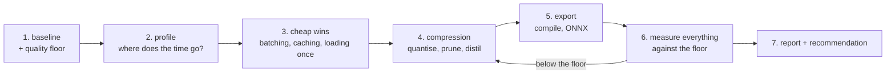

# Project 5 — Make a Real Model Cheaper

**Do this after the twelve lessons.**

You take a working model — ideally your Project 4 model — and make it
measurably faster, smaller or cheaper **without** dropping below a quality
floor you declare in advance. Then you prove it with numbers a sceptic could
reproduce.

Projects 3 and 4 asked whether you can build a model. This one asks whether
you can be trusted to **change one that already works**: every optimisation is
a trade, and the deliverable is the evidence that you understood the trade you
made.

---

## The pipeline



Step 1 is the one people skip, and without it nothing that follows means
anything.

---

## Requirements

### 1. The baseline and the budget

Before changing anything, write and measure:

```text
Model:            <what it is, how many parameters>
Quality metric:   <the metric from the model's own project>
Quality floor:    <the number below which you will not ship>
Latency now:      p50 ___ ms, p99 ___ ms, at batch ___
Throughput now:   ___ samples/s at the knee (batch ___)
Memory now:       ___ MB weights, ___ MB peak inference
Cost now:         $___ per 1,000 requests
Hardware:         <exact — CPU model or GPU, thread count>
```

Every number measured with a proper benchmark: warmup, ≥100 repeats,
percentiles, environment recorded (lesson 02). A single timed call is not a
baseline.

### 2. Profile before optimising

- A `torch.profiler` table, top 10 operations by self time
- **The share of end-to-end latency that is the model**, versus preprocessing,
  postprocessing and serialisation
- One sentence naming the bottleneck, with the number that identifies it

If the model is under half your latency, say so and optimise what is actually
slow. That is a legitimate and valuable result.

### 3. Apply at least four techniques

At least one from each half of the course:

| Training side | Inference side |
|---|---|
| Mixed precision | Quantisation (int8, and int4 if applicable) |
| Gradient accumulation / checkpointing | Pruning (report the *achieved* sparsity) |
| LoRA instead of full fine-tuning | Distillation to a smaller student |
| A better schedule, fewer epochs to target | `torch.compile`, TorchScript or ONNX |
| | Batching and caching |

For **each** technique, a row in the results table: what changed, latency,
throughput, memory, quality, and whether you kept it.

**Measure one change at a time.** Two at once and you cannot attribute either.

### 4. The results table

| Configuration | p50 ms | p99 ms | samples/s | Size MB | Quality | Kept? |
|---|---|---|---|---|---|---|
| Baseline | | | | | | — |
| + batching | | | | | | |
| + int8 | | | | | | |
| + distilled | | | | | | |
| + compiled | | | | | | |
| **Final** | | | | | | |

Every cell measured, not estimated. Include the configurations you **rejected**
and why — a technique that cost 3 points of quality for 5% latency is a finding
worth reporting.

### 5. Quality, checked properly

- The metric on the same held-out test set, for every configuration
- For classification: the confusion matrix for the final model, compared with
  the baseline's. Did the errors move to a different class?
- **Output drift**, not just the top-line metric: the maximum and mean change
  in the output probabilities. Lesson 08 showed accuracy surviving while the
  logits moved by 12 — argmax can be right for the wrong reasons.

### 6. The cost argument

- $ per 1,000 requests, before and after, with your real hardware prices
- The monthly figure at your real (or realistic) request volume
- The break-even point for any compile or conversion time
- A one-paragraph recommendation: what to deploy, and what not to bother with

### 7. Ship it

- The optimised artefact (`.pt`, `.onnx`, or a quantised checkpoint)
- A `Predictor` that loads it, validates input, batches, returns probabilities
- **An equivalence test**: the optimised model's outputs against the
  baseline's, with a stated tolerance, in your test suite
- A benchmark script that reproduces your whole table with one command

---

## Deliverables

```text
project-5/
├── README.md              baseline, technique-by-technique results, recommendation
├── benchmark.py           reproduces the results table
├── src/
│   ├── optimise.py        quantise / prune / distil / export
│   ├── serve.py           Predictor, batching, caching
│   └── profile_model.py   the profiler run
├── tests/
│   └── test_equivalence.py
├── models/
│   ├── baseline.pt
│   └── optimised.onnx     (or .pt)
└── results/
    ├── results.csv        every measurement
    └── figures/           latency vs batch, quality vs compression
```

---

## Marking

| Weight | Criterion |
|---|---|
| 20% | Baseline and budget: measured properly, quality floor stated first |
| 15% | Profiling, with the bottleneck identified by a number |
| 25% | Four techniques applied and measured **one at a time** |
| 15% | Quality checked, including output drift, not only the headline metric |
| 15% | Cost arithmetic and a defensible recommendation |
| 10% | Equivalence test and a reproducible benchmark script |

Automatic deductions: a benchmark without warmup; latency reported as a mean
with no percentiles; two changes measured together; a quantised or pruned model
shipped without a quality measurement; a pruned model whose achieved sparsity
was never printed; claimed speedups that the benchmark script does not
reproduce.

---

## Milestones

| Day | Done by end of day |
|---|---|
| 1 | Baseline measured, budget and floor written |
| 2 | Profiling; bottleneck identified |
| 3 | Cheap wins: batching, caching, loading once |
| 4 | Quantisation and pruning, each measured |
| 5 | Distillation, or LoRA on the training side |
| 6 | Export and compile; equivalence tests |
| 7 | Cost arithmetic, figures, README, recommendation |

---

## Before you submit

- [ ] Every number has warmup, repeats and percentiles behind it
- [ ] The environment is recorded with the results
- [ ] The quality floor was written **before** the first optimisation
- [ ] Each technique was measured alone
- [ ] Rejected techniques are reported, with the reason
- [ ] Output drift is measured, not just the metric
- [ ] The equivalence test passes at a stated tolerance
- [ ] `python benchmark.py` reproduces the table
- [ ] The recommendation says what **not** to do, as well as what to do
