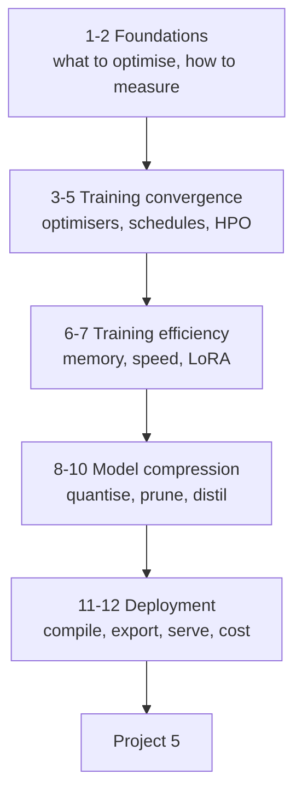

# Optimization in AI Models — Tayel AI Labs

The fourth course. You can train a model that works. This course is about
making it **train faster, fit in memory, respond quickly, and cost less** —
without quietly giving up the accuracy you earned.

Two halves:

- **Lessons 03–07 — training side.** Optimisers, schedules, hyperparameter
  search, memory and speed, parameter-efficient fine-tuning.
- **Lessons 08–12 — inference side.** Quantisation, pruning, distillation,
  compilation and export, serving and cost.

**Prerequisites:** [`../Deep-Learning`](../Deep-Learning), all thirteen
lessons. This course assumes you can write a training loop and read a loss
curve.

---

## The road



---

## Lessons

| # | Lesson | You will be able to |
|---|---|---|
| 01 | [What Are We Optimising](lessons/01-what-are-we-optimising.md) | Name the objective and its constraints |
| 02 | [Measuring Properly](lessons/02-measuring-properly.md) | Benchmark and profile without lying to yourself |
| 03 | [Optimisers](lessons/03-optimisers.md) | Choose SGD, Adam or AdamW deliberately |
| 04 | [Learning Rate Schedules](lessons/04-learning-rate-schedules.md) | Use warmup, cosine, one-cycle |
| 05 | [Hyperparameter Optimisation](lessons/05-hyperparameter-optimisation.md) | Spend a search budget well |
| 06 | [Training Speed and Memory](lessons/06-training-speed-and-memory.md) | Fit bigger models on the same card |
| 07 | [Parameter-Efficient Fine-Tuning](lessons/07-parameter-efficient-finetuning.md) | Implement and use LoRA |
| 08 | [Quantisation](lessons/08-quantisation.md) | Shrink a model 4× and measure the cost |
| 09 | [Pruning and Sparsity](lessons/09-pruning-and-sparsity.md) | Remove weights that do nothing |
| 10 | [Knowledge Distillation](lessons/10-knowledge-distillation.md) | Train a small model from a big one |
| 11 | [Compilation and Export](lessons/11-compilation-and-export.md) | Use `torch.compile`, TorchScript, ONNX |
| 12 | [Serving and Cost](lessons/12-serving-and-cost.md) | Do the arithmetic before the invoice |

## Then

- [`Project-5/`](Project-5/) — make a real model cheaper, and prove it

---

## The rule this whole course runs on

> **Measure. Change one thing. Measure again.**

Every optimisation in these twelve lessons is a trade. Quantisation trades
accuracy for size. Batching trades latency for throughput. Gradient
checkpointing trades compute for memory. An optimisation you have not measured
is a guess, and roughly half of all guesses in this field make things slower.

Lesson 02 exists because measuring is harder than it looks — and a
benchmark that lies is worse than no benchmark.

---

## Setup

```bash
python3 -m venv .venv
source .venv/bin/activate
pip install -r requirements.txt
```

Everything here runs on a laptop CPU. Where a technique only pays off on a GPU
— mixed precision, `torch.compile`'s biggest wins — the lesson says so and
shows the code without pretending the laptop numbers are the point.
