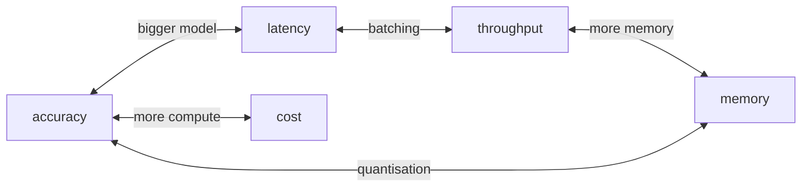
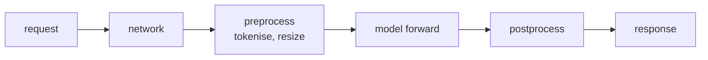
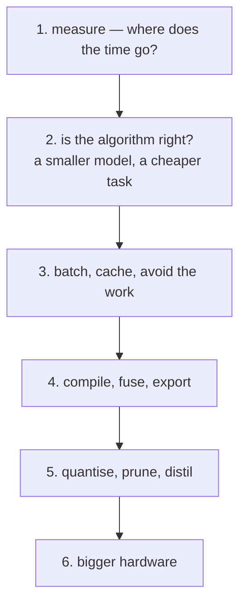

# Lesson 01 — What Are We Optimising

**Goal:** name the objective before touching anything.

## What you will learn

- The five things people mean by "optimise"
- Which trades against which
- Latency versus throughput
- Writing a budget you can hold a model to

---

## Five different goals

"Make the model better" is not a goal. These are:

| Goal | Measured as | Typical driver |
|---|---|---|
| **Accuracy** | Your task metric | Product quality |
| **Latency** | ms per request, p50 and p99 | A user is waiting |
| **Throughput** | requests or samples per second | Batch jobs, cost per unit |
| **Memory** | peak GB, model size on disk | It must fit on the card, or the phone |
| **Cost** | $ per 1,000 requests, $ per training run | The invoice |

They fight each other:



A bigger model raises accuracy and latency together. Batching raises
throughput and latency together. Quantisation cuts memory and, sometimes,
accuracy. **There is no move that improves everything**, and anyone who tells
you otherwise has not measured the other axis.

---

## Latency and throughput are not the same

This confuses people for years, so be concrete.

```python
import time
import torch
import torch.nn as nn

torch.manual_seed(0)
model = nn.Sequential(nn.Linear(128, 512), nn.ReLU(), nn.Linear(512, 10)).eval()

def timed(batch_size, repeats=50):
    """Return (latency per batch in ms, samples per second)."""
    x = torch.randn(batch_size, 128)
    with torch.inference_mode():
        for _ in range(5):                    # warmup
            model(x)
        start = time.perf_counter()
        for _ in range(repeats):
            model(x)
        elapsed = (time.perf_counter() - start) / repeats
    return elapsed * 1000, batch_size / elapsed

print(f"{'batch':>6}{'latency ms':>13}{'samples/s':>13}")
for batch_size in [1, 8, 64, 512]:
    latency, throughput = timed(batch_size)
    print(f"{batch_size:>6}{latency:>13.3f}{throughput:>13.0f}")
```

```text
 batch   latency ms    samples/s
     1        0.010       105024
     8        0.017       480360
    64        0.026      2486402
   512        0.186      2754330
```

Read both columns. Going from batch 1 to batch 512:

- **Latency per batch got 19× worse** — 0.010 ms to 0.186 ms.
- **Throughput got 26× better** — 105k samples/s to 2.75M.

Which is "faster"? Neither. They are different questions:

- **A user waiting for a page**: optimise latency. Batch size 1, or dynamic
  batching with a few milliseconds' window.
- **Scoring ten million rows overnight**: optimise throughput. Use the largest
  batch that fits.

And notice the diminishing return: 64 → 512 multiplies the batch by eight and
buys **11% more throughput** for **7× the latency**. The hardware was already
saturated at 64. **Find that knee on your own hardware** — it is usually far
lower than people assume, and everything past it is latency you paid for
nothing.

---

## p50 is not the number that matters

```python
import time
import torch
import torch.nn as nn
import numpy as np

torch.manual_seed(0)
model = nn.Sequential(nn.Linear(128, 512), nn.ReLU(), nn.Linear(512, 10)).eval()
x = torch.randn(8, 128)

with torch.inference_mode():
    for _ in range(20):
        model(x)
    timings = []
    for _ in range(500):
        start = time.perf_counter()
        model(x)
        timings.append((time.perf_counter() - start) * 1000)

timings = np.array(timings)
print(f"mean   {timings.mean():.3f} ms")
print(f"p50    {np.percentile(timings, 50):.3f} ms")
print(f"p95    {np.percentile(timings, 95):.3f} ms")
print(f"p99    {np.percentile(timings, 99):.3f} ms")
print(f"max    {timings.max():.3f} ms")
```

```text
mean   0.021 ms
p50    0.017 ms
p95    0.033 ms
p99    0.049 ms
max    0.174 ms
```

The slowest call is **10× the median**, and p99 is nearly 3× it — on an idle
laptop running identical work five hundred times. On a real service that tail
is garbage collection, a cold cache, a noisy neighbour, or a request that took
a different path.

Users experience the tail. A page that loads in 40 ms nineteen times and 500 ms
on the twentieth feels unreliable, not fast. **Report p50 and p99 together**,
always, and set your budget on p99.

---

## Where the time actually goes

Before optimising a model, check that the model is the problem.



In real services, the model is frequently **not** the bottleneck. Common
surprises, all of which the author of the model does not expect:

- Image decoding and resizing costing more than the forward pass
- Tokenisation on the critical path for short texts
- JSON serialisation of a large response
- A synchronous database lookup for features
- Loading the model per request (lesson 13 of the Deep Learning course)

Lesson 02 is about finding out. Optimising a forward pass that is 8% of your
latency caps your improvement at 8%, no matter how clever you are.

---

## Write the budget down

Before you start, fill this in. It turns arguments into arithmetic:

```text
Task:               ticket classification
Quality floor:      macro F1 >= 0.82   (below this, do not ship)
Latency budget:     p99 <= 150 ms      (measured at the API, not the model)
Throughput:         >= 200 req/s at peak
Memory:             <= 4 GB per replica
Cost ceiling:       <= $0.40 per 1,000 requests
Hardware:           CPU only, 4 vCPU  (no GPU budget approved)
```

Every decision later refers to this. "Should we quantise?" becomes "does
quantising keep F1 above 0.82 while bringing p99 under 150 ms?" — a question
with an answer.

The **quality floor** is the important line. Without it, optimisation becomes a
slide towards a fast model that nobody checks the accuracy of.

---

## The order of operations



The order matters because the early steps are cheap and reversible and the
later ones cost accuracy or money. Distilling a model before you have checked
whether you are loading it per request is a mistake people make every week.

---

## Common mistakes

| Mistake | What happens |
|---|---|
| "Optimise the model" with no stated goal | Effort spent on the wrong axis |
| Reporting the mean latency | The tail, which users feel, is invisible |
| Optimising before profiling | You speed up 8% of the runtime |
| No quality floor | A fast model that is quietly wrong |
| Comparing latency at different batch sizes | A meaningless comparison |
| Benchmarking with no warmup | Lesson 02 — the first calls are not representative |

---

## Exercises

1. Write the budget block above for a model you have built.
2. Measure latency and throughput at batch sizes 1, 8, 64, 256. Where is the
   knee on your machine?
3. Collect 500 timings and report mean, p50, p95, p99. How big is the tail?
4. For a service you know, estimate what share of the total latency is the
   model. What is the best possible speedup from optimising it?
