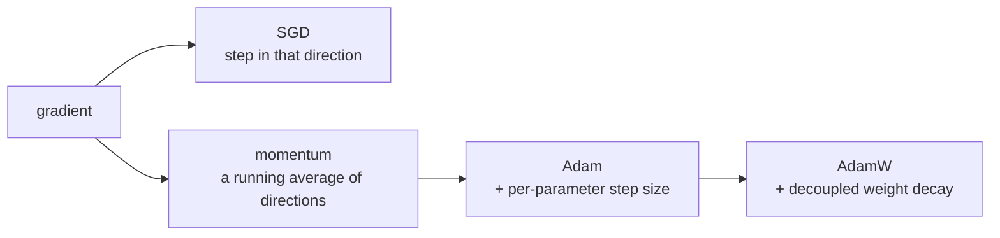

# Lesson 03 — Optimisers

**Goal:** know what each optimiser does to a weight, and choose on purpose.

## What you will learn

- The update rule, from SGD to AdamW
- Momentum, adaptive rates, and decoupled decay
- Memory cost per optimiser
- Gradient clipping

---

## The update rule

Every optimiser answers one question: given `w.grad`, how far do I move `w`?

```text
SGD:              w -= lr * g
+ momentum:       v = β·v + g          ;  w -= lr * v
Adam:             per-parameter lr, scaled by the recent gradient magnitude
AdamW:            Adam, with weight decay applied separately
```



---

## Seeing the difference

A convex problem with badly scaled features — the situation every real dataset
is in:

```python
import torch

def run(optimiser_name, steps=100, lr=0.1):
    """Fit y = Xw on an ill-conditioned problem; return the final loss."""
    torch.manual_seed(0)
    X = torch.randn(512, 20)
    X[:, 0] *= 50.0                       # one feature on a very different scale
    true_w = torch.randn(20, 1)
    y = X @ true_w + 0.1 * torch.randn(512, 1)

    w = torch.zeros(20, 1, requires_grad=True)
    optimisers = {
        "SGD":          torch.optim.SGD([w], lr=lr / 1000),
        "SGD+momentum": torch.optim.SGD([w], lr=lr / 1000, momentum=0.9),
        "Adam":         torch.optim.Adam([w], lr=lr),
        "AdamW":        torch.optim.AdamW([w], lr=lr, weight_decay=0.01),
    }
    optimiser = optimisers[optimiser_name]

    for _ in range(steps):
        optimiser.zero_grad()
        loss = ((X @ w - y) ** 2).mean()
        loss.backward()
        optimiser.step()
    return loss.item()

for name in ["SGD", "SGD+momentum", "Adam", "AdamW"]:
    print(f"{name:<14} final loss {run(name):10.4f}")
```

```text
SGD            final loss     7.6769
SGD+momentum   final loss     5.6642
Adam           final loss     0.0792
AdamW          final loss     0.0249
```

One feature is 50× the scale of the others, so its gradient is 50× larger.
Plain SGD must use a learning rate small enough for that feature, which leaves
the other nineteen crawling — after 100 steps it is still at loss 7.7.

Momentum accumulates the consistent directions and improves it to 5.7. Adam
gives **each parameter its own effective step size**, normalising the scale
difference away entirely, and reaches 0.079 — **97 times lower than SGD**, in
the same number of steps.

This is why Adam is the default: it is forgiving about things you got wrong.

---

## Momentum

```python
import torch

for beta in [0.0, 0.5, 0.9, 0.99]:
    torch.manual_seed(0)
    X = torch.randn(512, 20)
    X[:, 0] *= 50.0
    true_w = torch.randn(20, 1)
    y = X @ true_w + 0.1 * torch.randn(512, 1)

    w = torch.zeros(20, 1, requires_grad=True)
    optimiser = torch.optim.SGD([w], lr=1e-4, momentum=beta)
    for _ in range(100):
        optimiser.zero_grad()
        loss = ((X @ w - y) ** 2).mean()
        loss.backward()
        optimiser.step()
    print(f"momentum={beta:<5} final loss {loss.item():10.4f}")
```

```text
momentum=0.0   final loss     7.6769
momentum=0.5   final loss     7.3947
momentum=0.9   final loss     5.6642
momentum=0.99  final loss  1085.2882
```

0.9 is the standard value and the table shows why. Below it the gains are
small; at 0.99 the loss is **1085** — 140 times worse than using no momentum
at all. Momentum is a heavy ball: useful downhill, and perfectly capable of
rolling straight past the target.

---

## Adam's memory cost

```python
import torch
import torch.nn as nn

def optimiser_state_bytes(model, optimiser, steps=2):
    """Take a couple of steps, then measure the optimiser's stored state."""
    x = torch.randn(8, 512)
    for _ in range(steps):
        optimiser.zero_grad()
        model(x).sum().backward()
        optimiser.step()
    total = 0
    for state in optimiser.state.values():
        for value in state.values():
            if torch.is_tensor(value):
                total += value.numel() * value.element_size()
    return total

model_a = nn.Sequential(nn.Linear(512, 2048), nn.ReLU(), nn.Linear(2048, 512))
model_b = nn.Sequential(nn.Linear(512, 2048), nn.ReLU(), nn.Linear(2048, 512))

weights = sum(p.numel() * p.element_size() for p in model_a.parameters())
sgd_state = optimiser_state_bytes(model_a, torch.optim.SGD(model_a.parameters(), lr=0.01))
adam_state = optimiser_state_bytes(model_b, torch.optim.Adam(model_b.parameters(), lr=0.01))

print(f"weights:           {weights / 1024**2:.2f} MB")
print(f"SGD state:         {sgd_state / 1024**2:.2f} MB")
print(f"Adam state:        {adam_state / 1024**2:.2f} MB")
print(f"Adam total (w+g+s): {(weights * 2 + adam_state) / 1024**2:.2f} MB")
```

```text
weights:           8.01 MB
SGD state:         0.00 MB
Adam state:        16.02 MB
Adam total (w+g+s): 32.04 MB
```

Adam stores two extra tensors per parameter, so its state is **twice the
weights**. Add the gradients and training needs 4× the model size before a
single activation.

| Optimiser | State per parameter | Total memory (weights = 1) |
|---|---|---|
| SGD | 0 | 2× (weights + gradients) |
| SGD + momentum | 1 | 3× |
| Adam / AdamW | 2 | 4× |
| 8-bit Adam (`bitsandbytes`) | 2, quantised | ~2.5× |

On a 7-billion-parameter model in fp16 that is 14 GB of weights and 56 GB of
training memory. This arithmetic is why lesson 07 (LoRA) exists.

---

## Adam versus AdamW

Both penalise large weights; they differ in where the penalty is applied.

```python
import torch
import torch.nn as nn

def final_weight_norm(optimiser_class, decay, steps=200):
    torch.manual_seed(0)
    layer = nn.Linear(20, 1)
    optimiser = optimiser_class(layer.parameters(), lr=0.01, weight_decay=decay)
    X = torch.randn(256, 20)
    y = torch.randn(256, 1)
    for _ in range(steps):
        optimiser.zero_grad()
        ((layer(X) - y) ** 2).mean().backward()
        optimiser.step()
    return layer.weight.norm().item()

for decay in [0.0, 0.1]:
    adam = final_weight_norm(torch.optim.Adam, decay)
    adamw = final_weight_norm(torch.optim.AdamW, decay)
    print(f"decay={decay:<4} Adam ‖w‖ {adam:.4f}   AdamW ‖w‖ {adamw:.4f}")
```

```text
decay=0.0  Adam ‖w‖ 0.2857   AdamW ‖w‖ 0.2857
decay=0.1  Adam ‖w‖ 0.2704   AdamW ‖w‖ 0.2853
```

With no decay they are identical, as they must be. With `weight_decay=0.1`
they are not: Adam ends at 0.2704 and AdamW at 0.2853 — **the same number
means two different amounts of regularisation.**

Why: Adam adds the penalty to the gradient, after which it passes through the
per-parameter adaptive scaling. A parameter with small recent gradients gets a
large effective decay; one with large gradients gets almost none. The strength
you set is not the strength you get, and it varies per parameter and over time.

AdamW applies the decay directly to the weight — exactly `lr × weight_decay ×
w`, every step, for every parameter.

Neither number here is "better"; one is *predictable*. That is the whole
argument, and it is why **`AdamW` is what you use whenever
`weight_decay > 0`** — a value you tune on one model means the same thing on
the next.

---

## Choosing

| Situation | Optimiser | Learning rate |
|---|---|---|
| Anything, first attempt | `AdamW` | 1e-3 |
| Fine-tuning a pretrained model | `AdamW` | 2e-5 – 5e-5 |
| Vision, chasing the last point | `SGD` + momentum 0.9 + schedule | 0.1 with cosine |
| Very large models, memory bound | 8-bit Adam, or Adafactor | as above |
| Sparse embeddings | `SparseAdam`, `Adagrad` | task-dependent |

Start with AdamW. Move to SGD with a schedule only when you are on a
benchmark, have time, and can measure the difference.

---

## Gradient clipping

```python
import torch
import torch.nn as nn

torch.manual_seed(0)
model = nn.Sequential(nn.Linear(20, 64), nn.ReLU(), nn.Linear(64, 1))
x = torch.randn(32, 20) * 100.0            # large inputs -> large gradients
y = torch.randn(32, 1)

model.zero_grad()
((model(x) - y) ** 2).mean().backward()

before = torch.nn.utils.clip_grad_norm_(model.parameters(), max_norm=1.0)
after = torch.sqrt(sum((p.grad ** 2).sum() for p in model.parameters()))

print(f"gradient norm before clipping: {before:.2f}")
print(f"after clipping:                {after:.2f}")
```

```text
gradient norm before clipping: 8736.21
after clipping:                1.00
```

A single bad batch produced a gradient norm of 8,736 — where a healthy one is
near 1. Without clipping, that single step throws the weights somewhere
useless and the loss becomes `nan` a few batches later.

`clip_grad_norm_` rescales the whole gradient so its norm is at most
`max_norm`, keeping the **direction** and limiting the **size**. Put it between
`backward()` and `step()`:

```python
loss.backward()
torch.nn.utils.clip_grad_norm_(model.parameters(), max_norm=1.0)
optimiser.step()
```

`max_norm=1.0` is standard for transformers, and it is mandatory for RNNs.

---

## Common mistakes

| Mistake | What happens |
|---|---|
| `weight_decay` on plain `Adam` | Weaker and less predictable than intended |
| SGD with an Adam-sized learning rate | Diverges |
| Adam with an SGD-sized learning rate (0.1) | Unstable, poor final loss |
| Clipping after `step()` | It does nothing |
| Momentum 0.99 by default | Overshoots badly |
| Forgetting Adam's 2× state in memory planning | Out of memory at 4× the weights |

---

## Exercises

1. Reproduce the four-optimiser table on a dataset of your own.
2. Sweep momentum over `[0, 0.5, 0.9, 0.95, 0.99]` and find where it breaks.
3. Measure the optimiser state of SGD, momentum and Adam on one model.
4. Train without clipping on deliberately huge inputs, then with it.
