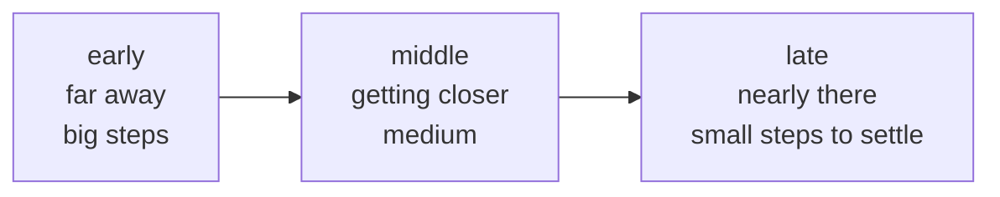

# Lesson 04 — Learning Rate Schedules

**Goal:** change the learning rate during training, on purpose.

## What you will learn

- Why a constant rate is a compromise
- Step, cosine, one-cycle
- Warmup, and when it is required
- Finding a starting rate

---

## Why change it at all

Early in training you are far from a good solution and want big steps. Late in
training you are close and want small ones, or you bounce around the minimum
forever.



A constant learning rate has to be small enough for the end, which makes the
beginning slow — or large enough for the beginning, which stops it settling.

---

## The schedules

```python
import torch
import torch.nn as nn

def rates(scheduler_name, epochs=20, base_lr=0.1):
    """Return the learning rate at each epoch, for one schedule."""
    model = nn.Linear(4, 2)
    optimiser = torch.optim.SGD(model.parameters(), lr=base_lr)
    schedulers = {
        "constant": None,
        "step":     torch.optim.lr_scheduler.StepLR(optimiser, step_size=5, gamma=0.5),
        "cosine":   torch.optim.lr_scheduler.CosineAnnealingLR(optimiser, T_max=epochs),
        "exponential": torch.optim.lr_scheduler.ExponentialLR(optimiser, gamma=0.85),
    }
    scheduler = schedulers[scheduler_name]

    values = []
    for _ in range(epochs):
        values.append(optimiser.param_groups[0]["lr"])
        optimiser.step()
        if scheduler is not None:
            scheduler.step()
    return values

for name in ["constant", "step", "cosine", "exponential"]:
    values = rates(name)
    shown = [round(v, 4) for v in values[::4]]
    print(f"{name:<12} {shown}")
```

```text
constant     [0.1, 0.1, 0.1, 0.1, 0.1]
step         [0.1, 0.1, 0.05, 0.025, 0.0125]
cosine       [0.1, 0.0905, 0.0655, 0.0345, 0.0095]
exponential  [0.1, 0.0522, 0.0272, 0.0142, 0.0074]
```

| Schedule | Shape | Use |
|---|---|---|
| `StepLR` | Drops by a factor every N epochs | The classic vision recipe |
| `CosineAnnealingLR` | Smooth fall to near zero | The modern default |
| `ExponentialLR` | Constant decay factor | Simple, can decay too fast |
| `ReduceLROnPlateau` | Drops when validation stalls | When you cannot predict the schedule |
| `OneCycleLR` | Up, then down | Fast convergence, vision |

**Cosine is the default worth starting from.** It needs one number — the total
number of steps — and it anneals smoothly to almost zero, which is exactly the
"settle at the end" behaviour you want.

---

## Does it help? Measure

```python
import torch
import torch.nn as nn
from torch.utils.data import TensorDataset, DataLoader

def train(schedule, epochs=20, base_lr=0.05):
    torch.manual_seed(0)
    X = torch.randn(2_000, 20)
    y = (X[:, 0] * 2 + X[:, 1] - X[:, 2] > 0).long()
    loader = DataLoader(TensorDataset(X[:1_600], y[:1_600]), batch_size=64, shuffle=True)

    torch.manual_seed(0)
    model = nn.Sequential(nn.Linear(20, 64), nn.ReLU(), nn.Linear(64, 2))
    optimiser = torch.optim.SGD(model.parameters(), lr=base_lr, momentum=0.9)
    scheduler = (torch.optim.lr_scheduler.CosineAnnealingLR(optimiser, T_max=epochs)
                 if schedule == "cosine" else None)
    loss_fn = nn.CrossEntropyLoss()

    for _ in range(epochs):
        model.train()
        for batch_X, batch_y in loader:
            optimiser.zero_grad()
            loss_fn(model(batch_X), batch_y).backward()
            optimiser.step()
        if scheduler is not None:
            scheduler.step()

    model.eval()
    with torch.no_grad():
        val_loss = loss_fn(model(X[1_600:]), y[1_600:]).item()
        accuracy = (model(X[1_600:]).argmax(1) == y[1_600:]).float().mean().item()
    return val_loss, accuracy

for schedule in ["constant", "cosine"]:
    loss, accuracy = train(schedule)
    print(f"{schedule:<9} val loss {loss:.4f}   accuracy {accuracy:.4f}")
```

```text
constant  val loss 0.0522   accuracy 0.9775
cosine    val loss 0.0559   accuracy 0.9800
```

A quarter of a point of accuracy — and a slightly **worse** validation loss.

That is the honest result on a 2,000-row toy problem, and it is worth sitting
with. The difference is well inside the noise of a single run; reporting
"cosine wins" from this table would be exactly the mistake ML lesson 11 warned
about.

Schedules earn their keep on long runs with large models, where the constant
rate spends its last epochs bouncing around a minimum it cannot settle into.
On a 20-epoch run over a simple function there is little to settle into.

Check yours the same way, on your own data, before believing a tutorial.

---

## Warmup

Starting at full learning rate can destroy a model in its first few steps —
particularly a transformer, where the attention weights are random and the
gradients are large and badly scaled.

```python
import torch
import torch.nn as nn

model = nn.Linear(4, 2)
optimiser = torch.optim.AdamW(model.parameters(), lr=1e-3)

warmup_steps, total_steps = 100, 1_000

def lr_lambda(step):
    """Linear warmup, then cosine decay. Returns a multiplier on the base lr."""
    if step < warmup_steps:
        return step / max(1, warmup_steps)
    progress = (step - warmup_steps) / max(1, total_steps - warmup_steps)
    return 0.5 * (1.0 + torch.cos(torch.tensor(3.14159 * progress)).item())

scheduler = torch.optim.lr_scheduler.LambdaLR(optimiser, lr_lambda)

for step in range(total_steps):
    optimiser.step()
    scheduler.step()
    if step in (0, 50, 100, 300, 600, 999):
        print(f"step {step:>4}  lr {optimiser.param_groups[0]['lr']:.6f}")
```

```text
step    0  lr 0.000010
step   50  lr 0.000510
step  100  lr 0.001000
step  300  lr 0.000882
step  600  lr 0.000411
step  999  lr 0.000000
```

The rate climbs from nearly zero to the full `1e-3` over 100 steps, then eases
back down. This "warmup then cosine" is the standard recipe for training and
fine-tuning transformers, and `transformers` ships it as
`get_linear_schedule_with_warmup`.

Warmup is **required** when: you are training a transformer, using a large
batch size, or using a learning rate near the edge of stability. It is
harmless otherwise — 5–10% of total steps is the usual budget.

---

## OneCycle

```python
import torch
import torch.nn as nn

model = nn.Linear(4, 2)
optimiser = torch.optim.SGD(model.parameters(), lr=0.01)
scheduler = torch.optim.lr_scheduler.OneCycleLR(
    optimiser, max_lr=0.1, total_steps=100)

values = []
for _ in range(100):
    values.append(optimiser.param_groups[0]["lr"])
    optimiser.step()
    scheduler.step()

print("start:", round(values[0], 5))
print("peak: ", round(max(values), 5), "at step", values.index(max(values)))
print("end:  ", round(values[-1], 8))
```

```text
start: 0.004
peak:  0.1 at step 29
end:   4e-07
```

Up for the first 30%, down for the rest, ending far below where it started.
The high middle acts as a regulariser — large steps skip past sharp minima —
and this schedule often reaches a given accuracy in noticeably fewer epochs.

**`OneCycleLR` steps per batch, not per epoch.** Call `scheduler.step()` inside
the batch loop and set `total_steps = epochs * len(loader)`.

---

## Finding a starting rate

Rather than guessing, sweep: raise the learning rate exponentially over a few
hundred steps and watch the loss.

```python
import torch
import torch.nn as nn

torch.manual_seed(0)
X = torch.randn(1_000, 20)
y = (X[:, 0] + X[:, 1] > 0).long()

print(f"{'lr':>10}{'loss after 30 steps':>22}")
for exponent in range(-5, 1):
    lr = 10.0 ** exponent
    torch.manual_seed(0)
    model = nn.Sequential(nn.Linear(20, 64), nn.ReLU(), nn.Linear(64, 2))
    optimiser = torch.optim.SGD(model.parameters(), lr=lr, momentum=0.9)
    loss_fn = nn.CrossEntropyLoss()
    for _ in range(30):
        optimiser.zero_grad()
        loss = loss_fn(model(X), y)
        loss.backward()
        optimiser.step()
    print(f"{lr:>10.0e}{loss.item():>22.4f}")
```

```text
     1e-05                0.7273
     1e-04                0.7234
     1e-03                0.6884
     1e-02                0.4919
     1e-01                0.0737
     1e+00                0.0004
```

Read it as a curve, not a winner: the loss falls steadily until it stops
falling or explodes. **Pick roughly one order of magnitude below the lowest
point**, because the fastest rate is usually not the most stable one over a
full run.

Here the loss is still falling at `1e+0`, so the sweep says: go higher and
find where it breaks. Note also how little happens below `1e-3` — three orders
of magnitude that barely move the loss from its starting 0.69, which is why
sweeping by powers of ten beats agonising over 3e-4 versus 4e-4.

(This is a linearly separable toy problem, so it tolerates an enormous rate.
A real model would diverge long before 1.0 — which is exactly what the sweep
is for: finding *your* edge, not copying someone else's.)

---

## Common mistakes

| Mistake | What happens |
|---|---|
| `scheduler.step()` per batch for an epoch scheduler | The rate collapses in the first epoch |
| `OneCycleLR` stepped per epoch | The cycle never completes |
| `scheduler.step()` before `optimiser.step()` | A warning, and a skipped first rate |
| No warmup on a transformer | Loss spikes or `nan` in the first steps |
| `T_max` not equal to the real number of epochs | The cosine ends in the wrong place |
| Tuning the schedule before the base rate | Backwards — find the rate first |

---

## Exercises

1. Plot all four schedules over 50 epochs on one chart.
2. Train with and without cosine on a dataset of yours and compare.
3. Implement warmup + cosine with `LambdaLR` and plot the result.
4. Run the learning-rate sweep on your own model and pick a value.
