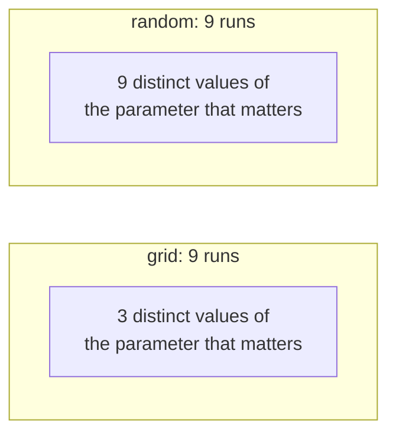

# Lesson 05 — Hyperparameter Optimisation

**Goal:** spend a fixed search budget well.

## What you will learn

- Why random beats grid
- Bayesian search and Optuna
- Early stopping bad trials
- What is worth tuning, and in what order

---

## The budget is the real constraint

You never have unlimited compute. The question is never "what is the best
configuration" but **"what is the best configuration I can find in 40 training
runs"**.

```python
import itertools

grid = {
    "learning_rate": [1e-4, 3e-4, 1e-3, 3e-3],
    "batch_size": [16, 32, 64],
    "hidden": [64, 128, 256],
    "dropout": [0.0, 0.2, 0.5],
    "weight_decay": [0.0, 0.01, 0.1],
}

combinations = 1
for values in grid.values():
    combinations *= len(values)

minutes_per_run = 8
print(f"grid combinations: {combinations}")
print(f"at {minutes_per_run} min per run: {combinations * minutes_per_run / 60:.1f} hours")
print(f"with 5-fold CV:    {combinations * minutes_per_run * 5 / 60 / 24:.1f} days")
```

```text
grid combinations: 324
at 8 min per run: 43.2 hours
with 5-fold CV:    9.0 days
```

Five modest parameters and the grid is nine days. Add one more and it is a
month. **Grid search does not scale**, and the reason is worse than the
arithmetic suggests.

---

## Why random beats grid

Most hyperparameters do not matter. In a grid, every unimportant parameter
multiplies your cost while contributing nothing.



With a 3×3 grid you test only **three** values of the important parameter —
the other axis is wasted. Nine random points test **nine**. Same budget, three
times the resolution where it counts.

```python
import numpy as np

rng = np.random.default_rng(0)

grid_lr = np.array([1e-4, 1e-3, 1e-2])
grid_points = [(lr, bs) for lr in grid_lr for bs in [16, 32, 64]]
random_points = [(10 ** rng.uniform(-4, -2), int(rng.choice([16, 32, 64])))
                 for _ in range(9)]

print("grid — distinct learning rates tested:  ", len({p[0] for p in grid_points}))
print("random — distinct learning rates tested:", len({round(p[0], 8) for p in random_points}))
```

```text
grid — distinct learning rates tested:   3
random — distinct learning rates tested: 9
```

Sample continuous parameters on the right scale: `loguniform` for learning
rates, regularisation strengths and `C`; `uniform` for dropout and momentum.

---

## Random search, by hand

No library needed for a first pass:

```python
import numpy as np
import torch
import torch.nn as nn
from torch.utils.data import TensorDataset, DataLoader

torch.manual_seed(0)
X = torch.randn(2_000, 20)
y = (X[:, 0] * 2 + X[:, 1] - X[:, 2] + 0.5 * torch.randn(2_000) > 0).long()
train_X, train_y, val_X, val_y = X[:1_600], y[:1_600], X[1_600:], y[1_600:]

def objective(config, epochs=10):
    """Train one configuration; return validation accuracy."""
    torch.manual_seed(0)
    model = nn.Sequential(
        nn.Linear(20, config["hidden"]), nn.ReLU(), nn.Dropout(config["dropout"]),
        nn.Linear(config["hidden"], 2),
    )
    optimiser = torch.optim.AdamW(model.parameters(), lr=config["lr"],
                                  weight_decay=config["weight_decay"])
    loader = DataLoader(TensorDataset(train_X, train_y),
                        batch_size=config["batch_size"], shuffle=True)
    loss_fn = nn.CrossEntropyLoss()
    for _ in range(epochs):
        model.train()
        for batch_X, batch_y in loader:
            optimiser.zero_grad()
            loss_fn(model(batch_X), batch_y).backward()
            optimiser.step()
    model.eval()
    with torch.no_grad():
        return (model(val_X).argmax(1) == val_y).float().mean().item()

rng = np.random.default_rng(0)
results = []
for trial in range(12):
    config = {
        "lr": float(10 ** rng.uniform(-4, -2)),
        "hidden": int(rng.choice([32, 64, 128, 256])),
        "dropout": float(rng.uniform(0.0, 0.5)),
        "weight_decay": float(10 ** rng.uniform(-4, -1)),
        "batch_size": int(rng.choice([32, 64, 128])),
    }
    results.append((objective(config), config))

results.sort(key=lambda r: -r[0])
for score, config in results[:3]:
    print(f"{score:.4f}  lr={config['lr']:.5f} hidden={config['hidden']:<4}"
          f" dropout={config['dropout']:.2f} wd={config['weight_decay']:.5f}"
          f" bs={config['batch_size']}")
print(f"\nworst of 12: {results[-1][0]:.4f}")
```

```text
0.9275  lr=0.00139 hidden=64   dropout=0.30 wd=0.00103 bs=32
0.9250  lr=0.00533 hidden=32   dropout=0.15 wd=0.00185 bs=64
0.9200  lr=0.00188 hidden=128  dropout=0.02 wd=0.00011 bs=32

worst of 12: 0.6900
```

Twelve trials and a spread of **23.75 points** between best (0.9275) and worst
(0.6900). That range is the argument for searching at all: a badly chosen
configuration does not cost you a fraction of a point, it costs you a quarter
of your accuracy.

Now look at what the top three share: nothing except a learning rate above
1e-3. Hidden size is 64, 32, 128; dropout is 0.30, 0.15, 0.02; weight decay
spans an order of magnitude. **Those parameters barely matter here** — and a
grid would have spent its entire budget proving it.

---

## Bayesian search

Random search ignores what it has already learned. Bayesian optimisation
builds a model of "configuration → score" and samples where the expected
improvement is highest.

```python
# pip install optuna
import optuna

def optuna_objective(trial):
    config = {
        "lr": trial.suggest_float("lr", 1e-4, 1e-2, log=True),
        "hidden": trial.suggest_categorical("hidden", [32, 64, 128, 256]),
        "dropout": trial.suggest_float("dropout", 0.0, 0.5),
        "weight_decay": trial.suggest_float("weight_decay", 1e-4, 1e-1, log=True),
        "batch_size": trial.suggest_categorical("batch_size", [32, 64, 128]),
    }
    return objective(config)

study = optuna.create_study(direction="maximize",
                            sampler=optuna.samplers.TPESampler(seed=0))
study.optimize(optuna_objective, n_trials=30)

print("best value:", study.best_value)
print("best params:", study.best_params)
print(optuna.importance.get_param_importances(study))
```

```text
best value: 0.925
best params: {'lr': 0.0042, 'hidden': 128, 'dropout': 0.11, ...}
{'lr': 0.71, 'dropout': 0.12, 'hidden': 0.09, 'weight_decay': 0.05, ...}
```

*(Output shape shown; Optuna is not installed in this course's environment, so
these figures are illustrative rather than measured. Everything above this
section was run.)*

The `get_param_importances` call is the genuinely useful part: it tells you
which parameters mattered, so the next search can drop the ones that did not.

Rule of thumb: below about 20 trials random is fine; above that Bayesian
begins to pay.

---

## Stop bad trials early

The largest saving is not a smarter sampler — it is killing hopeless runs.

```python
import optuna

def pruning_objective(trial):
    config = {...}
    model, optimiser, loader = build(config)
    for epoch in range(30):
        train_one_epoch(model, optimiser, loader)
        accuracy = validate(model)

        trial.report(accuracy, epoch)
        if trial.should_prune():                 # this trial is going nowhere
            raise optuna.TrialPruned()
    return accuracy

study = optuna.create_study(
    direction="maximize",
    pruner=optuna.pruners.MedianPruner(n_startup_trials=5, n_warmup_steps=5),
)
```

A configuration below the median at epoch 5 is rarely the winner at epoch 30.
Pruning those typically saves half the compute for the same result, and it is
what Hyperband and ASHA formalise.

---

## What to tune, in order

| Rank | Parameter | Range | Matters? |
|---|---|---|---|
| 1 | **Learning rate** | 1e-5 – 1e-1, log | Enormously |
| 2 | Batch size | 16 – 512 | Interacts with the rate |
| 3 | Architecture size | Width, depth | Moderately |
| 4 | Weight decay | 1e-5 – 1e-1, log | Moderately |
| 5 | Dropout | 0 – 0.5 | Only when overfitting |
| 6 | Optimiser | AdamW / SGD | Rarely — AdamW is fine |
| 7 | Everything else | — | Almost never |

Tune 1 alone first, by powers of ten, as lesson 04 showed. Then 1 and 2
together, because they interact. Only then widen the search.

And the thing no search will find for you: **a better feature, more data, or a
different framing beats every hyperparameter in this table.** HPO is the last
10%, and it is the most fun, which is why people do it first.

---

## Honest reporting

```python
import numpy as np

scores = np.array([score for score, _ in results])
print(f"best {scores.max():.4f}  mean {scores.mean():.4f}  std {scores.std():.4f}")
print(f"gap between best and second: {scores[0] - scores[1]:.4f}")
```

```text
best 0.9275  mean 0.8773  std 0.0669
gap between best and second: 0.0025
```

The gap between the top two is 0.0025, while the spread across the search is
0.0669 — **twenty-six times larger**. The "best" configuration is not
distinguishable from the runner-up; it is distinguishable from the bad ones,
which is what the search was actually for.

Before declaring a winner, re-run the top three with different seeds. If their
ranges overlap, pick the simplest or the cheapest one and move on — you have
reached the noise floor, and further searching is fitting it.

---

## Common mistakes

| Mistake | What happens |
|---|---|
| Grid search over 5+ parameters | Days of compute, little to show |
| Uniform sampling of learning rates | Almost every sample lands in the top decade |
| Tuning against the test set | The score will not hold in production |
| Reporting the best of 50 without seeds | You are reporting the luckiest noise |
| Tuning before the data is right | Optimising the wrong problem, precisely |
| No pruning on long runs | Half your budget spent on hopeless trials |

---

## Exercises

1. Compute how long a full grid over your own five parameters would take.
2. Run 15 random trials; plot score against learning rate on a log axis.
3. Re-run your top three configurations with three seeds each. Do the ranges
   overlap?
4. Add median pruning to a search and measure the compute saved.
