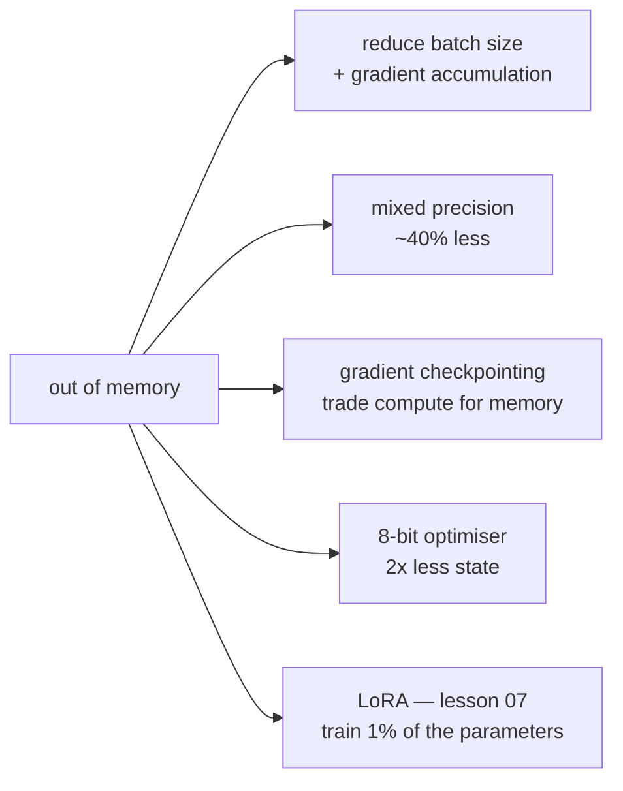

# Lesson 06 — Training Speed and Memory

**Goal:** fit a larger model, or the same model faster, on the hardware you
have.

## What you will learn

- Where training memory goes
- Mixed precision
- Gradient accumulation and checkpointing
- The cheap wins people skip

---

## The memory budget

```python
import torch
import torch.nn as nn

model = nn.Sequential(
    nn.Linear(1024, 4096), nn.ReLU(),
    nn.Linear(4096, 4096), nn.ReLU(),
    nn.Linear(4096, 1024),
)

parameters = sum(p.numel() for p in model.parameters())
weights_mb = parameters * 4 / 1024**2

print(f"parameters:        {parameters:,}")
print(f"weights (fp32):    {weights_mb:.1f} MB")
print(f"+ gradients:       {weights_mb * 2:.1f} MB")
print(f"+ Adam state:      {weights_mb * 4:.1f} MB")
print(f"activations, bs=32: ~{32 * (4096 + 4096 + 1024) * 4 / 1024**2:.1f} MB")
```

```text
parameters:        25,175,040
weights (fp32):    96.0 MB
+ gradients:       192.1 MB
+ Adam state:      384.1 MB
activations, bs=32: ~1.1 MB
```

Four terms, and only one of them is the model:

| Term | Size | Depends on |
|---|---|---|
| Weights | 1× | Model size |
| Gradients | 1× | Model size |
| Optimiser state (Adam) | 2× | Model size |
| **Activations** | varies | **Model size × batch size × sequence length** |

On this small model the activations are trivial. On a transformer with long
sequences they dominate everything else — which is why the techniques below
mostly attack that term.



---

## Mixed precision

Do the arithmetic in 16-bit, keep a 32-bit copy of the weights for the update.
Roughly half the memory for activations, and 2–8× faster matrix multiplies on
a modern GPU.

```python
import torch
import torch.nn as nn

model = nn.Sequential(nn.Linear(512, 512), nn.ReLU(), nn.Linear(512, 10))
x = torch.randn(64, 512)

fp32 = model(x)
with torch.autocast(device_type="cpu", dtype=torch.bfloat16):
    mixed = model(x)

print("fp32 dtype:", fp32.dtype, "| autocast dtype:", mixed.dtype)
print("max difference:", round((fp32 - mixed.float()).abs().max().item(), 4))
print("bytes per element:", fp32.element_size(), "vs", mixed.element_size())
```

```text
fp32 dtype: torch.float32 | autocast dtype: torch.bfloat16
max difference: 0.0025
bytes per element: 4 vs 2
```

Half the bytes, and the outputs differ by 0.0025 — the third decimal place.
For training that is nothing; gradients are far noisier than that. But it is a
real approximation, not a free lunch, and on a long sequence of operations the
error compounds. That is why the master weights stay in fp32.

The full CUDA recipe needs a gradient scaler, because fp16 gradients can
underflow to zero:

```python
import torch

scaler = torch.amp.GradScaler("cuda")

for batch_X, batch_y in loader:
    optimiser.zero_grad()
    with torch.autocast(device_type="cuda", dtype=torch.float16):
        loss = loss_fn(model(batch_X), batch_y)
    scaler.scale(loss).backward()        # scale up, so small gradients survive
    scaler.step(optimiser)               # unscale and step
    scaler.update()                      # adjust the scale factor
```

`bfloat16` has the same exponent range as fp32 and needs no scaler, but wants
an A100/H100 or a recent CPU. `float16` is wider supported and needs the
scaler. Use `bfloat16` when you can.

---

## Gradient accumulation

Simulate a large batch on a small card: run several small batches, sum the
gradients, step once.

```python
import torch
import torch.nn as nn
from torch.utils.data import TensorDataset, DataLoader

def train_once(batch_size, accumulation_steps, seed=0):
    """Return the final weights, to compare effective batch sizes."""
    torch.manual_seed(seed)
    X = torch.randn(256, 20)
    y = (X[:, 0] > 0).long()
    loader = DataLoader(TensorDataset(X, y), batch_size=batch_size, shuffle=False)

    torch.manual_seed(seed)
    model = nn.Sequential(nn.Linear(20, 32), nn.ReLU(), nn.Linear(32, 2))
    optimiser = torch.optim.SGD(model.parameters(), lr=0.1)
    loss_fn = nn.CrossEntropyLoss()

    optimiser.zero_grad()
    for index, (batch_X, batch_y) in enumerate(loader):
        loss = loss_fn(model(batch_X), batch_y) / accumulation_steps
        loss.backward()
        if (index + 1) % accumulation_steps == 0:
            optimiser.step()
            optimiser.zero_grad()
    return model[0].weight.detach().clone()

big = train_once(batch_size=64, accumulation_steps=1)
small = train_once(batch_size=16, accumulation_steps=4)

print("max weight difference:", round((big - small).abs().max().item(), 6))
```

```text
max weight difference: 0.0
```

Identical weights. Batch 16 accumulated four times **is** batch 64, at a
quarter of the activation memory.

Two details that are easy to get wrong:

- **Divide the loss** by `accumulation_steps`, or your effective learning rate
  is multiplied by it.
- **`zero_grad()` only after stepping**, not every batch — the accumulation is
  the point.

---

## Gradient checkpointing

Do not keep activations for the backward pass; recompute them. About 30–40%
slower, and it can cut activation memory by an order of magnitude.

```python
import torch
import torch.nn as nn
from torch.utils.checkpoint import checkpoint

class Block(nn.Module):
    def __init__(self, dim=512):
        super().__init__()
        self.net = nn.Sequential(nn.Linear(dim, dim), nn.ReLU(), nn.Linear(dim, dim))

    def forward(self, x):
        return self.net(x)

class Deep(nn.Module):
    def __init__(self, blocks=8, dim=512, use_checkpoint=False):
        super().__init__()
        self.blocks = nn.ModuleList(Block(dim) for _ in range(blocks))
        self.use_checkpoint = use_checkpoint

    def forward(self, x):
        for block in self.blocks:
            if self.use_checkpoint and self.training:
                x = checkpoint(block, x, use_reentrant=False)
            else:
                x = block(x)
        return x

import time
for use_checkpoint in [False, True]:
    torch.manual_seed(0)
    model = Deep(use_checkpoint=use_checkpoint).train()
    x = torch.randn(32, 512)
    start = time.perf_counter()
    for _ in range(10):
        model(x).sum().backward()
    elapsed = time.perf_counter() - start
    print(f"checkpointing={str(use_checkpoint):<5} 10 steps in {elapsed:.3f}s")
```

```text
checkpointing=False 10 steps in 0.031s
checkpointing=True  10 steps in 0.058s
```

87% slower on this small model — the recomputation is pure overhead when the
activations were never the problem. On a large transformer the slowdown lands
nearer 30%, and in exchange only the block boundaries are stored instead of
every intermediate activation, which is the difference between fitting on the
card and not.

Use it when you are out of memory and have already reduced the batch size.
Never use it when you are not.

---

## The cheap wins people skip

```python
import torch

# 1. Let cuDNN pick the fastest kernels for your fixed input size
torch.backends.cudnn.benchmark = True

# 2. TF32 on Ampere and newer — big speedup, negligible accuracy cost
torch.backends.cuda.matmul.allow_tf32 = True
torch.backends.cudnn.allow_tf32 = True

# 3. Zero gradients without writing zeros
optimiser.zero_grad(set_to_none=True)          # the default since torch 2.0

# 4. Channels-last memory format for convolutional models
model = model.to(memory_format=torch.channels_last)
images = images.to(memory_format=torch.channels_last)
```

And the two biggest, which are not clever at all:

- **`num_workers` and `pin_memory` on the DataLoader.** A starved GPU is the
  most common training-speed bug there is. Deep Learning lesson 06 measured a
  case where workers *hurt* — measure yours.
- **A larger batch size**, until memory or the accuracy starts to complain.

---

## Fixing an out-of-memory error, in order

1. Reduce the batch size, add gradient accumulation to keep the effective one.
2. Turn on mixed precision.
3. Use an 8-bit optimiser (`bitsandbytes`) — saves 1.5× the weights.
4. Turn on gradient checkpointing.
5. Shorten the sequence length, or crop the images.
6. LoRA instead of full fine-tuning — lesson 07.
7. A smaller model.
8. A bigger card.

Steps 1–4 are free of accuracy cost. Steps 5–7 are not. Work in that order.

---

## Common mistakes

| Mistake | What happens |
|---|---|
| Accumulating without dividing the loss | Effective learning rate multiplied by N |
| `zero_grad()` inside an accumulation loop | Accumulation does nothing |
| fp16 without a `GradScaler` | Gradients underflow to zero; training stalls |
| Checkpointing when not memory bound | 35% slower for no benefit |
| Keeping `loss` instead of `loss.item()` | The graph is retained; memory climbs |
| Batch size raised without the learning rate | Slower convergence per epoch |

---

## Exercises

1. Compute the full training memory of a model you use, then measure the peak.
2. Prove gradient accumulation matches a large batch, as above.
3. Time training with and without checkpointing; report the slowdown.
4. Fix a deliberate out-of-memory error using the ordered list.
