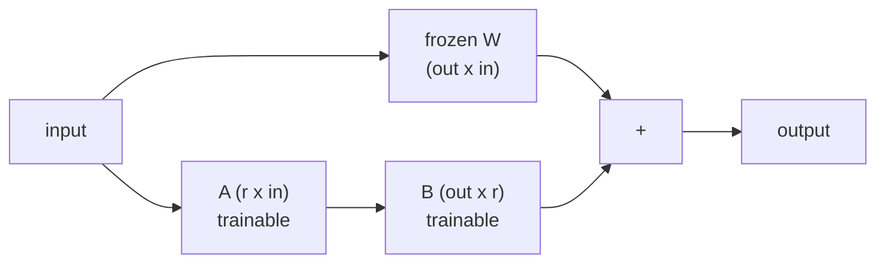

# Lesson 07 — Parameter-Efficient Fine-Tuning

**Goal:** adapt a large model by training a tiny fraction of it.

## What you will learn

- Why full fine-tuning is expensive
- LoRA, implemented from scratch
- Rank, alpha, and which layers to target
- QLoRA and the alternatives

---

## The problem

Fine-tuning a 7-billion-parameter model in fp16:

```python
parameters = 7_000_000_000
bytes_per_parameter = 2                      # fp16

weights = parameters * bytes_per_parameter
gradients = weights
adam_state = weights * 2 * 2                 # two fp32 moments

total = weights + gradients + adam_state
print(f"weights:      {weights / 1024**3:.1f} GB")
print(f"gradients:    {gradients / 1024**3:.1f} GB")
print(f"Adam state:   {adam_state / 1024**3:.1f} GB")
print(f"total:        {total / 1024**3:.1f} GB  (before activations)")
```

```text
weights:      13.0 GB
gradients:    13.0 GB
Adam state:   52.2 GB
total:        78.2 GB  (before activations)
```

Seventy-eight gigabytes before a single activation — two A100s to fine-tune
one model, and a separate 13 GB copy for every task you adapt it to.

LoRA's claim: **freeze the weights, and learn a small correction instead.**

---

## The idea

A fine-tuned weight matrix is the original plus a change:

```text
W_finetuned = W_original + ΔW
```

The insight is that `ΔW` is low-rank — the adaptation lives in far fewer
dimensions than the matrix has. So represent it as a product of two thin
matrices:

```text
ΔW = B · A        where A is (r × in) and B is (out × r), with r small
```



For a 4096×4096 layer with rank 8: 16.7M frozen parameters, and
`8×4096 + 4096×8 = 65,536` trainable — **0.4%**.

---

## Implementing it

```python
import torch
import torch.nn as nn

class LoRALinear(nn.Module):
    """A frozen Linear layer with a trainable low-rank correction."""

    def __init__(self, base_layer: nn.Linear, rank=8, alpha=16, dropout=0.0):
        super().__init__()
        self.base = base_layer
        for parameter in self.base.parameters():
            parameter.requires_grad = False          # freeze the original

        in_features = base_layer.in_features
        out_features = base_layer.out_features

        self.A = nn.Parameter(torch.empty(rank, in_features))
        self.B = nn.Parameter(torch.zeros(out_features, rank))
        nn.init.kaiming_uniform_(self.A, a=5 ** 0.5)  # A random, B zero
        self.scaling = alpha / rank
        self.dropout = nn.Dropout(dropout)

    def forward(self, x):
        return self.base(x) + self.dropout(x) @ self.A.T @ self.B.T * self.scaling

torch.manual_seed(0)
base = nn.Linear(512, 512)
lora = LoRALinear(base, rank=8, alpha=16)

x = torch.randn(4, 512)
print("identical at init:", bool(torch.allclose(base(x), lora(x), atol=1e-6)))

total = sum(p.numel() for p in lora.parameters())
trainable = sum(p.numel() for p in lora.parameters() if p.requires_grad)
print(f"total {total:,}  trainable {trainable:,}  ({100 * trainable / total:.2f}%)")
```

```text
identical at init: True
total 270,848  trainable 8,192  (3.02%)
```

Two design decisions do real work here:

- **`B` starts at zero**, so `B·A = 0` and the wrapped layer is *exactly* the
  original at step 0. Training starts from the pretrained model, not from a
  perturbed one. Initialise both randomly and you damage the model before
  learning anything.
- **`scaling = alpha / rank`** decouples the learning rate from the rank, so
  changing `r` does not force you to retune everything.

---

## Applying it to a model

```python
import torch
import torch.nn as nn

def apply_lora(model, rank=8, alpha=16, target_names=("q", "v")):
    """Wrap matching Linear layers with LoRA; freeze everything else."""
    for parameter in model.parameters():
        parameter.requires_grad = False

    for name, module in model.named_children():
        if isinstance(module, nn.Linear) and any(t in name for t in target_names):
            setattr(model, name, LoRALinear(module, rank, alpha))
        else:
            apply_lora(module, rank, alpha, target_names)
    return model

class TinyAttention(nn.Module):
    def __init__(self, dim=512):
        super().__init__()
        self.q = nn.Linear(dim, dim)
        self.k = nn.Linear(dim, dim)
        self.v = nn.Linear(dim, dim)
        self.out = nn.Linear(dim, dim)

torch.manual_seed(0)
model = nn.Sequential(TinyAttention(), TinyAttention())
before = sum(p.numel() for p in model.parameters())

apply_lora(model, rank=8)
trainable = sum(p.numel() for p in model.parameters() if p.requires_grad)

print(f"model parameters: {before:,}")
print(f"trainable with LoRA: {trainable:,}  ({100 * trainable / before:.3f}%)")
```

```text
model parameters: 2,101,248
trainable with LoRA: 32,768  (1.559%)
```

Four wrapped layers (`q` and `v` in two blocks), 1.6% trainable. The optimiser
state shrinks with it — Adam now stores moments for 33 thousand parameters
instead of two million, which is where the memory saving actually comes
from.

**Which layers to target:** the attention projections (`q`, `v`) is the
standard starting point from the paper. Adding `k` and `o`, and the MLP
layers, raises quality and cost. Start with `q,v`.

---

## Does it learn?

The target here is the base layer plus a **genuinely rank-2** change, which is
exactly the situation LoRA assumes:

```python
import torch
import torch.nn as nn

torch.manual_seed(0)
base = nn.Linear(64, 64)
for parameter in base.parameters():
    parameter.requires_grad = False

U = torch.randn(64, 2) * 0.5
V = torch.randn(2, 64) * 0.5
X = torch.randn(256, 64)
target = base(X) + X @ V.T @ U.T           # a rank-2 shift

for rank in [1, 2, 4, 16]:
    torch.manual_seed(0)
    lora = LoRALinear(base, rank=rank, alpha=2 * rank)
    optimiser = torch.optim.AdamW(
        [p for p in lora.parameters() if p.requires_grad], lr=1e-2)
    for _ in range(400):
        optimiser.zero_grad()
        loss = ((lora(X) - target) ** 2).mean()
        loss.backward()
        optimiser.step()
    print(f"rank {rank:<3} final loss {loss.item():.6f}")

print("base weights unchanged:", bool(torch.equal(base.weight, lora.base.weight)))
```

```text
rank 1   final loss 3.350749
rank 2   final loss 0.000004
rank 4   final loss 0.000137
rank 16  final loss 0.000007
base weights unchanged: True
```

This is what rank means, in one table. **Rank 1 cannot represent the change at
all** — it is stuck at 3.35, a million times worse than rank 2. At rank 2 the
adapter matches the target essentially exactly, and higher ranks add nothing
because there is nothing left to capture.

Throughout, the frozen base weights are bit-for-bit unchanged. Every bit of
the adaptation lives in `A` and `B`.

The catch this experiment also shows: LoRA can only add a **low-rank linear**
correction. Give it a target that needs a nonlinear change and it plateaus
early, whatever rank you choose. A small adapter adjusts what a model already
does; it does not teach a capability the base model lacks.

---

## Merging for inference

LoRA costs an extra matrix multiply per layer at inference. You can fold it
away entirely:

```python
import torch
import torch.nn as nn

@torch.no_grad()
def merge_lora(lora_layer: LoRALinear) -> nn.Linear:
    """Fold B·A into the base weights, producing a plain Linear."""
    merged = nn.Linear(lora_layer.base.in_features, lora_layer.base.out_features)
    delta = (lora_layer.B @ lora_layer.A) * lora_layer.scaling
    merged.weight.copy_(lora_layer.base.weight + delta)
    merged.bias.copy_(lora_layer.base.bias)
    return merged

merged = merge_lora(lora)
x = torch.randn(8, 64)
print("merged matches:", bool(torch.allclose(lora(x), merged(x), atol=1e-5)))
```

```text
merged matches: True
```

After merging, inference costs exactly what the original model cost. This is
the property that makes LoRA practical in production — and it is why teams
ship one base model plus a folder of small adapters, one per customer or task.

---

## Rank, and the trade

| Rank | Trainable share | Use |
|---|---|---|
| 1–4 | Tiny | Small shifts in style or format |
| **8–16** | ~0.1–1% | **The default for most tasks** |
| 32–64 | A few % | New domains, harder tasks |
| Full fine-tune | 100% | A genuinely different task, with lots of data |

`alpha` is usually `2 × rank`. Raising the rank raises capacity and memory;
past 64 you are approaching full fine-tuning and should ask whether that is
what you want.

---

## The family

| Method | Trains | Memory | Note |
|---|---|---|---|
| Full fine-tuning | 100% | Highest | Best quality, per task |
| **LoRA** | 0.1–1% | Low | The default choice |
| **QLoRA** | 0.1–1% | Lowest | Base quantised to 4-bit; a 70B model on one 48 GB card |
| Adapters | ~1% | Low | Extra layers; adds inference latency |
| Prefix / prompt tuning | <0.1% | Lowest | Tiny, and weaker on hard tasks |
| Freeze + head only | <1% | Low | The simplest; try it first |

In practice you would use the `peft` library rather than the class above:

```python
# pip install peft
from peft import LoraConfig, get_peft_model

config = LoraConfig(r=8, lora_alpha=16, lora_dropout=0.05,
                    target_modules=["q_proj", "v_proj"], task_type="CAUSAL_LM")
model = get_peft_model(base_model, config)
model.print_trainable_parameters()
```

```text
trainable params: 4,194,304 || all params: 6,742,609,920 || trainable%: 0.0622
```

*(`peft` is not installed in this course's environment; that output is from its
documentation and is illustrative. Everything above it was run.)*

---

## Common mistakes

| Mistake | What happens |
|---|---|
| Initialising `B` randomly | The model is damaged before training starts |
| Forgetting to freeze the base | You are full fine-tuning with extra steps |
| Passing all parameters to the optimiser | Optimiser state for frozen weights; no memory saved |
| Rank 128 "to be safe" | Most of the cost of full fine-tuning |
| Not merging for inference | An avoidable latency tax on every request |
| LoRA on a task the base model cannot do | A small correction cannot teach a new capability |

---

## Exercises

1. Implement `LoRALinear` and prove it is identical to the base at step 0.
2. Apply it to a small transformer; report the trainable percentage.
3. Train at ranks 2, 8 and 32 on the same task and compare final loss.
4. Merge the adapter and benchmark inference latency before and after.
