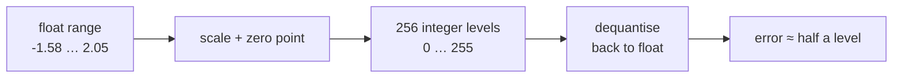
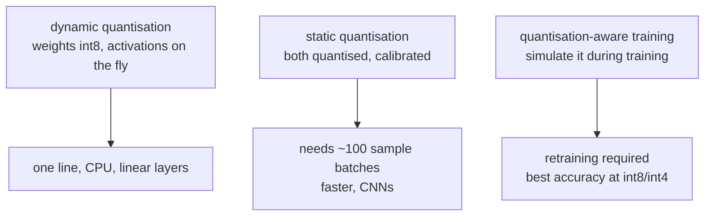

# Lesson 08 — Quantisation

**Goal:** store and compute in fewer bits, and know what it costs.

## What you will learn

- fp32, fp16, bf16, int8, int4
- Dynamic and static quantisation
- Quantisation-aware training
- Measuring the accuracy you gave up

---

## The arithmetic

```python
parameters = 7_000_000_000

for name, bits in [("fp32", 32), ("fp16 / bf16", 16), ("int8", 8), ("int4", 4)]:
    gigabytes = parameters * bits / 8 / 1024**3
    print(f"{name:<12} {bits:>2} bits  {gigabytes:>6.1f} GB")
```

```text
fp32         32 bits    26.1 GB
fp16 / bf16  16 bits    13.0 GB
int8          8 bits     6.5 GB
int4          4 bits     3.3 GB
```

A 7B model at fp32 needs a data-centre card. At int4 it fits on a laptop.
Quantisation is the difference between "we need a cluster" and "it runs on the
user's phone", and that is why it is the most consequential technique in this
course.

The size is only half of it: fewer bits means less memory bandwidth, and most
inference is bandwidth-bound rather than compute-bound.

---

## How it works

Map a float range onto integers with a scale and a zero point:

```python
import torch

weights = torch.randn(1000) * 0.5

scale = (weights.max() - weights.min()) / 255
zero_point = (-weights.min() / scale).round()

quantised = ((weights / scale) + zero_point).round().clamp(0, 255).to(torch.uint8)
dequantised = (quantised.float() - zero_point) * scale

error = (weights - dequantised).abs()
print(f"original dtype {weights.dtype}, {weights.numel() * 4} bytes")
print(f"quantised      {quantised.dtype}, {quantised.numel()} bytes")
print(f"max error      {error.max():.6f}")
print(f"mean error     {error.mean():.6f}")
print(f"signal range   {weights.min():.3f} to {weights.max():.3f}")
```

```text
original dtype torch.float32, 4000 bytes
quantised      torch.uint8, 1000 bytes
max error      0.007111
mean error     0.003507
signal range   -1.577 to 2.051
```

A quarter of the bytes, and every weight is within 0.0071 of its original
value on a range of 3.6. That ratio — error versus range — is what determines
whether accuracy survives.



**Outliers are the enemy.** One weight at 100 stretches the range so the other
999 share a handful of levels. This is why modern methods quantise per channel
or per group rather than per tensor, and why activation outliers make
large-language-model quantisation hard.

---

## Dynamic quantisation

The easiest real win: weights stored as int8, activations quantised on the
fly. One line, no calibration data, CPU inference.

```python
import torch
import torch.nn as nn

model = nn.Sequential(
    nn.Linear(512, 2048), nn.ReLU(),
    nn.Linear(2048, 2048), nn.ReLU(),
    nn.Linear(2048, 10),
).eval()

quantised = torch.ao.quantization.quantize_dynamic(
    model, {nn.Linear}, dtype=torch.qint8)
```

```text
RuntimeError: Didn't find engine for operation quantized::linear_prepack NoQEngine
```

That is the real output on the machine these lessons were written on, and it
is worth keeping. **Quantised kernels are hardware- and build-specific.**
PyTorch's eager-mode quantisation needs a backend (`fbgemm` on x86, `qnnpack`
on ARM) compiled into your build; this one has none, so the API exists and the
operation does not.

The lesson generalises: a quantised model is only fast where a kernel exists
for that dtype on that hardware. Int8 on a server CPU with `fbgemm` is a large
win; the same code on an unsupported build either falls over, as here, or
silently runs slower than fp32.

**Check that your target hardware supports the dtype before you plan around
it**, with `torch.backends.quantized.supported_engines`.

---

## What quantisation costs in accuracy

The kernels are hardware-specific; the *arithmetic* is not. Simulate it —
quantise the weights and dequantise them back — and you can measure the
accuracy cost of any bit width on any machine:

```python
import copy
import torch
import torch.nn as nn

def fake_quantise(model, levels):
    """Round every weight matrix to `levels` values, then map back to float."""
    quantised = copy.deepcopy(model)
    with torch.no_grad():
        for parameter in quantised.parameters():
            if parameter.dim() > 1:                       # weights, not biases
                scale = (parameter.max() - parameter.min()) / (levels - 1)
                zero_point = (-parameter.min() / scale).round()
                parameter.copy_(
                    ((parameter / scale + zero_point).round().clamp(0, levels - 1)
                     - zero_point) * scale)
    return quantised

# `model` here is a small classifier trained on breast-cancer data
with torch.inference_mode():
    baseline = (model(test_X).argmax(1) == test_y).float().mean().item()
print(f"fp32 accuracy {baseline:.4f}")

for bits in [8, 4, 2]:
    reduced = fake_quantise(model, 2 ** bits)
    with torch.inference_mode():
        accuracy = (reduced(test_X).argmax(1) == test_y).float().mean().item()
        drift = (model(test_X) - reduced(test_X)).abs().max().item()
    print(f"int{bits} accuracy {accuracy:.4f}   max logit change {drift:.4f}")
```

```text
fp32 accuracy 0.9561
int8 accuracy 0.9561   max logit change 0.0298
int4 accuracy 0.9649   max logit change 0.8886
int2 accuracy 0.9474   max logit change 12.2724
```

Three things in that table are worth stating plainly:

- **int8 is free.** Identical accuracy, and the logits move by 0.03 — a
  quarter of the memory for no measurable cost. This is the usual result, and
  it is why int8 is the default.
- **int4 changed the logits by 0.89 and the accuracy went *up*.** It did not
  get better; 114 test samples means one sample is 0.88 points, and this is
  noise. Do not report a quantised model as an improvement.
- **int2 broke the arithmetic** — logits moved by 12 — and accuracy fell by
  less than a point anyway, because the argmax survived. **Accuracy is a
  lagging indicator of quantisation damage.** Watch the output drift too, or
  you will ship a model whose probabilities are nonsense and whose top-1 label
  happens to be right.

Run this sweep on your own model and metric before choosing a bit width. It
needs no special hardware, and it answers the only question that matters.

---

## The three approaches



| Approach | Needs | Speed | Accuracy |
|---|---|---|---|
| Dynamic | Nothing | Good | Usually fine |
| Static (PTQ) | Calibration data | Better | Good, needs checking |
| QAT | Retraining | Best | Best |

Static, in outline:

```python
import torch
import torch.ao.quantization as quantization

model.qconfig = quantization.get_default_qconfig("x86")
prepared = quantization.prepare(model)

for batch in calibration_loader:          # ~100 representative batches
    prepared(batch)

quantised = quantization.convert(prepared)
```

The calibration data must **look like production**. Calibrate on clean daytime
images and deploy on dark noisy ones, and the ranges are wrong in a way no
test will catch.

---

## For large language models

Different tooling, same idea:

| Method | Bits | Notes |
|---|---|---|
| `bitsandbytes` 8-bit / 4-bit | 8 / 4 | Load a big model on a small card; QLoRA's base |
| GPTQ | 4 | Calibrated, post-training, strong quality |
| AWQ | 4 | Protects the weights that matter most |
| GGUF (llama.cpp) | 2–8 | CPU and Apple Silicon inference |

Rules of thumb: **int8 is usually free**; **int4 costs a little quality** and
is usually worth it; below 4 bits, quality falls quickly and you should
measure hard.

Always compare against the alternative: a smaller model at fp16 may beat a
large model at int4, on both quality and latency.

---

## Common mistakes

| Mistake | What happens |
|---|---|
| Shipping without measuring accuracy | A quietly worse model |
| Calibrating on unrepresentative data | Wrong ranges, degraded output |
| Quantising a model that is already fast enough | Complexity for nothing |
| Per-tensor quantisation with outliers | Large error on most weights |
| Assuming int8 is faster everywhere | Depends on hardware support — measure |
| Quantising then fine-tuning without QAT | The gains are undone |

---

## Exercises

1. Quantise a tensor to uint8 by hand; plot the error against the value.
2. Apply `quantize_dynamic` to a model and report size, latency and accuracy.
3. Add a single outlier weight of 100 and re-measure the quantisation error.
4. Compare a small fp32 model against a larger int8 one at equal latency.
