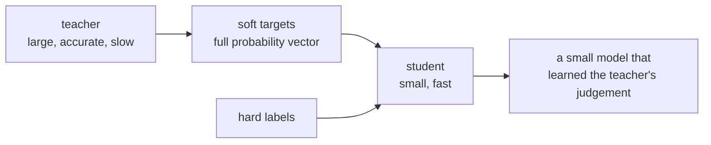

# Lesson 10 — Knowledge Distillation

**Goal:** train a small model to imitate a large one.

## What you will learn

- Soft targets, and why they carry more than labels
- Temperature
- The distillation loss
- When distillation beats pruning and quantisation

---

## The idea

A trained model outputs a probability for every class. Those probabilities
carry information the hard label does not: that this "cat" image is a bit dog,
not at all aeroplane.



The student learns from both: the ground truth, and the teacher's **relative
confidences** — sometimes called dark knowledge, because it is information the
dataset never contained.

---

## Temperature

Softmax with a temperature `T` flattens the distribution and exposes the small
probabilities:

```python
import torch
import torch.nn.functional as F

logits = torch.tensor([[4.0, 2.0, 1.0, 0.2]])

for temperature in [1.0, 3.0, 10.0]:
    probabilities = F.softmax(logits / temperature, dim=1)
    print(f"T={temperature:<5} {probabilities.round(decimals=3).tolist()[0]}")
```

```text
T=1.0   [0.828000009059906, 0.1120000034570694, 0.04100000113248825, 0.01899999938905239]
T=3.0   [0.4620000123977661, 0.2370000034570694, 0.17000000178813934, 0.12999999523162842]
T=10.0  [0.30799999833106995, 0.25200000405311584, 0.2280000001192093, 0.210999995470047]
```

At `T=1` the top class takes 83% and the last two are rounding error — almost
the same information as the hard label. At `T=3` the second class carries 24%
and even the fourth carries 13%, and that ordering is the signal the student
learns from. At `T=10` all four are within 10 points of each other: the
teacher's judgement has been flattened into noise.

Too high and everything becomes uniform and meaningless. `T` between 2 and 5
is the usual range.

---

## The loss

```python
import torch
import torch.nn as nn
import torch.nn.functional as F

def distillation_loss(student_logits, teacher_logits, labels, temperature=3.0, alpha=0.7):
    """Weighted mix of imitating the teacher and matching the true labels."""
    soft = F.kl_div(
        F.log_softmax(student_logits / temperature, dim=1),
        F.softmax(teacher_logits / temperature, dim=1),
        reduction="batchmean",
    ) * (temperature ** 2)

    hard = F.cross_entropy(student_logits, labels)
    return alpha * soft + (1 - alpha) * hard
```

Two details that are easy to get wrong:

- **Multiply the soft term by `T²`.** Dividing logits by `T` scales the
  gradients by `1/T²`; without the correction, changing the temperature
  silently changes your effective learning rate.
- **`alpha` weights the two.** 0.5–0.9 towards the teacher is normal; with a
  very strong teacher you can go higher.

---

## It works

A large teacher, a small student trained alone, and the same student trained
with distillation — all on the same data:

```python
import torch
import torch.nn as nn
import torch.nn.functional as F

# train_X, train_y, test_X, test_y as in lesson 08

def train(model, epochs=300, lr=1e-3, teacher=None, temperature=3.0, alpha=0.7):
    optimiser = torch.optim.AdamW(model.parameters(), lr=lr)
    for _ in range(epochs):
        model.train()
        optimiser.zero_grad()
        logits = model(train_X)
        if teacher is None:
            loss = F.cross_entropy(logits, train_y)
        else:
            with torch.no_grad():
                teacher_logits = teacher(train_X)
            loss = distillation_loss(logits, teacher_logits, train_y, temperature, alpha)
        loss.backward()
        optimiser.step()
    model.eval()
    with torch.inference_mode():
        return (model(test_X).argmax(1) == test_y).float().mean().item()

def count(model):
    return sum(p.numel() for p in model.parameters())

torch.manual_seed(0)
teacher = nn.Sequential(nn.Linear(30, 256), nn.ReLU(),
                        nn.Linear(256, 256), nn.ReLU(), nn.Linear(256, 2))
teacher_accuracy = train(teacher)

torch.manual_seed(1)
alone = nn.Sequential(nn.Linear(30, 8), nn.ReLU(), nn.Linear(8, 2))
alone_accuracy = train(alone)

torch.manual_seed(1)
distilled = nn.Sequential(nn.Linear(30, 8), nn.ReLU(), nn.Linear(8, 2))
distilled_accuracy = train(distilled, teacher=teacher)

print(f"teacher    {count(teacher):>7,} params  accuracy {teacher_accuracy:.4f}")
print(f"student    {count(alone):>7,} params  accuracy {alone_accuracy:.4f}")
print(f"distilled  {count(distilled):>7,} params  accuracy {distilled_accuracy:.4f}")
print(f"compression: {count(teacher) / count(alone):.0f}x fewer parameters")
```

```text
teacher     74,242 params  accuracy 0.9561
student        266 params  accuracy 0.9474
distilled      266 params  accuracy 0.9561
compression: 279x fewer parameters
```

Three rows worth reading carefully.

The student has **279 times fewer parameters** than the teacher and loses less
than a point on its own. That alone is the main lesson of this file: most
models are far larger than their task requires.

Distillation then moves the tiny model from 0.9474 to **0.9561** — exactly the
teacher's score. A 266-parameter model matching a 74,242-parameter one.

Be careful how you read that. The gain is one test sample out of 114, which is
inside the noise; the honest claim is "distillation did not hurt, and the tiny
student matches the teacher on this task". On a harder task the gap between
student-alone and student-distilled is larger and the difference is real —
which is why you measure it on yours rather than trusting this table.

---

## Tuning the two knobs

```python
for temperature in [1.0, 3.0, 10.0]:
    for alpha in [0.3, 0.7, 0.95]:
        torch.manual_seed(1)
        student = nn.Sequential(nn.Linear(30, 8), nn.ReLU(), nn.Linear(8, 2))
        accuracy = train(student, teacher=teacher, temperature=temperature, alpha=alpha)
        print(f"T={temperature:<5} alpha={alpha:<5} accuracy {accuracy:.4f}")
```

```text
T=1.0   alpha=0.3   accuracy 0.9474
T=1.0   alpha=0.7   accuracy 0.9474
T=1.0   alpha=0.95  accuracy 0.9474
T=3.0   alpha=0.3   accuracy 0.9561
T=3.0   alpha=0.7   accuracy 0.9561
T=3.0   alpha=0.95  accuracy 0.9561
T=10.0  alpha=0.3   accuracy 0.9474
T=10.0  alpha=0.7   accuracy 0.9474
T=10.0  alpha=0.95  accuracy 0.9474
```

Nine cells, two distinct values, and the whole spread is one test sample.
`alpha` changed nothing at all at any temperature. Only `T=3` reached the
teacher's score — and "reached" means one sample better than T=1 and T=10.

Reading a winner out of this grid would be exactly the mistake lesson 05
warned about. What it does support is the standard advice: **the middle of the
range is safe.** Use `T=3` and `alpha=0.7`, and spend your time on the student
architecture, which is where the real differences are.

---

## Where distillation wins

| Technique | Size reduction | Accuracy cost | Faster on normal hardware? |
|---|---|---|---|
| int8 quantisation | 4× | ~0 | Yes, with kernel support |
| Unstructured pruning | Large on disk | Moderate | **No** |
| Structured pruning | Real | Higher | Yes |
| **Distillation** | **Any factor you choose** | **Low** | **Yes, always** |

Distillation's advantage is that the output is a **plain, small, dense model**.
No sparse kernels, no quantised runtime, no special hardware — it is just a
smaller network, and it is fast everywhere.

Its cost is that it needs training, and a trained teacher.

The well-known examples: DistilBERT is 40% smaller and 60% faster than BERT at
97% of its performance; TinyBERT, MobileBERT and most small instruction models
are distilled from larger ones.

---

## Practical notes

- **Distil on unlabelled data too.** The teacher provides the targets, so any
  in-domain text or images you have — even without labels — become training
  data. This is often the biggest win.
- **The student does not have to share the teacher's architecture.** A CNN can
  learn from a vision transformer.
- **Combine with quantisation.** Distil to a small model, then quantise it:
  the reductions multiply.
- **An ensemble makes a good teacher.** Distil five models into one and keep
  most of the ensemble's accuracy at one model's cost.

---

## Common mistakes

| Mistake | What happens |
|---|---|
| No `T²` on the soft loss | The temperature silently rescales the learning rate |
| `T=1` | The soft targets carry almost nothing extra |
| Teacher left in train mode | Dropout makes the targets noisy |
| Teacher gradients not disabled | Wasted memory and compute |
| A student far too small | It cannot represent the function at any temperature |
| Reading a winner out of a noisy grid | See the table above |

---

## Exercises

1. Print softmax at T = 1, 2, 5, 20 and describe what happens.
2. Train a student alone and with distillation; report both.
3. Sweep the student size — 4, 8, 32, 128 hidden units — and find the smallest
   that keeps the teacher's accuracy.
4. Distil, then quantise the student to int8. Report size and accuracy at each
   step.
