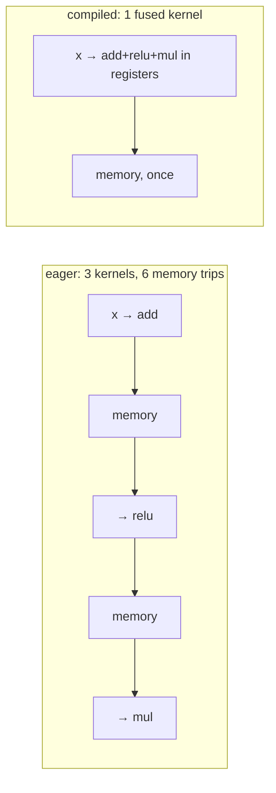

# Lesson 11 — Compilation and Export

**Goal:** make the same weights run faster, and run outside Python.

## What you will learn

- `torch.compile` and kernel fusion
- TorchScript
- ONNX and its runtimes
- Choosing a target

---

## Why compilation helps

Eager PyTorch executes one operation at a time. Each one reads its input from
memory, computes, and writes the result back — even when the next operation is
about to read it again.



Most small operations are **memory-bandwidth bound**, not compute bound.
Fusing them into one kernel removes the round trips, and that is where the
speedup comes from.

```python
import torch
import torch.nn as nn
import time

torch.manual_seed(0)
model = nn.Sequential(nn.Linear(64, 128), nn.GELU(), nn.Linear(128, 2)).eval()
compiled = torch.compile(model)
x = torch.randn(8, 64)

with torch.inference_mode():
    start = time.perf_counter()
    compiled(x)                                  # triggers compilation
    first_call = time.perf_counter() - start

def benchmark(m, repeats=200):
    with torch.inference_mode():
        for _ in range(50):
            m(x)
        start = time.perf_counter()
        for _ in range(repeats):
            m(x)
    return (time.perf_counter() - start) / repeats * 1000

eager_ms = benchmark(model)
compiled_ms = benchmark(compiled)

print(f"first compiled call: {first_call:.2f} s   (compilation)")
print(f"eager:    {eager_ms:.4f} ms")
print(f"compiled: {compiled_ms:.4f} ms")
print(f"speedup:  {eager_ms / compiled_ms:.2f}x")
```

```text
first compiled call: 2.56 s   (compilation)
eager:    0.0110 ms
compiled: 0.0226 ms
speedup:  0.49x
```

Read that last line again. `torch.compile` made this model **twice as slow**,
after spending 2.56 seconds compiling it.

Nothing is broken. The model is tiny, so its forward pass is already a handful
of microseconds and there is nothing to fuse; what remains is the compiled
path's own dispatch overhead. Inductor is built for large tensors and long
operation chains, and it has neither here.

A second data point from the same machine: the *larger* model this lesson
originally used — three layers of 512→2048→2048→512 — did not finish compiling
after **ten minutes**, on an ARM CPU with no tuned inductor backend. It was
abandoned.

Two conclusions, and both are the point of this lesson:

1. **`torch.compile` is a bet that you will run the model many times, at a
   size worth fusing.** On a GPU with a real model, 1.3–2× is normal and the
   compile cost is repaid in seconds. On a small model, or on hardware without
   a tuned backend, you can pay a large fixed cost for a slowdown.
2. **Never assume — measure, including the compile time, and separately from
   the steady state.** Any benchmark that folds the first call into the
   average will tell you a story that is wrong in both directions.

## Recompilation

```python
import torch
import torch.nn as nn

model = nn.Sequential(nn.Linear(64, 64), nn.ReLU(), nn.Linear(64, 2))
compiled = torch.compile(model)

with torch.inference_mode():
    for batch_size in [1, 8, 32]:
        compiled(torch.randn(batch_size, 64))      # a compile on each new shape
```

Every new input shape triggers a recompilation. A service with variable batch
sizes can spend more time compiling than computing.

Fixes, in order of preference:

- **Pad to fixed shapes** — batch 1, 8, 32, and pad the rest.
- `torch.compile(model, dynamic=True)` — one graph that handles varying sizes.
- `mode="reduce-overhead"` for small models, `mode="max-autotune"` when you can
  afford a long compile.

---

## TorchScript

Older, stable, and the route to running a model without Python.

```python
import torch
import torch.nn as nn

model = nn.Sequential(nn.Linear(64, 64), nn.ReLU(), nn.Linear(64, 2)).eval()
example = torch.randn(4, 64)

traced = torch.jit.trace(model, example)
traced.save("model_traced.pt")

reloaded = torch.jit.load("model_traced.pt")
with torch.inference_mode():
    print("traced matches:", bool(torch.allclose(model(example), reloaded(example))))
    print("other batch size works:", tuple(reloaded(torch.randn(16, 64)).shape))
```

```text
traced matches: True
other batch size works: (16, 2)
```

`trace` records the operations of one forward pass. Control flow that depends
on tensor **values** is baked in as it happened:

```python
import torch

class Conditional(torch.nn.Module):
    def forward(self, x):
        if x.sum() > 0:                  # depends on the data
            return x * 2
        return x * -1

traced = torch.jit.trace(Conditional(), torch.ones(4))    # took the > 0 branch
print("positive input:", traced(torch.ones(4)).tolist())
print("negative input:", traced(-torch.ones(4)).tolist())  # WRONG branch
```

```text
positive input: [2.0, 2.0, 2.0, 2.0]
negative input: [-2.0, -2.0, -2.0, -2.0]
```

The negative input should have given `[1, 1, 1, 1]`. It gave `[-2, -2, -2, -2]`
— the traced graph only knows the branch it saw, and it **does not warn you at
inference time.**

Use `torch.jit.script` when your model has data-dependent control flow: it
compiles the source, branches included.

---

## ONNX

A framework-neutral graph format, executed by ONNX Runtime, TensorRT,
OpenVINO, CoreML and mobile runtimes.

```python
import torch
import torch.nn as nn

model = nn.Sequential(nn.Linear(64, 64), nn.ReLU(), nn.Linear(64, 2)).eval()
example = torch.randn(4, 64)

torch.onnx.export(
    model, example, "model.onnx",
    input_names=["input"], output_names=["logits"],
    dynamic_axes={"input": {0: "batch"}, "logits": {0: "batch"}},
    opset_version=17,
)
```

Then, in any language or runtime:

```python
# pip install onnxruntime
import onnxruntime as ort
import numpy as np

session = ort.InferenceSession("model.onnx", providers=["CPUExecutionProvider"])
outputs = session.run(None, {"input": np.random.randn(16, 64).astype(np.float32)})
print(outputs[0].shape)
```

```text
(16, 2)
```

*(ONNX Runtime is not installed in this course's environment; that snippet is
illustrative. Everything above it was run.)*

Three rules for ONNX export:

- **`dynamic_axes` for the batch dimension**, or the graph accepts only the
  batch size you traced with.
- **Verify numerically after exporting.** Compare PyTorch and runtime outputs
  with `np.allclose`; an unsupported operation can be silently replaced.
- **Pin `opset_version`.** Runtimes support different ranges, and the default
  moves between PyTorch releases.

---

## Choosing a target

| Target | When | Cost |
|---|---|---|
| Eager PyTorch | Development, and short-lived scripts | None |
| `torch.compile` | A long-running Python service | Compile time per shape |
| TorchScript | C++, mobile, no Python | Tracing pitfalls |
| ONNX Runtime | Cross-platform, CPU serving | Export and verification work |
| TensorRT | NVIDIA production, lowest latency | Engine build, per GPU model |
| CoreML / TFLite | iOS / Android | Conversion, per platform |

Start eager. Move to `torch.compile` when the service is long-lived and you
have measured a gain. Export only when you must leave Python or need a
specialised runtime.

---

## Verify after every conversion

```python
import torch

def check_equivalence(original, converted, example, tolerance=1e-5):
    """Fail loudly if a conversion changed the numbers."""
    with torch.inference_mode():
        a, b = original(example), converted(example)
    difference = (a - b).abs().max().item()
    if difference > tolerance:
        raise AssertionError(f"outputs differ by {difference:.6f}")
    return difference

print("max difference:", check_equivalence(model, traced, example))
```

```text
max difference: 0.0
```

Put that check in your test suite. A conversion that silently changes the
numbers is the worst bug in this course: every test passes, the service runs,
and the predictions are subtly wrong.

---

## Common mistakes

| Mistake | What happens |
|---|---|
| Including compile time in a benchmark | You "prove" compilation is slower |
| `torch.compile` for a one-shot script | Slower overall |
| Variable shapes without `dynamic=True` | Constant recompilation |
| `jit.trace` on data-dependent branches | A wrong branch, silently, forever |
| ONNX export without `dynamic_axes` | Fails on any other batch size |
| Not verifying after conversion | Subtly wrong predictions in production |

---

## Exercises

1. Benchmark eager against compiled, reporting the first-call cost separately.
2. Trace a model with an `if` on tensor values and show the wrong branch.
3. Export to ONNX with dynamic axes and check the outputs match.
4. Work out how many requests it takes to repay the compile time in your
   service.
