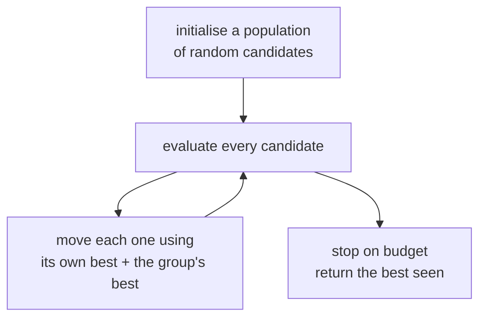

# Lesson 13 — Swarm and Population Optimisation

**Goal:** optimise things gradients cannot reach, and find out how rarely that
is the bottleneck.

## What you will learn

- Particle swarm optimisation and differential evolution, from scratch
- Three landscapes, and which method wins on each
- Random search, the baseline everyone skips
- A real hyperparameter search where none of it mattered

---

## When gradients are not available

Every optimiser in lessons 03-05 needed a derivative. Plenty of real objectives
have none:

| Objective | Why no gradient |
|---|---|
| Hyperparameters (tree depth, batch size) | Integers; the loss is not differentiable in them |
| Feature subset selection | Combinatorial |
| Which layers to quantise (lesson 08) | Discrete choices |
| A simulation's output | The simulator is a black box |
| Inference latency under a memory budget | Measured, not computed |
| Pipeline or route order | Permutations |

**Population methods** need only the ability to evaluate `f(x)`. They keep a
set of candidate solutions, and each generation moves them using information
shared across the population.



**Particle swarm optimisation (PSO)** gives every candidate a velocity, pulled
towards its own best position and the swarm's best:

```text
v <- w*v  +  c1*r1*(personal_best - x)  +  c2*r2*(global_best - x)
x <- x + v
```

**Differential evolution (DE)** has no velocity. For each member it builds a
mutant from three *other* members and keeps it only if it scores better:

```text
mutant = a + F*(b - c)        a, b, c are three distinct other members
trial  = crossover(mutant, x)
x <- trial  if  f(trial) < f(x)
```

---

## Four optimisers, three landscapes

```python
import numpy as np

def sphere(x):               # smooth, convex, one minimum at 0
    return np.sum(x ** 2, axis=-1)

def rastrigin(x):            # same minimum, 10^d local minima around it
    return 10 * x.shape[-1] + np.sum(x ** 2 - 10 * np.cos(2 * np.pi * x), axis=-1)

def step_cost(x):            # piecewise constant: gradient is zero everywhere
    return np.sum(np.floor(np.abs(x) * 2), axis=-1)

def gradient_descent(f, dim, budget, seed, lr=0.01, h=1e-5, bounds=5.12):
    rng = np.random.default_rng(seed)
    x = rng.uniform(-bounds, bounds, dim)
    used = 0
    best = float(f(x))
    while used + dim + 1 <= budget:
        base = float(f(x)); used += 1
        grad = np.zeros(dim)
        for i in range(dim):                      # finite differences
            xp = x.copy(); xp[i] += h
            grad[i] = (float(f(xp)) - base) / h; used += 1
        x = np.clip(x - lr * grad, -bounds, bounds)
        best = min(best, float(f(x)))
    return best

def random_search(f, dim, budget, seed, bounds=5.12):
    rng = np.random.default_rng(seed)
    X = rng.uniform(-bounds, bounds, (budget, dim))
    return float(f(X).min())

def pso(f, dim, budget, seed, n=20, w=0.7, c1=1.5, c2=1.5, bounds=5.12):
    rng = np.random.default_rng(seed)
    X = rng.uniform(-bounds, bounds, (n, dim))
    V = rng.uniform(-1, 1, (n, dim))
    P = X.copy(); pbest = f(X); used = n
    g = int(np.argmin(pbest)); gbest = P[g].copy(); gval = float(pbest[g])
    while used + n <= budget:
        r1, r2 = rng.random((n, dim)), rng.random((n, dim))
        V = w * V + c1 * r1 * (P - X) + c2 * r2 * (gbest - X)
        X = np.clip(X + V, -bounds, bounds)
        vals = f(X); used += n
        better = vals < pbest
        P[better] = X[better]; pbest[better] = vals[better]
        i = int(np.argmin(pbest))
        if pbest[i] < gval:
            gval = float(pbest[i]); gbest = P[i].copy()
    return gval

def differential_evolution(f, dim, budget, seed, n=20, F=0.8, CR=0.9, bounds=5.12):
    rng = np.random.default_rng(seed)
    X = rng.uniform(-bounds, bounds, (n, dim))
    vals = f(X); used = n
    while used + n <= budget:
        for i in range(n):
            a, b, c = rng.choice([j for j in range(n) if j != i], 3, replace=False)
            mutant = np.clip(X[a] + F * (X[b] - X[c]), -bounds, bounds)
            cross = rng.random(dim) < CR
            if not cross.any():
                cross[rng.integers(dim)] = True
            trial = np.where(cross, mutant, X[i])
            tv = float(f(trial)); used += 1
            if tv < vals[i]:
                X[i], vals[i] = trial, tv
        used += 0
    return float(vals.min())
```

```python
BUDGET, DIM, SEEDS = 4_000, 10, 20
print(f"budget {BUDGET} function evaluations, {DIM} dimensions, "
      f"median of {SEEDS} runs\n")
print(f"{'function':<16}{'grad descent':>14}{'random':>10}{'PSO':>10}{'DE':>10}")
for name, f in [("sphere (smooth)", sphere), ("rastrigin (rugged)", rastrigin),
                ("step (flat grad)", step_cost)]:
    row = []
    for algo in (gradient_descent, random_search, pso, differential_evolution):
        row.append(np.median([algo(f, DIM, BUDGET, s) for s in range(SEEDS)]))
    print(f"{name:<16}{row[0]:>14.3f}{row[1]:>10.3f}{row[2]:>10.3f}{row[3]:>10.3f}")
```

```text
budget 4000 function evaluations, 10 dimensions, median of 20 runs

function          grad descent    random       PSO        DE
sphere (smooth)          0.000    15.430     0.000     0.003
rastrigin (rugged)       127.061    77.740    14.428    45.692
step (flat grad)        49.500    15.500     0.000     0.000
```

Three rows, three different winners, and the reason each one wins is structural.

**Sphere — gradient descent ties PSO at 0.000.** The function is smooth and
convex; a derivative points straight at the answer. Here the swarm is not
better, it is merely not worse, and it spent the same 4,000 evaluations to get
there. On a differentiable objective, use the derivative.

**Rastrigin — PSO wins by a factor of nine** (14.4 against gradient descent's
127.1). The function has the same global minimum surrounded by roughly `10^10`
local ones. Gradient descent falls into the nearest pit and stays; it finishes
**worse than random search**. A population samples many basins at once and the
global-best term pulls the swarm towards the best basin found so far.

**Step — only the derivative-free methods work at all.** The function is
piecewise constant, so every finite-difference gradient is exactly zero and
gradient descent cannot move from where it started (49.5). PSO and DE find the
optimum, 0.000.

Note also that **random search beats gradient descent on two of the three
rows.** It is a one-line baseline and it is the number your fancy optimiser has
to beat before you tell anyone about it.

---

## A real hyperparameter search

Benchmark functions are chosen to make the method look good. Here is the job you
would actually use it for: tuning three hyperparameters of a gradient boosting
model, with a budget of 36 model fits.

```python
# skip-verify: ~5 minutes of model fitting
import numpy as np
from sklearn.datasets import make_classification
from sklearn.ensemble import HistGradientBoostingClassifier
from sklearn.model_selection import cross_val_score, StratifiedKFold

X, y = make_classification(n_samples=2_000, n_features=20, n_informative=6,
                           n_redundant=2, class_sep=0.8, random_state=0)
cv = StratifiedKFold(4, shuffle=True, random_state=0)

def objective(vec):
    """vec in [0,1]^3 -> (learning_rate, max_leaf_nodes, min_samples_leaf).
    Returns -AUC, because these optimisers minimise."""
    lr = 10 ** (-3 + 2 * float(vec[0]))            # 1e-3 .. 1e-1
    leaves = int(4 + 60 * float(vec[1]))           # 4 .. 64
    min_leaf = int(2 + 60 * float(vec[2]))         # 2 .. 62
    model = HistGradientBoostingClassifier(
        learning_rate=lr, max_leaf_nodes=leaves,
        min_samples_leaf=min_leaf, max_iter=60, random_state=0)
    return -cross_val_score(model, X, y, cv=cv, scoring="roc_auc").mean()
```

Running PSO and random search at 36 evaluations each, across 5 seeds:

```text
budget 36 model fits each, 5 seeds, 4-fold AUC

search             best AUC (median)    worst     best   seconds
random search                 0.9660   0.9652   0.9698       149
PSO                           0.9692   0.9616   0.9702       177

default hyperparameters: 0.9678
```

Read the last line first. **The library defaults score 0.9678.**

- Random search's median, 0.9660, is **worse than doing nothing**.
- PSO's median, 0.9692, beats the defaults by **0.0014** — and its worst run,
  0.9616, is clearly worse than them.
- PSO took 177 seconds against random search's 149, for a median gain of 0.003.

The honest conclusion: **on this problem, three hours of swarm optimisation
would have bought nothing you could measure.** That is the same finding as
Data-Science lesson 05, where `C` across three orders of magnitude moved AUC by
0.0001 — and it is the normal case, not the exception, for a well-defaulted
library on a well-conditioned problem.

Two caveats that keep this from being an argument against the whole family:

1. **36 evaluations is a small budget.** With 500, PSO's advantage over random
   search grows — but then so does the question of whether 500 model fits are
   worth 0.003 AUC.
2. **A swarm's advantage grows with the interaction between parameters.** These
   three barely interact. On a quantisation-per-layer decision (lesson 08) or a
   pipeline ordering, they interact strongly, and the population's shared
   information starts to earn its cost.

---

## Choosing

| Situation | Use |
|---|---|
| Differentiable objective | **Gradients.** Lessons 03-04 |
| A handful of hyperparameters, any budget | **Random search first**, then Bayesian (lesson 05) |
| Rugged landscape, many local minima | PSO or DE |
| No gradient at all (integers, permutations, black box) | PSO, DE, or simulated annealing |
| Strong interaction between many discrete choices | DE, genetic algorithms |
| Expensive objective (minutes per evaluation) | Bayesian optimisation, **not** a swarm — a swarm needs hundreds of evaluations |

That last row is the practical filter. PSO with 20 particles for 50 generations
is 1,000 evaluations. If one evaluation is a 40-minute training run, the method
is unaffordable no matter how elegant it is.

| Method | Population | Tuning knobs | Parallel? |
|---|---|---|---|
| Random search | n/a | none | Perfectly |
| PSO | 20-50 | `w`, `c1`, `c2` | Per generation |
| Differential evolution | 10x dimensions | `F`, `CR` | Per generation |
| Genetic algorithm | 50+ | selection, crossover, mutation | Per generation |
| Simulated annealing | 1 | temperature schedule | No |
| Bayesian / TPE | n/a | kernel, acquisition | Poorly |

The parallel column matters more than the convergence proofs. A swarm evaluates
its whole generation independently, so 20 particles on 20 cores cost one
evaluation of wall-clock time — which is often what makes a 1,000-evaluation
budget affordable after all.

---

## Common mistakes

| Mistake | Why it hurts |
|---|---|
| No random-search baseline | It beat gradient descent on two landscapes out of three |
| No "do nothing" baseline | The library defaults beat random search's median here |
| A swarm on a differentiable objective | Same answer as the gradient, for far more evaluations |
| A swarm on an expensive objective | 1,000 evaluations x 40 minutes is not a plan |
| Reporting the best of 5 seeds | PSO's range here was 0.9616 to 0.9702 |
| Copying `w`, `c1`, `c2` from a paper | They interact with the bounds and the dimension |
| Claiming a 0.003 improvement | It is inside the seed noise; say so |

---

## Exercises

1. Raise the benchmark budget to 40,000 evaluations. Does gradient descent
   catch PSO on Rastrigin? What does the answer say about *why* it was losing?
2. Set `w=0.2` and then `w=0.95` in PSO. One collapses early and one never
   settles — which is which, and on which landscape does each failure show up
   first?
3. Add simulated annealing (a single candidate with a decreasing acceptance
   temperature) to the benchmark table. Where does it land?
4. Use DE to choose **which of 20 features** to keep for a logistic regression,
   encoding the subset as a binary vector. Compare against
   `SelectKBest` at the same number of features.
5. Run the hyperparameter search at a budget of 200. Report the median, the
   range across seeds, and whether the gain over the defaults now exceeds that
   range.

---

**Next:** back to [the course index](../README.md), or on to
[`../../Data-Science`](../../Data-Science).
