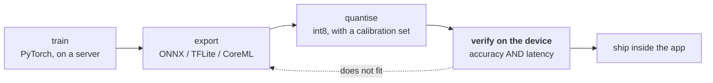

# Lesson 15 — Edge and On-Device

**Goal:** fit a model inside a device's budget, and discover that parameter
count is not latency.

## What you will learn

- The four budgets an edge device imposes
- Why the "efficient" architecture was the slowest here
- Choosing a model for hardware you do not control
- The deployment path

---

## Four budgets, not one

Cloud deployment has one real constraint: money. An edge device has four, and
any one of them can kill the project.

| Budget | Typical | Violating it means |
|---|---|---|
| **Memory** | 50-500 MB for your model | It does not load. Hard failure |
| **Compute** | 1-10 GFLOPs per inference | It loads and is too slow to use |
| **Power** | Milliwatt-hours per inference | The battery dies in an afternoon |
| **Storage** | The app download size | Users abandon a 400 MB install |

The first is a cliff, the rest are slopes. **Check memory before anything
else** — a model that does not fit has no latency to measure.

---

## Parameter count is not latency

The obvious way to pick an edge model is to sort by parameter count. Measure it
instead.

```python
# skip-verify: latency is hardware-dependent; the ORDERING is the lesson
import time, torch, torchvision.models as M
torch.set_num_threads(4)

MODELS = {
    "resnet50":        (M.resnet50, 224),
    "resnet18":        (M.resnet18, 224),
    "efficientnet_b0": (M.efficientnet_b0, 224),
    "mobilenet_v3_small": (M.mobilenet_v3_small, 224),
    "mobilenet_v3_small@128": (M.mobilenet_v3_small, 128),
}
print(f"{'model':<24}{'params M':>10}{'fp32 MB':>10}{'ms/image':>11}{'img/sec':>9}")
for name, (ctor, size) in MODELS.items():
    m = ctor(weights=None).eval()
    params = sum(p.numel() for p in m.parameters())
    mb = params * 4 / 1e6
    x = torch.randn(1, 3, size, size)
    with torch.no_grad():
        for _ in range(3):
            m(x)
        t0 = time.perf_counter()
        for _ in range(20):
            m(x)
        dt = (time.perf_counter() - t0) / 20
    print(f"{name:<24}{params/1e6:>10.1f}{mb:>10.1f}{dt*1000:>11.1f}{1/dt:>9.1f}")
```

```text
model                     params M   fp32 MB   ms/image  img/sec
resnet50                      25.6     102.2       21.1     47.4
resnet18                      11.7      46.8       13.5     73.9
efficientnet_b0                5.3      21.2       87.6     11.4
mobilenet_v3_small             2.5      10.2       30.3     33.0
mobilenet_v3_small@128         2.5      10.2       26.6     37.6
```

Read that table twice, because it contradicts everything the names suggest.

**EfficientNet-B0 has a fifth of ResNet-50's parameters and is four times
slower** — 87.6 ms against 21.1 ms.

**MobileNet-v3-small has a fifth of ResNet-18's parameters and is more than
twice as slow** — 30.3 ms against 13.5 ms.

The "mobile" and "efficient" architectures lost, decisively, on this hardware.

### Why

Both use **depthwise separable convolutions**, which minimise FLOPs by doing
many small operations instead of a few large ones. That is the right trade on a
phone's NPU, which has dedicated hardware for exactly that pattern. On a general
CPU it is the wrong trade: each small operation has fixed overhead, the memory
access pattern is poor, and the highly optimised dense-convolution kernels that
ResNet uses go unused.

**FLOPs are not time. Parameters are not memory bandwidth. Benchmarks do not
transfer across hardware.**

The practical rule: **measure on the target device, or on something with the
same accelerator.** A latency table produced on your laptop tells you almost
nothing about a phone, a Jetson or a Raspberry Pi — and this table is the proof.

Note also the last row: shrinking the input from 224 to 128 pixels — 3.1x fewer
pixels — bought only 12% (30.3 ms to 26.6 ms). The model was not compute-bound;
it was bound by everything else.

---

## Getting under the budget

In order of how much they usually buy:

| Technique | Size | Speed | Accuracy cost | Lesson |
|---|---|---|---|---|
| **Pick the right architecture for the hardware** | varies | **up to 4x here** | none | This lesson |
| **int8 quantisation** | **4x smaller** | 2-3x on supporting hardware | usually < 1 point | [08](08-quantisation.md) |
| **Distillation** into a small model | large | large | a few points | [10](10-knowledge-distillation.md) |
| Structured pruning | 2-3x | real, if structured | 1-3 points | [09](09-pruning-and-sparsity.md) |
| Lower input resolution | none | **12% here** | task-dependent | This lesson |
| Compilation / ONNX / TFLite / CoreML | small | 1.5-3x | none | [11](11-compilation-and-export.md) |
| Unstructured pruning | on disk only | **none** without sparse kernels | 1-3 points | [09](09-pruning-and-sparsity.md) |

The first row is free and is usually left until last. The last row is the trap
covered in lesson 09: 90% sparsity that runs at exactly the same speed because
nothing on the device executes sparse kernels.

**Quantisation is the reliable one.** Four times smaller, works everywhere,
costs under a point on most tasks — and on an int8-capable NPU it is also the
speed win.

---

## The deployment path



Two steps people skip, and both of them hurt:

**Verify accuracy after export, on the device.** Export and quantisation change
numerics. A model that scores 0.91 in PyTorch and 0.86 in TFLite int8 is normal,
and you will not find out unless you run the eval set through the exported
artefact — not through the original.

**Verify latency on the device, under realistic conditions.** A phone throttles
when it is warm, when the battery is low, and when another app is in the
foreground. A latency measured on a cold, plugged-in, idle device is the best
case and not the one your users get.

---

## What changes when the model is on someone else's device

| Concern | Cloud | Edge |
|---|---|---|
| Updating the model | A deploy | An app release, and users who never update |
| Monitoring (Data-Science 09) | Server logs | Telemetry you must build, and consent to collect |
| A bad model version | Roll back in minutes | It is on 100,000 phones |
| The weights | Yours | **Shipped to the attacker** — Data-Security 05 is free for them |
| Data for retraining | You have it | You may not be allowed to collect it |
| Debugging a failure | Reproduce from logs | The device is gone |

The fourth row deserves a decision, not a shrug: shipping weights to a device is
publishing your model. Model extraction (Data-Security lesson 05) stops being a
query-budget problem and becomes a file-copy. If the model is the product, that
is an argument for keeping inference in the cloud, whatever the latency costs.

And the first row is the one that bites operationally. **Design for a population
of model versions**, because you will have one: version in every telemetry
event, a server-side kill switch for a bad version, and a floor version below
which the app refuses to score and falls back.

---

## Common mistakes

| Mistake | Why it hurts |
|---|---|
| Choosing by parameter count | EfficientNet-B0 has 1/5 the parameters of ResNet-50 and is 4x slower |
| Benchmarking on a laptop for a phone | Different accelerator, different winner |
| Counting FLOPs instead of measuring time | Depthwise convolutions are cheap in FLOPs and slow on CPUs |
| Evaluating accuracy before export | Export and int8 change numerics |
| Measuring latency on a cold, idle, plugged-in device | Users are none of those |
| Unstructured pruning for speed | No sparse kernels, no speedup |
| Forgetting old app versions exist | You will run a population of models |
| Ignoring that the weights are now public | Extraction becomes a file copy |

---

## Exercises

1. Run the benchmark table on your target device. Does the ordering match this
   one? Which model wins?
2. Quantise the winner to int8, export it, and measure size, latency **and
   accuracy** on the device.
3. Sweep input resolution from 96 to 320 and plot accuracy against latency.
   Where is the knee for your task?
4. Measure latency on a warm, throttled device with the screen on. How much
   worse than your best-case number?
5. Write the version-management plan: how a bad model on 100,000 devices gets
   turned off, and what the app does then.

---

**Next:** back to [the course index](../README.md).
