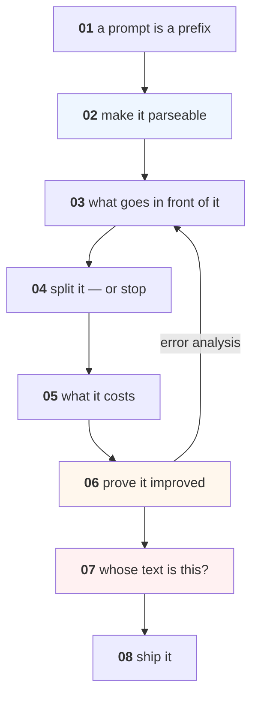

# Prompt Engineering — Basics

The craft layer between "I called a model" and "I shipped something that
works": how a prompt actually behaves, how to specify the output, what to put
in the context, when to split a task, what a prompt costs, how to tell an
improvement from noise, and what happens when the text in your prompt was
written by someone else.

Everything runs on a laptop CPU with **`gpt2-medium` (355M)**. It is small
enough that its failures are visible — which is the point. The mechanism is
identical at 400B; a bigger model hides these effects behind competence, it does
not escape them.

**No API keys, no accounts, no bills.**

---

## Lessons

| # | Lesson | The measured finding |
|---|---|---|
| 01 | [What a Prompt Actually Is](lessons/01-what-a-prompt-is.md) | Asking politely puts **45.9%** of the mass on a newline; the bare prefix is **35x** more likely to answer |
| 02 | [The Output Contract](lessons/02-the-output-contract.md) | Three reasonable prompts: **0/12 parseable**. One worked example: **12/12** |
| 03 | [What Goes in the Context](lessons/03-what-goes-in-the-context.md) | Irrelevant text *helped* (0.70 → 0.93); one wrong fact placed last flipped the answer (0.70 → **0.06**) |
| 04 | [Breaking the Task Up](lessons/04-breaking-the-task-up.md) | Splitting the prompt: **identical results, 1.69x the tokens.** Moving the comparison to Python: **5/10 → 10/10** |
| 05 | [What a Prompt Costs](lessons/05-what-a-prompt-costs.md) | 16 examples cost **21.8x** the tokens of none, for a gain nobody measured |
| 06 | [The Iteration Loop](lessons/06-the-iteration-loop.md) | A **16-point** improvement is still noise at 50 examples; 291 needed for 10 points |
| 07 | [Untrusted Text in a Prompt](lessons/07-untrusted-text.md) | Two of four injections work; the one that failed **works once reordered** |
| 08 | [Prompts in Production](lessons/08-prompts-in-production.md) | Version it, log the parse rate, and know when to stop |

Every lesson is also a notebook: `lessons/NN-name.ipynb`, generated from the
markdown by `tools/build_notebooks.py`.

---

## The shape of the course



Lessons 01-05 are the craft. **Lesson 06 is what makes the other seven more
than opinion** — without an eval set, every claim in this course is a story,
including mine.

---

## Where this sits

Prompting appears three times in this organisation, deliberately, at three
different depths:

| | What it is |
|---|---|
| **This course** | How to write one: the prefix, the contract, the context, the cost, the loop |
| [LLM-and-GenAI 04](../LLM-and-GenAI/lessons/04-prompting.md) | How to know one is better: six formats scored, and how little survives measurement |
| [`Advanced-Prompt-Engineering`](https://github.com/Tayel-Ai-Labs-Courses/Advanced-Prompt-Engineering) | The technique catalogue, a separate repository |

Do them in that order. The catalogue is only useful once you can tell a real
improvement from noise, and that is lesson 06 here and LLM 04 there.

The two courses overlap on purpose and reach the same place from opposite
sides: this one shows free generation returning **0/12** usable answers, while
LLM 04 scores the label words directly and gets 0.90 accuracy from the *same*
kind of prompt. That is not a contradiction — it is the entire argument for
constraining the output.

---

## Project

**[Project 23 — One Prompt, Properly](Project-23/)** — build, measure,
attack and ship a single prompt for a real task.

---

## Prerequisites

| You need | From |
|---|---|
| Comfortable Python | [Python](../Python/) |
| What a model is, roughly | [Deep-Learning](../Deep-Learning/) 01-04, or curiosity |
| Nothing else | — |

You do **not** need [LLM-and-GenAI](../LLM-and-GenAI/) first. This course is the
gentler entry to Block 5 and the two can be taken in either order, though this
one first is the easier path.

---

## What this course does not cover

- **Tokens, decoding, sampling temperature** — [LLM 01-03](../LLM-and-GenAI/)
- **Embeddings, retrieval, RAG** — [LLM 05-06](../LLM-and-GenAI/)
- **Structured output and guardrails as a system** — [LLM 09](../LLM-and-GenAI/lessons/09-structured-output.md)
- **Agents, tools, and what happens when a prompt gets powers** — [AI-Agents](../AI-Agents/)
- **The full threat model** — [Data-Security-for-AI](../Data-Security-for-AI/); lesson 07 here is the entry point only

---

## Setup

```bash
pip install -r requirements.txt
```

The first run downloads `gpt2-medium` (~1.5 GB) once. Every lesson then runs in
under a minute on a CPU.
