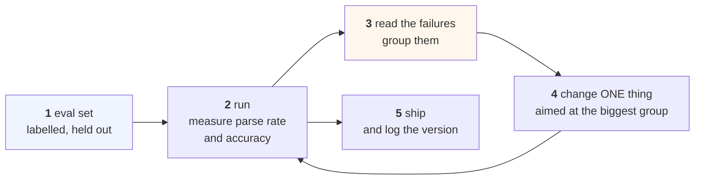

# Lesson 06 — The Iteration Loop

**Goal:** improve a prompt the way you improve a model, instead of by rewriting
it until it feels better.

## What you will learn

- Why "I tried it and it seemed better" is not evidence
- How big an eval set has to be, computed
- Error analysis: reading the failures instead of rewriting the prompt
- The prompt changelog

---

## The loop



Step 1 is the one people skip, and skipping it makes steps 2-5 impossible. The
eval set is the asset; **the prompt is disposable.** You will throw away ten
prompts and keep the eval set for years.

---

## Is that improvement real?

You change a prompt, your 12 test cases go from 8 right to 10 right, and it
feels like progress. Here is what that is worth.

```python
import numpy as np
from scipy import stats

print(f"{'eval set':>10}{'before':>9}{'after':>8}{'gain':>8}{'p-value':>10}{'verdict':>12}")
for n, a, b in [(12, 8, 10), (50, 33, 41), (100, 66, 82), (300, 198, 246), (1000, 660, 820)]:
    table = [[b, n - b], [a, n - a]]
    p = stats.fisher_exact(table)[1]
    print(f"{n:>10}{a/n:>9.2f}{b/n:>8.2f}{(b-a)/n:>8.2f}{p:>10.4f}"
          f"{('real' if p < 0.05 else 'noise'):>12}")
print("\nthe same 16-point improvement, judged on five eval-set sizes.")
```

```text
  eval set   before   after    gain   p-value     verdict
        12     0.67    0.83    0.17    0.6404       noise
        50     0.66    0.82    0.16    0.1095       noise
       100     0.66    0.82    0.16    0.0151        real
       300     0.66    0.82    0.16    0.0000        real
      1000     0.66    0.82    0.16    0.0000        real

the same 16-point improvement, judged on five eval-set sizes.
```

**The same sixteen-point improvement is indistinguishable from noise at 12
examples and at 50, and solid at 100.**

That is a sixteen-point gain — enormous, far larger than any real prompt change
you are likely to make. If *this* cannot be detected on fifty examples, the
three-point difference you are currently excited about cannot be detected on
anything you have.

So the honest reading of a 12-example test is not "it improved". It is
**"I learned nothing, and I have now also overfit my prompt to twelve
sentences."**

---

## How big does the eval set need to be?

```python
print(f"{'gain to detect':>16}{'examples needed':>18}")
for gain in [0.20, 0.10, 0.05, 0.02]:
    p0 = 0.70
    n = 1
    while True:
        se = np.sqrt(p0 * (1 - p0) / n + (p0 + gain) * (1 - p0 - gain) / n)
        if gain / se >= 2.8:
            break
        n += 1
    print(f"{gain:>16.0%}{n:>18,}")
print("\nlabelled, held out, and never used to write the prompt.")
```

```text
  gain to detect   examples needed
             20%                59
             10%               291
              5%             1,247
              2%             8,068

labelled, held out, and never used to write the prompt.
```

**Detecting a 10-point improvement takes 291 labelled examples. A 2-point one
takes 8,068.**

Three practical conclusions:

**Around 300 examples is the sweet spot for prompt work.** It catches
everything worth catching — a 10-point change is a big change — and it is an
afternoon of labelling, not a project.

**Below about 60 examples you cannot detect anything but a catastrophe.** This
is the regime almost all prompt engineering happens in, which is why almost all
of it is folklore.

**Stop chasing 2-point gains.** At 8,068 examples the cost of knowing exceeds
the value of the gain for nearly any product. Spend that effort on the error
analysis below instead.

The same arithmetic, same shape, appears in
[Data-Science 07](../../Data-Science/lessons/07-reproducibility.md) for seeds
and [MLOps 05](../../MLOps/lessons/05-deployment.md) for canary detection —
it is not a prompting fact, it is how counting works.

---

## Error analysis

This is the step that actually improves prompts, and it is not a measurement —
it is reading.

```text
1. Collect every failure. Not a sample, all of them.
2. Read 20. Write one short phrase for each describing what went wrong.
3. Group the phrases. Count the groups.
4. The biggest group is your next change. Make exactly that change.
5. Re-run. Did that group shrink? Did another grow?
```

A real grouping from the failures in this course's lessons:

| Group | Count | What it means | The fix |
|---|---|---|---|
| Output was prose, not a label | 36 | Format failure | A worked example (lesson 02) |
| Answered with the wrong password | — | A distractor in context | Remove it, or reorder (lesson 03) |
| Compared two numbers wrongly | 5 | Capability gap | Move it to code (lesson 04) |
| Topic wrong, format fine | 9 | Capability gap | Not a prompt problem (lesson 04) |

Note that **three of the four fixes are not "write a better prompt".** That is
the usual result of error analysis and the reason to do it: the instinct is
always to rewrite the instruction, and the instruction is rarely what is
broken.

Two rules that keep this honest:

**Change one thing.** If you change the instruction, add an example, and
reorder the context at once, a gain tells you nothing about which to keep —
and a loss tells you nothing about which to undo.

**Never look at the test split.** Keep a dev set for error analysis and a test
set you run twice: once before the work, once at the end. A prompt tuned
against the set you measure on is
[Data-Science 03](../../Data-Science/lessons/03-the-data-you-have.md)'s leakage
with extra steps.

---

## The prompt changelog

A prompt is a production artefact. Give it a file, a version, and a history:

```text
v7  2026-10-03  added "unclear" as a third label
                dev 0.82 -> 0.84 (n=300, p=0.56 — kept for the escape hatch,
                not for the accuracy)
                parse failures 4% -> 0%

v6  2026-09-28  cut examples from 8 to 2
                dev 0.82 -> 0.82 (n=300), tokens 114 -> 36 per call
                saves ~78M tokens/month at current volume

v5  2026-09-21  moved the question after the retrieved chunks
                dev 0.74 -> 0.82 (n=300, p=0.02)
```

Three things make this worth keeping:

**Every entry has an n and a p.** Without them an entry is an opinion.

**v7 records a change that did not improve accuracy and was kept anyway** — for
the escape hatch and the parse rate. That is a legitimate reason, and writing
it down stops someone reverting it in three months to "simplify".

**v6 records a change that improved nothing and saved money.** Deletions belong
in the log as much as additions, and they are the entries nobody writes.

---

## Common mistakes

| Mistake | Why it hurts |
|---|---|
| Testing on 12 cases | A 16-point gain is still noise there |
| "It seems better" | Not a measurement; you cannot defend or reproduce it |
| Chasing 2-point gains | 8,068 labelled examples to know |
| Changing three things at once | The result is uninterpretable either way |
| Tuning against the test set | Leakage, and your number is now fiction |
| Rewriting the instruction first | Error analysis usually points elsewhere |
| No changelog | Nobody knows why the prompt says what it says |
| Not logging deletions | The removed example comes back |

---

## Exercises

1. Build a 300-example eval set for one task. Time how long it took.
2. Run your current prompt on it. What is the parse rate, separately from
   accuracy?
3. Read 20 failures and group them. How many groups? How big is the biggest?
4. Make exactly one change aimed at that group. Re-measure with a p-value.
5. Write the changelog entry, including the n and the p.
6. Compute how many examples you would need to detect the gain you are hoping
   for. Is it reachable?

---

**Next:** [Lesson 07 — Untrusted Text in a Prompt](07-untrusted-text.md)
