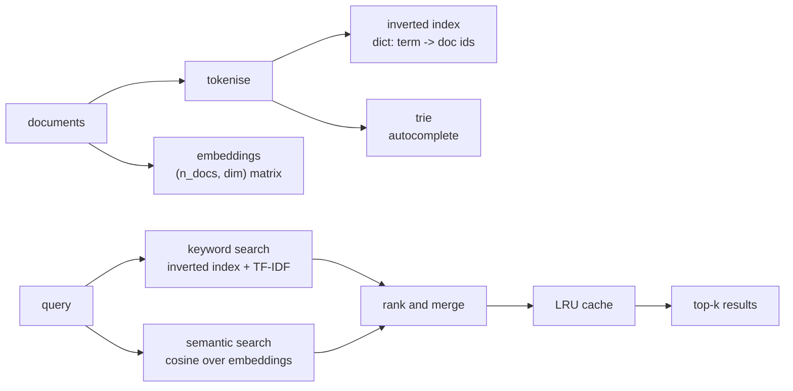

# Project 2 — Build a Search Engine

**Do this after the eleven lessons of Track 2.**

You will build a working search engine over a real text corpus: keyword search,
semantic search, and a benchmark proving which is better and what each costs.

Project 1 asked whether you can analyse data. This one asks whether you can
build a system — with the right data structures, measured performance, and
tests that hold it together.

---

## The system



Everything in that diagram is a structure from Track 2: a hash table, a trie,
a matrix, a heap for top-k, and a cache.

---

## Requirements

### Part 1 — Corpus and tokenisation

At least **2,000 documents**: Wikipedia extracts, news articles, product
reviews, arXiv abstracts, or your own scraped set. Each with an id, a title,
and a body.

```python
def tokenise(text: str) -> list[str]:
    """Lowercase, strip punctuation, drop stopwords, return tokens."""
```

State your decisions in the README: stopwords or not, stemming or not, minimum
token length. Each one changes the results, and you should be able to say how.

### Part 2 — The inverted index

```python
index: dict[str, set[int]] = {}      # term -> document ids
```

Build it, then implement:

- `search(term)` — all documents containing the term
- `search_all(terms)` — set intersection (AND)
- `search_any(terms)` — set union (OR)

**Report the Big-O of each**, and explain why an inverted index beats scanning
every document. Measure both at 2,000 documents and state the ratio.

### Part 3 — Ranking with TF-IDF

Exact matches are not enough; a term appearing in every document carries no
information.

```text
tf(t, d)  = count of t in d / length of d
idf(t)    = log(N / number of documents containing t)
score     = tf * idf, summed over query terms
```

Implement it yourself. Return the top k with a **heap**, not a full sort, and
justify that choice with the Big-O.

### Part 4 — Semantic search

Embed every document (`sentence-transformers/all-MiniLM-L6-v2` is fine on a
laptop; TF-IDF vectors from scikit-learn are an acceptable fallback if you have
no GPU and little patience).

- Store as one normalised `(n_docs, dim)` NumPy array — not a list of arrays
- Search with a single matrix multiply
- Return the top k with `np.argpartition`

Then show the case that makes this worthwhile: a query whose best result shares
**no words** with the document. That one example is the point of the whole
part.

### Part 5 — Autocomplete

A trie over the vocabulary. `complete(prefix, limit=10)` returns matching terms,
most frequent first. Compare its speed against scanning the vocabulary list,
and say why the trie wins.

### Part 6 — Cache

An `LRUCache` for query results, written by hand. Report the hit rate over a
realistic query stream — repeats included, because real users repeat.

### Part 7 — Benchmark

A table you produce by running code, not by estimating:

| Method | Build time | Index memory | Query p50 | Query p95 | Precision@5 |
|---|---|---|---|---|---|
| Linear scan | | | | | |
| Inverted index + TF-IDF | | | | | |
| Semantic (exact) | | | | | |
| Semantic + cache | | | | | |

For Precision@5, hand-label the relevant results for **20 queries** and measure
against that. Labelling is tedious and it is the only honest way to say one
method is better than another.

### Part 8 — Code quality

- `src/` with modules: `tokenise.py`, `inverted_index.py`, `trie.py`,
  `semantic.py`, `cache.py`, `search.py`
- Type hints on every public function, `mypy` clean
- **At least 15 pytest tests**, including: empty query, single-character query,
  a term in no document, a term in every document, unicode and Arabic input,
  cache eviction at capacity
- A CLI: `python -m src.search "your query" --method semantic --k 5`
- Docstrings stating the complexity of each search method

---

## Deliverables

```text
project-2/
├── README.md              design, benchmark, findings
├── src/                   the modules above
├── tests/                 pytest suite
├── notebooks/
│   └── benchmark.ipynb    the measurements and charts
└── data/
    └── corpus.jsonl       or a script that downloads it
```

The README must contain:

1. **Architecture** — a diagram and a paragraph
2. **Structures chosen, and why** — with the Big-O of each operation
3. **The benchmark table**, from real runs
4. **Two example queries** where semantic beats keyword, and one where keyword
   beats semantic
5. **Limits** — corpus size at which this breaks, and what you would use
   instead (FAISS, HNSW, a vector database)

---

## Marking

| Weight | Criterion |
|---|---|
| 25% | Structures implemented correctly by hand |
| 20% | Benchmark is real, reproducible, and honestly reported |
| 15% | Semantic search works and the advantage is demonstrated |
| 15% | Tests: coverage of edge cases, all passing |
| 15% | Code quality: typed, modular, documented |
| 10% | README a reader can follow without asking you anything |

Automatic deductions: using FAISS or scikit-learn's `NearestNeighbors` in place
of writing the search (a comparison against them is welcome); benchmark numbers
that cannot be reproduced by running your code; tests that do not run.

---

## Extensions, if you want to push

- Phrase search with positional postings (`"flat white"` as a phrase)
- Fuzzy matching with edit distance for typos
- Hybrid ranking: combine BM25 and cosine, and tune the weight
- Implement HNSW yourself and measure recall against exact search
- A FastAPI endpoint and a small front end

---

## Milestones

| Day | Done by end of day |
|---|---|
| 1 | Corpus loaded, tokeniser written and tested |
| 2 | Inverted index + TF-IDF ranking |
| 3 | Embeddings, semantic search, trie |
| 4 | Cache, CLI, tests |
| 5 | Benchmark, labelling, README |

---

## Before you submit

- [ ] `pytest` — all green
- [ ] `mypy src/` — clean
- [ ] The benchmark reproduces from a fresh clone
- [ ] Every Big-O claim in the README matches the code
- [ ] The semantic-beats-keyword example actually shares no words
- [ ] The limits section names the real breaking point
