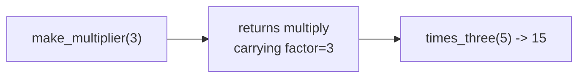

# Lesson 01 — Advanced Functions

**Goal:** treat functions as values, and build tools out of them.

## What you will learn

- Functions as objects; `lambda`, `map`, `filter`
- Closures
- Decorators — writing them, and why every framework uses them
- `functools`: `wraps`, `lru_cache`, `partial`, `reduce`

---

## Functions are objects

A function can be assigned, passed, returned, and stored in a list.

```python
def double(x):
    return x * 2

operation = double                 # no brackets: the function itself
print(operation(5))

operations = {"double": double, "square": lambda x: x ** 2}
print(operations["square"](5))
```

```text
10
25
```

`double` is the function. `double()` is the result of calling it. That
distinction is the foundation of everything below.

---

## lambda, map, filter

A `lambda` is a small function with no name.

```python
prices = [45, 60, 85, 30]

print(list(map(lambda p: round(p * 1.14, 2), prices)))
print(list(filter(lambda p: p > 50, prices)))
print(sorted(prices, key=lambda p: -p))
```

```text
[51.3, 68.4, 96.9, 34.2]
[60, 85]
[85, 60, 45, 30]
```

In Python, `map` and `filter` are usually better written as comprehensions —
`[p * 1.14 for p in prices]` reads better than `map(lambda ...)`. But `lambda`
as a `key=` argument is idiomatic and worth knowing well:

```python
items = [("Latte", 60, 340), ("V60", 85, 90), ("Tea", 30, 200)]

print(sorted(items, key=lambda row: row[2], reverse=True)[0])
print(max(items, key=lambda row: row[1] * row[2]))
```

```text
('Latte', 60, 340)
('Latte', 60, 340)
```

`key=` says *what to compare by*. `sorted`, `max`, `min`, and `groupby` all
take it.

---

## Closures

A function defined inside another function remembers the outer variables, even
after the outer function has returned.

```python
def make_multiplier(factor):
    def multiply(x):
        return x * factor          # 'factor' is remembered
    return multiply

times_three = make_multiplier(3)
times_ten = make_multiplier(10)

print(times_three(5), times_ten(5))
```

```text
15 50
```



Each returned function carries its own copy of the enclosing scope. This is how
you build configured functions — and it is the mechanism decorators rest on.

---

## Decorators

A decorator is a function that takes a function and returns a new one.

```python
import time
import functools

def timed(func):
    @functools.wraps(func)
    def wrapper(*args, **kwargs):
        start = time.perf_counter()
        result = func(*args, **kwargs)
        elapsed = time.perf_counter() - start
        print(f"{func.__name__} took {elapsed:.4f}s")
        return result
    return wrapper

@timed
def slow_sum(n):
    """Add up the numbers below n."""
    return sum(range(n))

print(slow_sum(1_000_000))
print(slow_sum.__name__, "|", slow_sum.__doc__)
```

```text
slow_sum took 0.0094s
499999500000
slow_sum | Add up the numbers below n.
```

`@timed` above `def slow_sum` is exactly `slow_sum = timed(slow_sum)`. The
decorator wraps the original and adds behaviour around it, without changing a
line inside it.

**`@functools.wraps(func)` is not optional.** Without it, the wrapper replaces
the function's name and docstring with its own, and every debugger, traceback
and documentation tool starts lying to you.

A decorator with arguments needs one more layer:

```python
import functools

def retry(attempts=3):
    def decorator(func):
        @functools.wraps(func)
        def wrapper(*args, **kwargs):
            for attempt in range(1, attempts + 1):
                try:
                    return func(*args, **kwargs)
                except Exception as e:
                    print(f"attempt {attempt} failed: {e}")
            raise RuntimeError(f"{func.__name__} failed after {attempts} attempts")
        return wrapper
    return decorator

calls = {"n": 0}

@retry(attempts=3)
def flaky():
    calls["n"] += 1
    if calls["n"] < 3:
        raise ValueError("network")
    return "ok"

print(flaky())
```

```text
attempt 1 failed: network
attempt 2 failed: network
ok
```

Three levels: arguments, then the function, then the call. Read it from the
inside out and it stops being mysterious.

You have already met decorators without writing one: `@dataclass`,
`@property`, `@staticmethod`, Flask's `@app.route`, pytest's `@fixture`.

---

## functools

### lru_cache — memoisation for free

```python
import functools

@functools.lru_cache(maxsize=None)
def fib(n):
    return n if n < 2 else fib(n - 1) + fib(n - 2)

print(fib(50))
print(fib.cache_info())
```

```text
12586269025
CacheInfo(hits=48, misses=51, maxsize=None, currsize=51)
```

Without the cache, `fib(50)` makes about 40 billion calls and never finishes.
With it, 51. The function is unchanged; one line made it usable.

Only cache **pure** functions — same input, same output, no side effects. And
the arguments must be hashable, so no lists or dicts.

### partial — fix some arguments now

```python
import functools

def connect(host, port, timeout):
    return f"{host}:{port} (timeout {timeout}s)"

local = functools.partial(connect, "localhost", timeout=5)
print(local(5432))
print(local(6379))
```

```text
localhost:5432 (timeout 5s)
localhost:6379 (timeout 5s)
```

### reduce — fold a sequence into one value

```python
import functools

print(functools.reduce(lambda a, b: a * b, [1, 2, 3, 4, 5]))
```

```text
120
```

Use it for genuine folds. For sums and maxima, `sum()` and `max()` are clearer.

---

## Common mistakes

| Mistake | What happens |
|---|---|
| `@decorator` without `functools.wraps` | Names and docstrings are destroyed |
| Caching a function with side effects | The side effect happens once, silently |
| `lru_cache` on a method taking `self` | Instances are kept alive forever — a leak |
| A lambda longer than one line's worth | Write a `def` and give it a name |
| Forgetting a decorator runs at import time | Surprising order of execution |

---

## Exercises

1. Write a `@log_calls` decorator printing arguments and the return value.
2. Write `make_counter()` using a closure, returning a function that counts up.
3. Add `lru_cache` to a slow recursive function and measure the difference.
4. Write `@retry` with exponential backoff and use it on a function that fails
   twice before succeeding.
