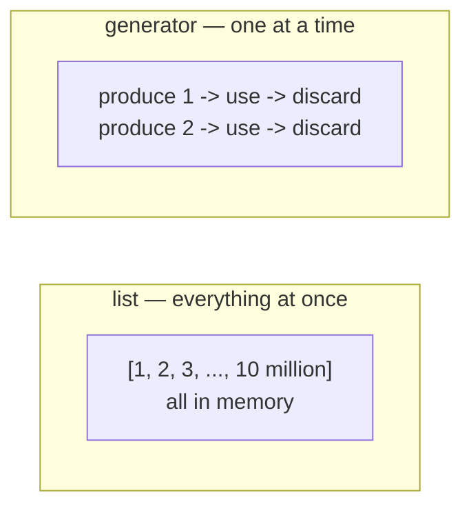

# Lesson 02 — Iterators and Generators

**Goal:** process data that does not fit in memory.

## What you will learn

- The iterator protocol
- `yield`, and generator functions
- Generator expressions
- `itertools`, and streaming pipelines

---

## The problem

```python
data = [line for line in open("events.log")]   # 40 GB file
```

That loads everything into RAM, and your machine has 16 GB. The program dies
before doing any work.

Generators produce values **one at a time, on demand**. Memory stays flat no
matter how large the source is.



---

## The iterator protocol

```python
numbers = [10, 20, 30]
it = iter(numbers)

print(next(it))
print(next(it))
print(next(it))
print(next(it))
```

```text
10
20
30
StopIteration
```

A `for` loop is this, with the `StopIteration` handled for you. Everything you
can loop over — lists, files, dicts, DataFrames — supports it.

---

## yield

A function with `yield` in it is a generator function. Calling it runs no code;
it hands back a generator.

```python
def countdown(n):
    while n > 0:
        yield n
        n -= 1

gen = countdown(3)
print(gen)
print(list(gen))
```

```text
<generator object countdown at 0x...>
[3, 2, 1]
```

`yield` pauses the function and hands a value out. The next `next()` resumes
exactly where it stopped, with all local variables intact.

```python
def stages():
    print("starting")
    yield 1
    print("resumed")
    yield 2
    print("finishing")

g = stages()
print(next(g))
print(next(g))
```

```text
starting
1
resumed
2
```

Notice `"starting"` printed only when the first value was requested. Nothing
runs until someone asks.

---

## Reading a huge file

```python
def read_lines(path):
    """Yield stripped, non-empty lines one at a time."""
    with open(path, encoding="utf-8") as f:
        for line in f:
            line = line.strip()
            if line:
                yield line

def parse(lines):
    """Turn 'item,amount' lines into dicts, skipping broken ones."""
    for line in lines:
        parts = line.split(",")
        if len(parts) != 2:
            continue
        yield {"item": parts[0], "amount": float(parts[1])}

total = sum(row["amount"] for row in parse(read_lines("events.csv")))
print(total)
```

```text
245.0
```

Three generators chained. At any moment exactly one line is in memory — this
works identically on a 4 KB file and a 400 GB one.

That is the pattern worth taking from this lesson: **small generator functions
composed into a pipeline.**

---

## Generator expressions

A comprehension with round brackets:

```python
import sys

squares_list = [x ** 2 for x in range(100_000)]
squares_gen  = (x ** 2 for x in range(100_000))

print(sys.getsizeof(squares_list), "bytes")
print(sys.getsizeof(squares_gen), "bytes")
print(sum(squares_gen))
```

```text
800984 bytes
200 bytes
333328333350000
```

Same result, four thousand times less memory. When you are passing straight
into `sum`, `max`, `any`, or a `for` loop, drop the square brackets.

One cost: a generator is **exhausted after one pass.**

```python
gen = (x for x in range(3))
print(list(gen))
print(list(gen))
```

```text
[0, 1, 2]
[]
```

The second call is empty, with no error. If you need the data twice, keep a
list.

---

## itertools

```python
import itertools

print(list(itertools.islice(itertools.count(10, 5), 4)))
print(list(itertools.chain([1, 2], [3, 4])))
print(list(itertools.combinations("ABC", 2)))
print(list(itertools.accumulate([1, 2, 3, 4])))
```

```text
[10, 15, 20, 25]
[1, 2, 3, 4]
[('A', 'B'), ('A', 'C'), ('B', 'C')]
[1, 3, 6, 10]
```

Batching a stream — the function you will write when feeding a model or an API:

```python
import itertools

def batched(iterable, size):
    """Yield lists of at most `size` items from any iterable."""
    iterator = iter(iterable)
    while batch := list(itertools.islice(iterator, size)):
        yield batch

for batch in batched(range(7), 3):
    print(batch)
```

```text
[0, 1, 2]
[3, 4, 5]
[6]
```

(Python 3.12 added `itertools.batched` for exactly this.)

---

## Generators in a class

```python
class Dataset:
    def __init__(self, rows):
        self.rows = rows

    def __iter__(self):
        for row in self.rows:
            yield row["item"], row["amount"]

data = Dataset([{"item": "Latte", "amount": 60}, {"item": "V60", "amount": 85}])
for item, amount in data:
    print(item, amount)
```

```text
Latte 60
V60 85
```

Defining `__iter__` makes your object work in a `for` loop like a native one.
PyTorch's `IterableDataset` is this idea, and so is every streaming API client
you will use.

---

## When not to use a generator

- You need `len()` — generators have no length
- You need to index or slice — they have no positions
- You need the data more than once
- The data is small and clarity matters more

---

## Common mistakes

| Mistake | What happens |
|---|---|
| Consuming a generator twice | The second pass is silently empty |
| `len(gen)` | `TypeError` |
| `return` instead of `yield` | You get one value, not a stream |
| Building a list inside a generator | You gave back the memory saving |
| Forgetting a generator is lazy | Exceptions surface far from their cause |

---

## Exercises

1. Write `read_lines(path)` that yields non-empty stripped lines.
2. Chain three generators: read, parse, filter. Verify memory stays flat.
3. Compare `sys.getsizeof` for a list comprehension and a generator expression.
4. Write `batched(iterable, size)` without `itertools`, then with it.
