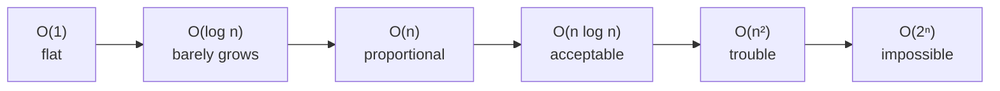

# Lesson 03 — Complexity and Big-O

**Goal:** predict how code behaves as the data grows, before you run it.

## What you will learn

- What Big-O measures
- The common classes, with real examples
- The cost of Python's built-in operations
- How to measure instead of guess

---

## The question Big-O answers

Not "how many seconds?" — that depends on the machine. It answers: **if the
input gets ten times bigger, what happens to the work?**

```python
def find_linear(values, target):
    """O(n) — may look at every element."""
    for i, v in enumerate(values):
        if v == target:
            return i
    return -1
```

Double the list, double the worst-case work. That is O(n).

---

## The classes you will meet

| Big-O | Name | n = 1,000 | n = 1,000,000 | Example |
|---|---|---|---|---|
| O(1) | constant | 1 | 1 | `dict[key]`, `list[i]`, `len()` |
| O(log n) | logarithmic | 10 | 20 | binary search |
| O(n) | linear | 1,000 | 1,000,000 | one loop, `x in list` |
| O(n log n) | linearithmic | 10,000 | 20,000,000 | `sorted()` |
| O(n²) | quadratic | 1,000,000 | 10¹² | nested loops over the same data |
| O(2ⁿ) | exponential | unusable | unusable | naive recursive fibonacci |



The practical line is between O(n log n) and O(n²). Below it you can scale;
above it you cannot. An O(n²) algorithm on a million rows is 10¹² operations —
around eleven days in Python.

---

## Reading the code

Count the loops over the input:

```python
def has_duplicate_slow(values):        # O(n²)
    for i in range(len(values)):
        for j in range(i + 1, len(values)):
            if values[i] == values[j]:
                return True
    return False

def has_duplicate_fast(values):        # O(n)
    return len(set(values)) < len(values)
```

Same answer. On 100,000 items the first takes minutes and the second
milliseconds — because a set lookup is O(1), so one pass is enough.

This trade — **spend memory on a set or dict to remove a loop** — is the single
most valuable optimisation in everyday Python.

Rules for reading:

- Sequential blocks add: O(n) + O(n) = O(n)
- Nested loops multiply: O(n) × O(n) = O(n²)
- Constants drop: O(3n + 50) is O(n)
- The worst term wins: O(n² + n) is O(n²)

---

## The cost of Python's operations

Know this table and half your performance problems disappear before they exist.

| Operation | Cost |
|---|---|
| `list[i]` | O(1) |
| `list.append(x)` | O(1) amortised |
| `list.insert(0, x)` | O(n) — everything shifts |
| `list.pop()` | O(1) |
| `list.pop(0)` | O(n) — use `collections.deque` |
| `x in list` | **O(n)** |
| `x in set` / `x in dict` | **O(1)** |
| `dict[key]`, `dict[key] = v` | O(1) |
| `sorted(list)` | O(n log n) |
| `list.sort()` | O(n log n), no copy |
| `"".join(parts)` | O(n) |
| `s += piece` in a loop | O(n²) — build a list and join |

The two rows in bold are the ones that matter most. This is why:

```python
import time

values = list(range(200_000))
as_set = set(values)

start = time.perf_counter()
199_999 in values
list_time = time.perf_counter() - start

start = time.perf_counter()
199_999 in as_set
set_time = time.perf_counter() - start

print(f"list: {list_time*1000:.3f} ms")
print(f"set:  {set_time*1000:.3f} ms")
```

```text
list: 1.284 ms
set:  0.001 ms
```

A thousandfold difference from one word of the code. Inside a loop over a
million rows, it is the difference between a coffee break and a weekend.

---

## Space complexity

The same idea for memory.

```python
def squares_list(n):      # O(n) memory
    return [x ** 2 for x in range(n)]

def squares_gen(n):       # O(1) memory
    return (x ** 2 for x in range(n))
```

Time and space usually trade against each other: caching buys speed with
memory, streaming buys memory with time. Know which one you are short of.

---

## Measure, do not guess

```python
import timeit

setup = "values = list(range(10_000))"

print(timeit.timeit("sum(values)", setup=setup, number=1000))
print(timeit.timeit("total = 0\nfor v in values: total += v", setup=setup, number=1000))
```

```text
0.038
0.442
```

For finding the slow part of a real program:

```bash
python -m cProfile -s cumtime my_script.py | head -20
```

```text
   ncalls  tottime  percall  cumtime  percall filename:lineno(function)
        1    0.001    0.001   12.402   12.402 my_script.py:1(<module>)
      100    0.004    0.000   11.900    0.119 my_script.py:22(clean_row)
   100000    8.221    0.000    8.221    0.000 my_script.py:31(lookup)
```

Sort by `cumtime`, look at the top three lines, and fix those. Optimising
anything else is a hobby, not engineering.

The order is always: **make it work, measure it, then make the slow part fast.**
Guessing at the bottleneck is wrong more often than it is right.

---

## Common mistakes

| Mistake | What happens |
|---|---|
| `x in big_list` inside a loop | O(n²) — convert to a set once, outside |
| `list.pop(0)` in a loop | O(n²) — use `deque.popleft()` |
| `s += piece` in a loop | O(n²) string copying — use `"".join` |
| Optimising before profiling | Days spent on 2% of the runtime |
| Nested loops over the same DataFrame | Vectorise or merge instead |

---

## Exercises

1. Write duplicate detection in O(n²) and O(n). Time both at n = 20,000.
2. Give the Big-O of three functions from your Project 1 code.
3. Build a string of 100,000 pieces with `+=` and with `join`. Time both.
4. Profile any script of yours and name its top three costs.
