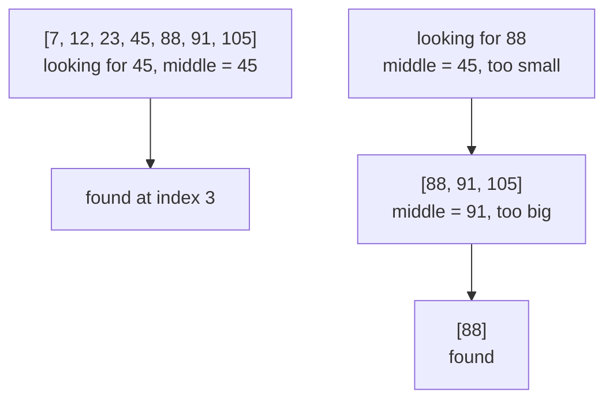
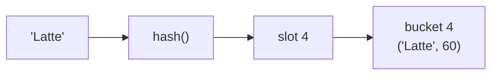

# Lesson 04 — Searching

**Goal:** find things fast, and know which method the situation allows.

## What you will learn

- Linear search, and when it is the right answer
- Binary search, by hand and with `bisect`
- Hashing as search
- Where each one shows up in AI work

---

## Linear search — O(n)

```python
def linear_search(values, target):
    """Return the index of target, or -1. Works on any list."""
    for i, value in enumerate(values):
        if value == target:
            return i
    return -1

print(linear_search([12, 45, 7, 88, 23], 88))
print(linear_search([12, 45, 7, 88, 23], 99))
```

```text
3
-1
```

It needs no preparation and no ordering. For a few hundred items, or a list you
search once, it is the correct choice — sorting first would cost more than the
search saves.

---

## Binary search — O(log n)

If the data is **sorted**, you can halve the problem with every comparison.

```python
def binary_search(values, target):
    """Return the index of target in a sorted list, or -1."""
    low, high = 0, len(values) - 1

    while low <= high:
        middle = (low + high) // 2
        if values[middle] == target:
            return middle
        if values[middle] < target:
            low = middle + 1          # discard the left half
        else:
            high = middle - 1         # discard the right half

    return -1

values = [7, 12, 23, 45, 88, 91, 105]
print(binary_search(values, 45))
print(binary_search(values, 46))
```

```text
3
-1
```



On a million sorted items, binary search needs about **20** comparisons.
Linear search needs up to a million. That is the whole reason databases build
indexes.

Two details that matter in real code:

- `(low + high) // 2` — integer division, or the index is a float and the
  lookup fails.
- `low <= high`, not `<`. With `<`, a one-element range is never checked, and
  the bug only shows up on some inputs.

---

## bisect — the version you should actually use

```python
import bisect

values = [7, 12, 23, 45, 88, 91]

print(bisect.bisect_left(values, 45))     # index of 45
print(bisect.bisect_left(values, 50))     # where 50 would go
bisect.insort(values, 50)                 # insert, keeping order
print(values)
```

```text
3
4
[7, 12, 23, 45, 50, 88, 91]
```

`bisect` is in the standard library, written in C, and correct. Implement
binary search by hand once to understand it, then use this.

It also answers range questions in O(log n):

```python
import bisect

prices = [30, 45, 60, 85, 120, 150]
low = bisect.bisect_left(prices, 45)
high = bisect.bisect_right(prices, 120)
print(prices[low:high])
```

```text
[45, 60, 85, 120]
```

"Every value between X and Y" without scanning the list — this is what a
database range index does.

---

## Hashing — O(1)

Binary search is fast. A hash lookup does not search at all: it computes where
the value must be.

```python
menu = {"Espresso": 45, "Latte": 60, "V60": 85}
print(menu["Latte"])
```

```text
60
```



The key is hashed to a number, the number picks a slot, and the value is read
directly. The dictionary's size does not matter.

Two conditions:

- **Keys must be hashable** — immutable. Strings, numbers and tuples work;
  lists and dicts do not.
- **Only exact matches.** A dict cannot answer "the nearest key" or "everything
  between 40 and 60". For those, you need sorted data or a tree.

---

## Choosing

| Situation | Method | Cost |
|---|---|---|
| Unsorted, one-off search | linear | O(n) |
| Sorted, many searches | binary / `bisect` | O(log n) |
| Exact key lookup | dict / set | O(1) |
| Range query | `bisect` or a B-tree index | O(log n + k) |
| Nearest in high dimensions | vector index (lesson 09) | approximate |

Preparing the data costs something: sorting is O(n log n), building a dict is
O(n). Amortise that over many searches and it pays; do it for a single lookup
and it does not.

---

## Searching in the real world

**pandas.** `df[df.id == x]` scans the whole column — O(n). Set the column as
the index and `df.loc[x]` becomes a hash lookup.

```python
import pandas as pd

df = pd.DataFrame({"id": [3, 1, 2], "value": ["c", "a", "b"]})
indexed = df.set_index("id")
print(indexed.loc[2, "value"])
```

```text
b
```

**Databases.** An index is a B-tree — the same halving idea, laid out for disk.
A query with no usable index is a full table scan, and that is what "the
dashboard got slow" usually means.

**AI systems.** Finding the nearest vector among ten million embeddings cannot
be done exactly and fast, because sorted order does not exist in 384
dimensions. Approximate nearest-neighbour indexes trade a little accuracy for
a thousandfold speedup. Lesson 09 covers them, and Project 2 has you build one.

---

## Common mistakes

| Mistake | What happens |
|---|---|
| Binary search on unsorted data | Wrong answer, no error |
| `(low + high) / 2` | Float index, `TypeError` |
| `while low < high` | Misses the last element on some inputs |
| `x in list` inside a loop | O(n²); build a set once |
| Re-sorting inside a loop | The sort dominates everything else |

---

## Exercises

1. Implement binary search iteratively and recursively; test both on edge cases
   — empty list, one element, target absent.
2. Count comparisons for linear vs binary search on a sorted list of 1,000,000.
3. Use `bisect` to find all values in a range without scanning.
4. Take a slow `x in list` lookup from your own code and convert it to a set.
