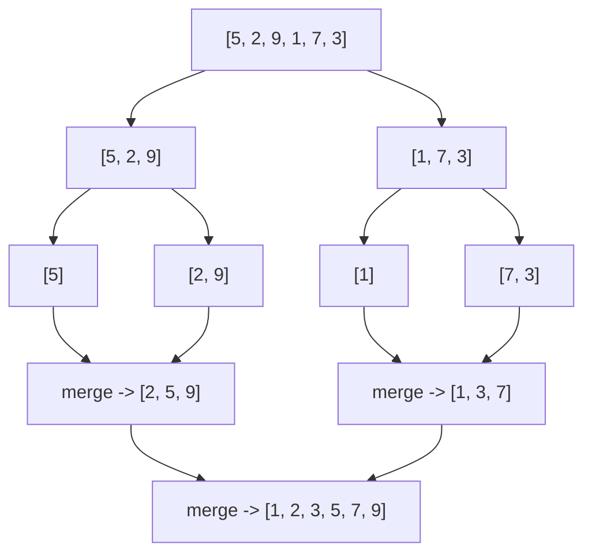

# Lesson 05 — Sorting

**Goal:** understand what `sorted()` costs, and sort real data correctly.

## What you will learn

- Bubble, insertion, merge, quick — what each teaches
- Timsort, which is what Python actually runs
- Sorting by keys, stability
- When not to sort

---

## Why learn the classic algorithms

You will never write a sort in production. You will be asked about them in
interviews, and more usefully, they are the clearest possible demonstration of
how an algorithm's structure decides its cost.

---

## Bubble sort — O(n²)

```python
def bubble_sort(values):
    """Repeatedly swap neighbours that are out of order."""
    items = values.copy()
    n = len(items)
    for i in range(n):
        swapped = False
        for j in range(n - i - 1):
            if items[j] > items[j + 1]:
                items[j], items[j + 1] = items[j + 1], items[j]
                swapped = True
        if not swapped:          # already sorted, stop early
            break
    return items

print(bubble_sort([5, 2, 9, 1, 7]))
```

```text
[1, 2, 5, 7, 9]
```

Two nested loops over the same data: O(n²). Never use it. Understand it,
because it makes the next ones look clever.

---

## Insertion sort — O(n²), but fast where it counts

```python
def insertion_sort(values):
    """Take each item and slide it back into its place."""
    items = values.copy()
    for i in range(1, len(items)):
        current = items[i]
        j = i - 1
        while j >= 0 and items[j] > current:
            items[j + 1] = items[j]
            j -= 1
        items[j + 1] = current
    return items

print(insertion_sort([5, 2, 9, 1, 7]))
```

```text
[1, 2, 5, 7, 9]
```

On nearly-sorted data it approaches O(n), and on tiny lists its low overhead
beats the clever algorithms. That is why Python's real sort uses it for small
runs.

---

## Merge sort — O(n log n), always

```python
def merge_sort(values):
    """Split in half, sort each half, merge them back."""
    if len(values) <= 1:
        return values

    middle = len(values) // 2
    left = merge_sort(values[:middle])
    right = merge_sort(values[middle:])
    return merge(left, right)

def merge(left, right):
    """Interleave two sorted lists into one sorted list."""
    result = []
    i = j = 0
    while i < len(left) and j < len(right):
        if left[i] <= right[j]:
            result.append(left[i]); i += 1
        else:
            result.append(right[j]); j += 1
    result.extend(left[i:])
    result.extend(right[j:])
    return result

print(merge_sort([5, 2, 9, 1, 7, 3]))
```

```text
[1, 2, 3, 5, 7, 9]
```



log n levels of splitting, n work to merge each level: O(n log n) guaranteed,
on any input. The cost is O(n) extra memory.

Merge sort also works when the data does not fit in memory — sort chunks,
write them out, merge the sorted files. That is how you sort a terabyte, and
how Spark does it.

---

## Quick sort — O(n log n) average, O(n²) worst

```python
def quick_sort(values):
    """Partition around a pivot, then sort each side."""
    if len(values) <= 1:
        return values

    pivot = values[len(values) // 2]
    smaller = [v for v in values if v < pivot]
    equal   = [v for v in values if v == pivot]
    larger  = [v for v in values if v > pivot]

    return quick_sort(smaller) + equal + quick_sort(larger)

print(quick_sort([5, 2, 9, 1, 7, 3]))
```

```text
[1, 2, 3, 5, 7, 9]
```

Usually faster than merge sort in practice, and sorts in place in its real
implementation. Its weakness: a bad pivot choice on already-sorted data
degrades it to O(n²).

---

## Comparison

| Algorithm | Best | Average | Worst | Memory | Stable |
|---|---|---|---|---|---|
| Bubble | O(n) | O(n²) | O(n²) | O(1) | yes |
| Insertion | O(n) | O(n²) | O(n²) | O(1) | yes |
| Merge | O(n log n) | O(n log n) | O(n log n) | O(n) | yes |
| Quick | O(n log n) | O(n log n) | O(n²) | O(log n) | no |
| **Timsort** | **O(n)** | **O(n log n)** | **O(n log n)** | O(n) | yes |

---

## What Python actually does

`sorted()` and `.sort()` use **Timsort**: merge sort and insertion sort
combined, with a trick — it detects runs that are already ordered and merges
them instead of re-sorting.

```python
import timeit

setup = "import random; values = list(range(50_000)); random.shuffle(values)"
print("random:", round(timeit.timeit("sorted(values)", setup=setup, number=20), 3))

setup_sorted = "values = list(range(50_000))"
print("sorted:", round(timeit.timeit("sorted(values)", setup=setup_sorted, number=20), 3))
```

```text
random: 0.312
sorted: 0.021
```

Real data is often partly ordered — logs by time, exports by id — and Timsort
exploits that. Write your own sort only to learn.

---

## Sorting real data

```python
items = [
    {"name": "Latte", "price": 60, "cups": 340},
    {"name": "V60", "price": 85, "cups": 90},
    {"name": "Tea", "price": 30, "cups": 340},
]

print([i["name"] for i in sorted(items, key=lambda x: x["price"])])
print([i["name"] for i in sorted(items, key=lambda x: (-x["cups"], x["name"]))])
```

```text
['Tea', 'Latte', 'V60']
['Latte', 'Tea', 'V60']
```

A tuple key sorts by the first element, then the second — here, cups
descending, then name alphabetically. This covers nearly every "sort by this,
then by that" requirement.

`operator.itemgetter` is the faster version for large data:

```python
from operator import itemgetter
print([i["name"] for i in sorted(items, key=itemgetter("price"))])
```

```text
['Tea', 'Latte', 'V60']
```

---

## Stability

A stable sort keeps the original order of items that compare equal. Timsort is
stable, and that lets you sort by several keys in separate passes:

```python
records = [("B", 2), ("A", 1), ("C", 2), ("D", 1)]

by_name = sorted(records, key=lambda r: r[0])
by_group = sorted(by_name, key=lambda r: r[1])
print(by_group)
```

```text
[('A', 1), ('D', 1), ('B', 2), ('C', 2)]
```

Within each group, names stayed alphabetical. Sort by the secondary key first,
then the primary.

---

## When not to sort a whole list

```python
import heapq

values = [45, 12, 88, 23, 91, 7, 60]
print(heapq.nlargest(3, values))
print(min(values), max(values))
```

```text
[91, 88, 60]
7 91
```

Sorting to get the top three is O(n log n) for an answer that costs O(n log k).
On ten million rows that difference is real. Lesson 07 explains the heap that
makes it work.

---

## Common mistakes

| Mistake | What happens |
|---|---|
| `values = values.sort()` | `None` — `.sort()` returns nothing |
| Sorting inside a loop | The sort dominates the runtime |
| Sorting to find min or max | Use `min` / `max` / `nlargest` |
| Sorting mixed types | `TypeError` between `str` and `int` |
| Assuming a stable order from a set or dict-in-old-Python | Order is not guaranteed |

---

## Exercises

1. Implement bubble, insertion and merge sort. Time all three at n = 2,000.
2. Sort a list of dicts by two keys, one ascending and one descending.
3. Use `heapq.nlargest` and `sorted()[:5]` on a million values; compare times.
4. Demonstrate stability: sort by one field, then another, and explain the
   final order.
