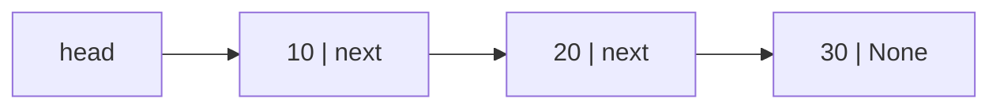
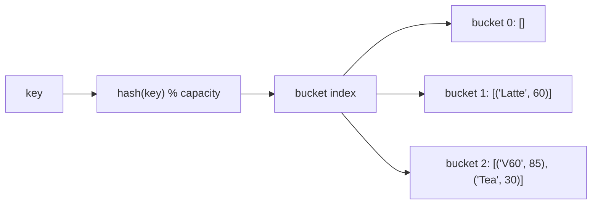

# Lesson 06 — Core Data Structures

**Goal:** build the four structures everything else is made of.

## What you will learn

- Stack and queue, and where each appears
- Linked lists, and why Python rarely needs one
- Hash tables — built by hand, so `dict` stops being magic
- Choosing a structure from the operations you need

---

## Stack — last in, first out

```python
class Stack:
    """LIFO. All operations O(1)."""

    def __init__(self):
        self._items = []

    def push(self, item):
        self._items.append(item)

    def pop(self):
        if not self._items:
            raise IndexError("pop from empty stack")
        return self._items.pop()

    def peek(self):
        return self._items[-1] if self._items else None

    def __len__(self):
        return len(self._items)

stack = Stack()
for token in "abc":
    stack.push(token)
print(stack.pop(), stack.peek(), len(stack))
```

```text
c b 2
```

A Python list already is a stack — `append` and `pop` are both O(1) at the end.

Stacks are everywhere: the call stack that produces your tracebacks, undo
history, expression parsing, and the iterative form of any recursive algorithm.

```python
def is_balanced(text):
    """Check that brackets open and close in the right order."""
    pairs = {")": "(", "]": "[", "}": "{"}
    stack = []
    for char in text:
        if char in "([{":
            stack.append(char)
        elif char in pairs:
            if not stack or stack.pop() != pairs[char]:
                return False
    return not stack

print(is_balanced("{[()]}"), is_balanced("{[(])}"))
```

```text
True False
```

---

## Queue — first in, first out

```python
from collections import deque

queue = deque()
queue.append("first")
queue.append("second")
queue.append("third")

print(queue.popleft())
print(len(queue))
```

```text
first
2
```

Use `collections.deque`, never a list. `list.pop(0)` is O(n) because every
remaining element shifts down; `deque.popleft()` is O(1).

```python
import time
from collections import deque

n = 100_000

start = time.perf_counter()
lst = list(range(n))
while lst:
    lst.pop(0)
list_time = time.perf_counter() - start

start = time.perf_counter()
dq = deque(range(n))
while dq:
    dq.popleft()
deque_time = time.perf_counter() - start

print(f"list:  {list_time:.3f}s")
print(f"deque: {deque_time:.3f}s")
```

```text
list:  0.842s
deque: 0.004s
```

Queues run task pipelines, request handling, and breadth-first search in
lesson 08.

A `deque` with `maxlen` is also the cleanest sliding window there is:

```python
from collections import deque

window = deque(maxlen=3)
for value in [10, 20, 30, 40, 50]:
    window.append(value)
    print(list(window), round(sum(window) / len(window), 1))
```

```text
[10] 10.0
[10, 20] 15.0
[10, 20, 30] 20.0
[20, 30, 40] 30.0
[30, 40, 50] 40.0
```

Old values fall off the front automatically — a moving average in four lines.

---

## Linked list

Each node holds a value and a pointer to the next node.



```python
class Node:
    def __init__(self, value):
        self.value = value
        self.next = None

class LinkedList:
    def __init__(self):
        self.head = None

    def push_front(self, value):
        """Insert at the front — O(1)."""
        node = Node(value)
        node.next = self.head
        self.head = node

    def to_list(self):
        values, current = [], self.head
        while current:
            values.append(current.value)
            current = current.next
        return values

    def reverse(self):
        """Reverse in place — the classic interview question."""
        previous, current = None, self.head
        while current:
            following = current.next
            current.next = previous
            previous, current = current, following
        self.head = previous

ll = LinkedList()
for v in [30, 20, 10]:
    ll.push_front(v)
print(ll.to_list())
ll.reverse()
print(ll.to_list())
```

```text
[10, 20, 30]
[30, 20, 10]
```

| Operation | Linked list | Python list |
|---|---|---|
| Insert at front | O(1) | O(n) |
| Insert at end | O(1) with a tail pointer | O(1) |
| Index access | O(n) | O(1) |
| Memory per item | Higher — a pointer each | Lower, contiguous |

In practice, Python's list wins almost always: contiguous memory is friendly to
the CPU cache, while a linked list scatters nodes across RAM. Learn it for the
pointer manipulation — it is what trees and graphs are built from — not to use
it.

---

## Hash table

This is `dict`, built by hand.

```python
class HashTable:
    """A dict with chaining for collisions."""

    def __init__(self, capacity=8):
        self.capacity = capacity
        self.size = 0
        self.buckets = [[] for _ in range(capacity)]

    def _index(self, key):
        return hash(key) % self.capacity

    def put(self, key, value):
        bucket = self.buckets[self._index(key)]
        for i, (k, _) in enumerate(bucket):
            if k == key:
                bucket[i] = (key, value)       # replace
                return
        bucket.append((key, value))
        self.size += 1
        if self.size > self.capacity * 0.7:    # load factor
            self._resize()

    def get(self, key, default=None):
        for k, v in self.buckets[self._index(key)]:
            if k == key:
                return v
        return default

    def _resize(self):
        old = self.buckets
        self.capacity *= 2
        self.buckets = [[] for _ in range(self.capacity)]
        self.size = 0
        for bucket in old:
            for k, v in bucket:
                self.put(k, v)

table = HashTable()
for name, price in [("Latte", 60), ("V60", 85), ("Tea", 30)]:
    table.put(name, price)

print(table.get("V60"), table.get("Missing", 0), table.capacity)
```

```text
85 0 8
```



Three things this explains about `dict`:

- **Why lookup is O(1).** The hash computes the location; nothing is searched.
- **Why keys must be immutable.** Change a key after insertion and its hash
  changes, so the value is stranded in the wrong bucket.
- **Why it resizes.** Once buckets get crowded, collisions turn lookups into
  linear scans. Growing early keeps them short — at the cost of memory, which
  is why a dict is bigger than a list of the same data.

---

## Choosing

| You need | Use | Cost |
|---|---|---|
| Ordered, indexable | `list` | index O(1), insert-front O(n) |
| Add/remove at both ends | `deque` | O(1) both ends |
| Lookup by key | `dict` | O(1) |
| Uniqueness / membership | `set` | O(1) |
| Sorted with fast insert | `list` + `bisect.insort` | search O(log n) |
| Always get the smallest | `heapq` (lesson 07) | O(log n) |
| Counting | `collections.Counter` | O(n) to build |
| Grouping | `collections.defaultdict(list)` | O(1) per append |

Pick the structure from the operation you perform most, not from habit.

---

## Common mistakes

| Mistake | What happens |
|---|---|
| `list.pop(0)` for a queue | O(n) per call — use `deque` |
| Mutable object as a dict key | `TypeError`, or a stranded value |
| `x in list` for membership checks | O(n); use a set |
| Building a linked list in Python for speed | Slower than a list, every time |
| Ignoring the cache: many small objects | Contiguous beats scattered |

---

## Exercises

1. Implement `Stack` with `push`, `pop`, `peek`, `is_empty` and test it.
2. Use a stack to check balanced brackets, including quotes.
3. Time `list.pop(0)` against `deque.popleft()` at n = 100,000.
4. Extend `HashTable` with `delete`, `keys()` and `__contains__`.
