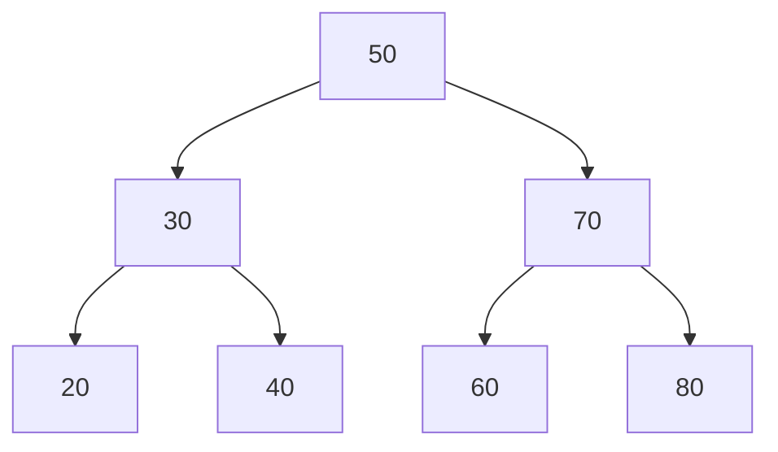

# Lesson 07 — Trees and Heaps

**Goal:** structures that keep order cheaply.

## What you will learn

- Binary search trees: insert, search, traverse
- Why balance matters
- Heaps and `heapq`
- Where trees show up in your actual work

---

## A tree



A node holds a value and links to children. One root, no cycles.

**Binary search tree rule:** everything in the left subtree is smaller than the
node, everything on the right is larger. That single invariant makes search a
series of left/right decisions — O(log n) when the tree is balanced.

---

## Building one

```python
class TreeNode:
    def __init__(self, value):
        self.value = value
        self.left = None
        self.right = None

class BST:
    def __init__(self):
        self.root = None

    def insert(self, value):
        self.root = self._insert(self.root, value)

    def _insert(self, node, value):
        if node is None:
            return TreeNode(value)
        if value < node.value:
            node.left = self._insert(node.left, value)
        elif value > node.value:
            node.right = self._insert(node.right, value)
        return node                      # equal values ignored

    def contains(self, value):
        node = self.root
        while node:
            if value == node.value:
                return True
            node = node.left if value < node.value else node.right
        return False

    def in_order(self):
        """Values in sorted order."""
        result = []
        def walk(node):
            if node:
                walk(node.left)
                result.append(node.value)
                walk(node.right)
        walk(self.root)
        return result

    def height(self):
        def h(node):
            return 0 if node is None else 1 + max(h(node.left), h(node.right))
        return h(self.root)

tree = BST()
for v in [50, 30, 70, 20, 40, 60, 80]:
    tree.insert(v)

print(tree.in_order())
print(tree.contains(40), tree.contains(45))
print("height:", tree.height())
```

```text
[20, 30, 40, 50, 60, 70, 80]
True False
height: 3
```

An in-order walk of a BST returns sorted data — that is not a coincidence, it
is the invariant paying out.

---

## Traversals

```python
def traversals(node, order):
    if node is None:
        return []
    left = traversals(node.left, order)
    right = traversals(node.right, order)
    if order == "pre":
        return [node.value] + left + right      # root, left, right
    if order == "in":
        return left + [node.value] + right      # left, root, right
    return left + right + [node.value]          # post: left, right, root

print(traversals(tree.root, "pre"))
print(traversals(tree.root, "in"))
print(traversals(tree.root, "post"))
```

```text
[50, 30, 20, 40, 70, 60, 80]
[20, 30, 40, 50, 60, 70, 80]
[20, 40, 30, 60, 80, 70, 50]
```

| Traversal | Order | Used for |
|---|---|---|
| Pre-order | root, left, right | Copying a tree, serialising |
| In-order | left, root, right | Reading a BST in sorted order |
| Post-order | left, right, root | Deleting, evaluating expressions |

Breadth-first, level by level, needs a queue rather than recursion:

```python
from collections import deque

def level_order(root):
    if not root:
        return []
    result, queue = [], deque([root])
    while queue:
        node = queue.popleft()
        result.append(node.value)
        if node.left:
            queue.append(node.left)
        if node.right:
            queue.append(node.right)
    return result

print(level_order(tree.root))
```

```text
[50, 30, 70, 20, 40, 60, 80]
```

---

## Balance is the whole game

```python
balanced = BST()
for v in [50, 30, 70, 20, 40, 60, 80]:
    balanced.insert(v)

degenerate = BST()
for v in [10, 20, 30, 40, 50, 60, 70]:
    degenerate.insert(v)

print("balanced height:  ", balanced.height())
print("degenerate height:", degenerate.height())
```

```text
balanced height:   3
degenerate height: 7
```

Inserting already-sorted data gives every node one child — the tree is a linked
list wearing a costume, and search degrades to O(n).

Real systems use self-balancing trees (AVL, red-black) that rotate on insert to
keep the height at O(log n). Python's standard library has no BST, because
`dict` covers key lookup and `bisect` covers sorted lists; you meet balanced
trees through database indexes (B-trees) rather than by writing them.

---

## Heaps

A heap keeps only one promise: **the smallest item is at the top**. That is
weaker than sorting, and much cheaper to maintain.

```python
import heapq

values = [45, 12, 88, 23, 91, 7]
heapq.heapify(values)
print(values[0])

heapq.heappush(values, 3)
print(heapq.heappop(values), heapq.heappop(values))
```

```text
7
3 7
```

| Operation | Cost |
|---|---|
| `heapify(list)` | O(n) |
| `heappush` | O(log n) |
| `heappop` | O(log n) |
| peek at smallest — `heap[0]` | O(1) |

`heapq` is a **min-heap**. For a max-heap, push negated values:

```python
import heapq

heap = []
for value in [45, 12, 88, 23]:
    heapq.heappush(heap, -value)
print(-heapq.heappop(heap))
```

```text
88
```

---

## Top-k without sorting

```python
import heapq
import random

random.seed(0)
values = [random.randint(0, 1_000_000) for _ in range(1_000_000)]

print(heapq.nlargest(3, values))
```

```text
[1000000, 1000000, 999999]
```

Sorting a million values to read three of them is O(n log n). A heap of size k
does it in O(n log k) with k items of memory. On streams — where you cannot
hold the data at all — it is the only option.

---

## Priority queue

```python
import heapq
import itertools

class PriorityQueue:
    """Lowest priority number comes out first; ties break by insertion order."""

    def __init__(self):
        self._heap = []
        self._counter = itertools.count()

    def push(self, item, priority):
        heapq.heappush(self._heap, (priority, next(self._counter), item))

    def pop(self):
        priority, _, item = heapq.heappop(self._heap)
        return item, priority

    def __len__(self):
        return len(self._heap)

queue = PriorityQueue()
queue.push("write report", 3)
queue.push("fix production", 1)
queue.push("reply to email", 2)

while queue:
    print(queue.pop())
```

```text
('fix production', 1)
('reply to email', 2)
('write report', 3)
```

The counter matters: without it, two items of equal priority make Python
compare the items themselves, and it raises `TypeError` on anything that is not
comparable. Every real priority queue has this tiebreaker.

Priority queues drive Dijkstra's algorithm in lesson 08, task schedulers, and
beam search in text generation.

---

## Where trees appear in your work

- **Database indexes** — B-trees, the same idea widened for disk pages
- **Decision trees and gradient boosting** — the model *is* a tree, and its
  depth is the balance problem from above
- **File systems, JSON, HTML** — trees you already use daily
- **Beam search** — a heap over partial sequences when generating text

---

## Common mistakes

| Mistake | What happens |
|---|---|
| Inserting sorted data into a plain BST | Degenerates to O(n) |
| Expecting `heapq` to keep the list sorted | Only `heap[0]` is guaranteed |
| No tiebreaker in a priority queue | `TypeError` comparing payloads |
| Deep recursion on a large tree | `RecursionError` — go iterative |
| Sorting to get the top 3 | Use `nlargest` |

---

## Exercises

1. Add `delete(value)` to the BST. Handle the three cases: leaf, one child, two.
2. Write `is_balanced(root)` returning whether the subtree heights differ by
   at most one.
3. Find the 10 largest values in a million-element list with `heapq` and with
   `sorted()`. Time both.
4. Build a priority queue and simulate a task scheduler with equal priorities.
