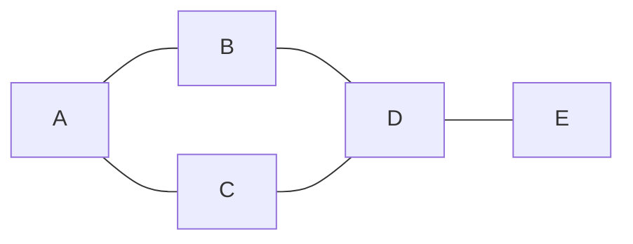

# Lesson 08 — Graphs

**Goal:** model relationships, and walk them.

## What you will learn

- Representing a graph
- BFS and DFS
- Shortest paths: unweighted and weighted
- Cycle detection and topological sort

---

## What a graph is

Nodes connected by edges. Unlike a tree, there is no root and cycles are
allowed.



You are already surrounded by them: social networks, road maps, package
dependencies, web links, neural network computation graphs, Spark DAGs.

---

## Representation

```python
graph = {
    "A": ["B", "C"],
    "B": ["A", "D"],
    "C": ["A", "D"],
    "D": ["B", "C", "E"],
    "E": ["D"],
}
```

An **adjacency list** — a dict of node to neighbours. It uses O(V + E) memory
and is the right default for the sparse graphs that occur in reality.

An adjacency matrix (a V×V grid of 0/1) answers "is A connected to B?" in O(1)
but costs O(V²) memory. For 100,000 nodes that is ten billion cells, almost all
zero. Use it only for small, dense graphs.

---

## BFS — breadth first

Visit everything one step away, then two steps, and so on. Needs a queue.

```python
from collections import deque

def bfs(graph, start):
    """Visit nodes in order of distance from start."""
    visited = {start}
    order = []
    queue = deque([start])

    while queue:
        node = queue.popleft()
        order.append(node)
        for neighbour in graph[node]:
            if neighbour not in visited:
                visited.add(neighbour)
                queue.append(neighbour)
    return order

print(bfs(graph, "A"))
```

```text
['A', 'B', 'C', 'D', 'E']
```

**The `visited` set is not optional.** A graph has cycles; without it, BFS
loops forever. Mark a node visited when you *enqueue* it, not when you dequeue
it, or it lands in the queue twice.

Because BFS expands by distance, the first time it reaches a node is by a
shortest path:

```python
from collections import deque

def shortest_path(graph, start, goal):
    """Fewest edges from start to goal, or None."""
    if start == goal:
        return [start]
    visited = {start}
    queue = deque([(start, [start])])

    while queue:
        node, path = queue.popleft()
        for neighbour in graph[node]:
            if neighbour == goal:
                return path + [neighbour]
            if neighbour not in visited:
                visited.add(neighbour)
                queue.append((neighbour, path + [neighbour]))
    return None

print(shortest_path(graph, "A", "E"))
```

```text
['A', 'B', 'D', 'E']
```

This is "degrees of separation", the shortest route on an unweighted map, and
the minimum number of moves in a puzzle.

---

## DFS — depth first

Follow one path as far as it goes, then back up. Needs a stack, or recursion.

```python
def dfs(graph, node, visited=None):
    """Recursive depth-first traversal."""
    if visited is None:
        visited = set()
    visited.add(node)
    order = [node]
    for neighbour in graph[node]:
        if neighbour not in visited:
            order.extend(dfs(graph, neighbour, visited))
    return order

def dfs_iterative(graph, start):
    """Same idea with an explicit stack — no recursion limit."""
    visited, order, stack = set(), [], [start]
    while stack:
        node = stack.pop()
        if node in visited:
            continue
        visited.add(node)
        order.append(node)
        stack.extend(reversed(graph[node]))
    return order

print(dfs(graph, "A"))
print(dfs_iterative(graph, "A"))
```

```text
['A', 'B', 'D', 'C', 'E']
['A', 'B', 'D', 'C', 'E']
```

| | BFS | DFS |
|---|---|---|
| Structure | queue | stack / recursion |
| Finds | shortest path (unweighted) | any path |
| Memory | wide level can be large | depth of the path |
| Good for | nearest, levels, distance | cycles, components, topological order |

Use the iterative version on large graphs — Python's recursion limit is around
1,000 frames, and a long chain will hit it.

---

## Weighted graphs and Dijkstra

When edges have a cost, "fewest edges" stops being "cheapest".

```python
import heapq

weighted = {
    "A": {"B": 4, "C": 2},
    "B": {"A": 4, "D": 5},
    "C": {"A": 2, "D": 8, "E": 10},
    "D": {"B": 5, "C": 8, "E": 2},
    "E": {"C": 10, "D": 2},
}

def dijkstra(graph, start):
    """Cheapest cost from start to every reachable node."""
    distances = {node: float("inf") for node in graph}
    distances[start] = 0
    queue = [(0, start)]

    while queue:
        cost, node = heapq.heappop(queue)
        if cost > distances[node]:
            continue                       # a better route already won
        for neighbour, weight in graph[node].items():
            candidate = cost + weight
            if candidate < distances[neighbour]:
                distances[neighbour] = candidate
                heapq.heappush(queue, (candidate, neighbour))
    return distances

print(dijkstra(weighted, "A"))
```

```text
{'A': 0, 'B': 4, 'C': 2, 'D': 9, 'E': 11}
```

A heap holds the frontier, always handing back the cheapest unexplored node —
this is the priority queue from lesson 07 doing real work.

Dijkstra requires non-negative weights. With negative edges, use Bellman-Ford.

---

## Cycle detection and topological sort

For a directed graph — dependencies, build steps, a DAG in Spark or Airflow —
two questions come up constantly: is there a cycle, and in what order can I run
these?

```python
def topological_sort(graph):
    """Return an order where every node comes after its dependencies.
    Returns None if the graph has a cycle."""
    in_degree = {node: 0 for node in graph}
    for node in graph:
        for neighbour in graph[node]:
            in_degree[neighbour] += 1

    from collections import deque
    queue = deque([n for n, d in in_degree.items() if d == 0])
    order = []

    while queue:
        node = queue.popleft()
        order.append(node)
        for neighbour in graph[node]:
            in_degree[neighbour] -= 1
            if in_degree[neighbour] == 0:
                queue.append(neighbour)

    return order if len(order) == len(graph) else None

tasks = {
    "clean":   ["features"],
    "load":    ["clean"],
    "features": ["train"],
    "train":   ["evaluate"],
    "evaluate": [],
}
print(topological_sort(tasks))

cyclic = {"a": ["b"], "b": ["c"], "c": ["a"]}
print(topological_sort(cyclic))
```

```text
['load', 'clean', 'features', 'train', 'evaluate']
None
```

Repeatedly take everything with no remaining dependencies. If nodes are left
over when the queue empties, they are tangled in a cycle — which is exactly how
a build tool reports a circular dependency.

---

## Cost

| Operation | Adjacency list |
|---|---|
| BFS / DFS | O(V + E) |
| Dijkstra with a heap | O((V + E) log V) |
| Topological sort | O(V + E) |
| Memory | O(V + E) |

---

## In practice

For real graph work use a library — `networkx` for analysis, `igraph` for
scale, PyTorch Geometric for graph neural networks:

```python
import networkx as nx

g = nx.Graph(graph)
print(nx.shortest_path(g, "A", "E"))
print(round(nx.density(g), 3))
```

```text
['A', 'B', 'D', 'E']
0.5
```

Write the algorithms once to understand them. Then use the library, which
handles the cases you have not thought of.

---

## Common mistakes

| Mistake | What happens |
|---|---|
| No `visited` set | Infinite loop on any cycle |
| Marking visited on dequeue | Duplicates in the queue, wasted work |
| BFS for weighted shortest paths | Wrong answer — use Dijkstra |
| Dijkstra with negative weights | Wrong answer, silently |
| Recursive DFS on a deep graph | `RecursionError` |
| Adjacency matrix for a sparse graph | Memory exhausted |

---

## Exercises

1. Build a graph of ten nodes; run BFS and DFS and explain the different orders.
2. Write `has_path(graph, a, b)` and `connected_components(graph)`.
3. Run Dijkstra on a weighted graph and return the path, not only the cost.
4. Topologically sort your Project 1 pipeline steps.
