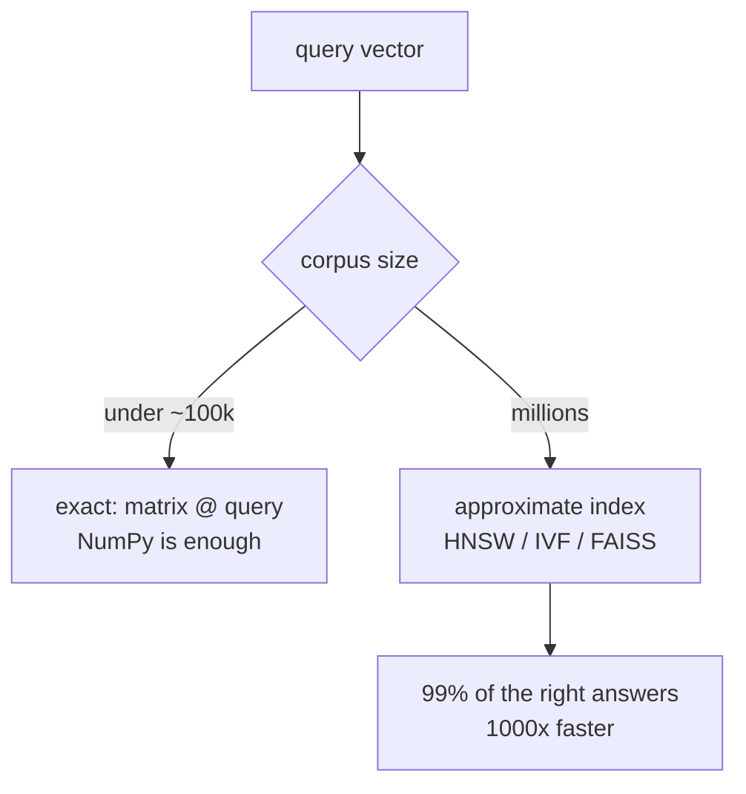
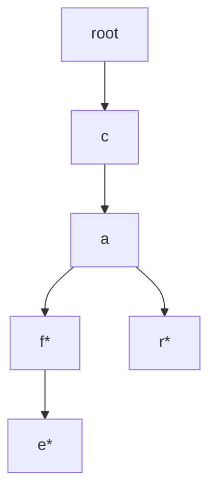

# Lesson 09 — Data Structures for AI Engineers

**Goal:** the structures that show up specifically in AI systems.

## What you will learn

- Vectors and embeddings as a data structure
- Nearest-neighbour search, exact and approximate
- Tries for prefixes and tokenisation
- Caches, and batching as a structure

---

## The vector

An embedding is a fixed-length array of floats where **distance means
meaning**. That is the entire foundation of semantic search, recommendation,
RAG, and deduplication.

```python
import numpy as np

embeddings = {
    "espresso":   np.array([0.9, 0.1, 0.0]),
    "americano":  np.array([0.8, 0.2, 0.1]),
    "sports car": np.array([0.0, 0.1, 0.9]),
}

def cosine(a, b):
    """1.0 = identical direction, 0 = unrelated, -1 = opposite."""
    return float(a @ b / (np.linalg.norm(a) * np.linalg.norm(b)))

print(round(cosine(embeddings["espresso"], embeddings["americano"]), 3))
print(round(cosine(embeddings["espresso"], embeddings["sports car"]), 3))
```

```text
0.984
0.012
```

Cosine similarity compares **direction**, ignoring length — which is what you
want, since a longer document should not be less similar just for being longer.

**Normalise once, then similarity is a dot product:**

```python
import numpy as np

matrix = np.random.default_rng(0).normal(size=(5, 4))
normalised = matrix / np.linalg.norm(matrix, axis=1, keepdims=True)

similarity = normalised @ normalised.T
print(similarity.shape)
print(np.allclose(np.diag(similarity), 1.0))
```

```text
(5, 5)
True
```

Every vector is perfectly similar to itself, so the diagonal is 1.0 — a quick
sanity check that your normalisation actually ran.

A matrix multiply of the whole corpus at once beats a Python loop over pairs by
two orders of magnitude. Store embeddings as one `(n_items, n_dims)` array, not
as a list of arrays.

---

## Exact nearest neighbour

```python
import numpy as np

def top_k(query, matrix, k=3):
    """Indices of the k most similar rows. Assumes normalised vectors."""
    scores = matrix @ query
    best = np.argpartition(-scores, k)[:k]          # O(n), not a full sort
    return best[np.argsort(-scores[best])]          # sort only those k

rng = np.random.default_rng(0)
corpus = rng.normal(size=(10_000, 128))
corpus /= np.linalg.norm(corpus, axis=1, keepdims=True)
query = corpus[42]

print(top_k(query, corpus, k=3)[0])
```

```text
42
```

`np.argpartition` is the heap idea from lesson 07 in NumPy: it finds the top k
without sorting all n. On ten thousand vectors this is instant.

The problem is scale. Exact search is O(n × d) per query — at ten million
vectors of 768 dimensions, that is seven billion multiplications for **one**
query.

---

## Approximate nearest neighbour



The trade is explicit: give up a little recall, gain orders of magnitude in
speed. Three approaches you will hear named:

- **IVF** — cluster the vectors, search only the nearest few clusters.
- **HNSW** — a layered graph where each layer is a coarser view; greedily walk
  towards the query, dropping down layers. This is lesson 08's graph traversal
  applied to vectors, and it is what most vector databases use.
- **Product quantisation** — compress each vector into a few bytes so the index
  fits in RAM.

In production you use `faiss`, `hnswlib`, or a vector database. You do not
implement HNSW. You do need to know which knob you are turning: more clusters
searched means better recall and slower queries.

---

## Trie

A tree keyed by prefix. Every node is one character; the path from the root
spells the word.



```python
class Trie:
    """Prefix tree. Lookup costs the length of the word, not the size of the set."""

    def __init__(self):
        self.root = {}
        self.END = "*"

    def insert(self, word):
        node = self.root
        for char in word:
            node = node.setdefault(char, {})
        node[self.END] = True

    def contains(self, word):
        node = self._walk(word)
        return node is not None and self.END in node

    def starts_with(self, prefix):
        """All words with this prefix."""
        node = self._walk(prefix)
        if node is None:
            return []
        found = []
        def collect(node, current):
            if self.END in node:
                found.append(current)
            for char, child in node.items():
                if char != self.END:
                    collect(child, current + char)
        collect(node, prefix)
        return sorted(found)

    def _walk(self, prefix):
        node = self.root
        for char in prefix:
            if char not in node:
                return None
            node = node[char]
        return node

trie = Trie()
for word in ["cafe", "caf", "car", "cart", "dog"]:
    trie.insert(word)

print(trie.contains("cafe"), trie.contains("ca"))
print(trie.starts_with("car"))
```

```text
True False
['car', 'cart']
```

A set answers "is this word present?" just as fast. Only a trie answers "every
word starting with `car`" without scanning everything.

Where it appears in AI work: autocomplete, BPE and WordPiece tokenisers,
dictionary-based entity matching, and constrained decoding — forcing a language
model to generate only strings in a valid set.

---

## Caches

Inference is expensive and requests repeat. A cache is a dict plus an eviction
policy.

```python
from collections import OrderedDict

class LRUCache:
    """Least Recently Used. Both operations O(1)."""

    def __init__(self, capacity=128):
        self.capacity = capacity
        self.data = OrderedDict()

    def get(self, key, default=None):
        if key not in self.data:
            return default
        self.data.move_to_end(key)        # mark as recently used
        return self.data[key]

    def put(self, key, value):
        if key in self.data:
            self.data.move_to_end(key)
        self.data[key] = value
        if len(self.data) > self.capacity:
            self.data.popitem(last=False)  # drop the oldest

cache = LRUCache(capacity=2)
cache.put("a", 1)
cache.put("b", 2)
cache.get("a")                 # 'a' is now the most recent
cache.put("c", 3)              # evicts 'b'

print(list(cache.data.keys()))
```

```text
['a', 'c']
```

`functools.lru_cache` gives you this for function calls. Write it by hand once
so you know what "cache eviction" means when your inference service runs out of
memory.

The KV cache in a transformer is the same idea at a different scale: keys and
values for tokens already processed are kept so each new token costs one step
instead of re-reading the whole sequence.

---

## Batching

Batching is a data structure decision, not an optimisation trick. A GPU
processing one item at a time is idle almost all of the time.

```python
import numpy as np

def batched(items, size):
    """Yield consecutive slices of `size` items."""
    for start in range(0, len(items), size):
        yield items[start:start + size]

texts = [f"document {i}" for i in range(10)]
for batch in batched(texts, 4):
    print(len(batch), batch[0])
```

```text
4 document 0
4 document 4
2 document 8
```

Two things to get right:

- **Padding.** A batch must be rectangular, so short sequences are padded and
  an attention mask marks the real tokens. A batch of one 500-token document
  and thirty 10-token ones wastes most of the compute.
- **Sort by length first.** Group similar lengths into the same batch and
  padding waste collapses. This is called length bucketing and it is often a
  2–3× throughput win for free.

---

## The map

| Need | Structure | Cost |
|---|---|---|
| Exact key lookup | `dict` | O(1) |
| Similarity search, small corpus | NumPy matrix | O(n·d) per query |
| Similarity search, large corpus | HNSW / IVF index | ~O(log n), approximate |
| Prefix queries, autocomplete | trie | O(len(prefix)) |
| Repeated expensive calls | LRU cache | O(1) |
| Top-k from a stream | heap | O(n log k) |
| Feeding a GPU | batch + mask | — |

---

## Common mistakes

| Mistake | What happens |
|---|---|
| Looping in Python over embeddings | 100× slower than one matrix multiply |
| Forgetting to normalise before dot products | Cosine similarity is wrong |
| Exact search at ten million vectors | Seconds per query |
| Not measuring recall of an approximate index | You cannot tell what you gave up |
| Unbounded cache | Memory grows until the process is killed |
| Batching without sorting by length | Most of the compute is padding |

---

## Exercises

1. Build the similarity matrix of 10 normalised vectors. Why is the
   diagonal all ones, and why is the matrix symmetric?
2. Implement cosine similarity search over 10,000 random vectors; return top 5.
3. Build a trie over a word list and implement autocomplete for a prefix.
4. Write an `LRUCache`, then compare against `functools.lru_cache` on a slow
   function.
