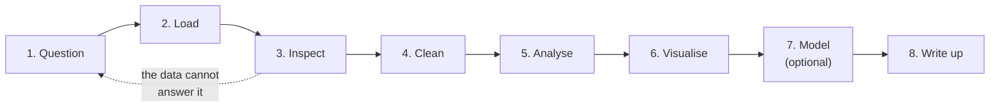

# Project 1 — From Raw Data to a Defended Answer

**Do this after finishing the eleven lessons and the libraries section.**

You pick a dataset, ask a real question of it, answer the question, and defend
the answer. That is the job. Everything in Track 1 exists to make this
possible.

---

## What you deliver

A folder containing:

```text
project-1/
├── README.md              your findings, written for a human
├── analysis.ipynb         the work, top to bottom, runs without errors
├── data/
│   ├── raw/               exactly as downloaded, never edited
│   └── processed/         what your code produced
├── src/
│   └── clean.py           reusable functions, with docstrings
└── figures/               the charts you reference in the README
```

Two rules about this layout, and they are not stylistic:

- **`data/raw/` is read-only.** You never edit it, ever. Every change is made
  in code, so that anyone can reproduce your result from the original file.
- **Anything in `processed/` is disposable.** If deleting it and re-running the
  notebook does not recreate it, your analysis is not reproducible.

---

## The pipeline you are building



That arrow back to the question is the one people skip. Sometimes the honest
finding is that the data cannot answer what you asked. Say so — that is a
result, not a failure.

---

## Requirements

### 1. A question, first

Write it in your README before you load anything. It must be specific enough
to be wrong.

- Bad: "analyse sales data"
- Good: "Which three products generate the most revenue per order, and does
  that ranking hold across all branches?"

### 2. Data

Any real dataset with at least **1,000 rows** and **five columns**, including
at least one numeric, one categorical, and one date. Sources: Kaggle,
data.gov.eg, the World Bank, a public API, or data from your own work.

Synthetic data you generated yourself does not count. The messiness is the
lesson.

### 3. Cleaning, documented

In the notebook, show:

- `df.info()` and `df.isna().sum()` before you touch anything
- Every cleaning decision, with a markdown cell saying **why**
- Row count before and after each step that removes rows

"I dropped 340 rows with a missing price, which is 3% of the data, because
price is the variable I am analysing" is a defensible sentence. "`df.dropna()`"
with no comment is not.

### 4. Analysis

At least:

- One `groupby().agg()` producing a real comparison
- One merge or join of two sources, with the row count checked before and after
- Three computed columns that did not exist in the raw data

### 5. Charts

Four charts minimum, each of a different type, each with:

- A title that states the finding, not the column names
- Labelled axes with units
- A sentence under it in the notebook saying what it shows

Save them into `figures/` at `dpi=150`.

### 6. Code quality

- At least three functions with docstrings, living in `src/clean.py`
- No copy-pasted block repeated three times
- The notebook runs top to bottom on a fresh kernel with no errors
- No hard-coded absolute paths like `/Users/you/Desktop/...`

### 7. The README

The part most people rush, and the only part a manager reads.

```markdown
# <Title — the finding, not the topic>

## Question
## Data — source, size, date obtained, licence
## Method — what you did, in six sentences
## Findings — three to five, each with a number and a chart
## Limitations — what this does NOT prove
## How to reproduce — the exact commands
```

The **Limitations** section is not modesty. Correlation from one year of data
in one city does not generalise, and saying so is what separates an analyst
from someone with a chart.

---

## Optional extension

Add a `LogisticRegression` or `LinearRegression` baseline from
[scikit-learn](../libraries/04-scikit-learn.md): split properly, report a
metric that suits the problem, and state plainly whether it beats guessing the
majority class or the mean. A model that does not beat that baseline is a
finding too.

---

## Marking

| Weight | Criterion |
|---|---|
| 20% | The question is specific, and it is actually answered |
| 25% | Cleaning is correct, documented, and reproducible |
| 20% | Analysis is sound — right aggregation, joins verified |
| 15% | Charts are readable and support the claims |
| 10% | Code quality: functions, docstrings, no repetition |
| 10% | README a non-technical reader can follow |

Automatic deductions: the notebook does not run end to end; `data/raw/` was
edited by hand; a chart has no axis labels; a claim in the README has no number
behind it.

---

## Milestones

| Day | Done by end of day |
|---|---|
| 1 | Question written, dataset chosen, `df.info()` inspected |
| 2 | Cleaning finished, `processed/` written by code |
| 3 | Analysis and charts |
| 4 | README, tidy-up, fresh-kernel run |

---

## Before you submit

- [ ] Restart the kernel, run all — no errors
- [ ] `data/raw/` is untouched
- [ ] Every chart has a title stating a finding, and labelled axes
- [ ] Every number in the README appears in the notebook
- [ ] The limitations section is honest
- [ ] Someone else can clone the folder and reproduce it
