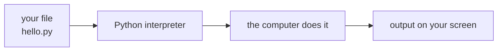

# Lesson 01 — Hello, Python

**Goal:** run your first program and understand exactly what happened.

## What you will learn

- What Python actually is
- The two ways to run code
- `print()`, and why it is the most useful debugging tool you own
- Comments

---

## What Python is

Python is a language you write in, and a program (the *interpreter*) that reads
what you wrote and does it — line by line, top to bottom.



There is no compile step you have to think about. You write a file, you run it,
you see the result. That loop — write, run, look — is the whole job.

---

## Two ways to run code

**1. A file.** Put this in a file called `hello.py`:

```python
print("Hello, Python")
```

Then in the terminal:

```bash
python3 hello.py
```

```text
Hello, Python
```

**2. A notebook or the REPL.** Type a line, press run, see the answer
immediately. Good for experimenting. The lessons in this course ship as
notebooks for exactly this reason.

Use files for programs you keep. Use notebooks for questions you are asking.

---

## print()

`print()` puts something on the screen.

```python
print("Tayel AI Labs")
print(2026)
print(3 * 7)
```

```text
Tayel AI Labs
2026
21
```

Three things are worth noticing already:

- Text goes in quotes. `"Tayel AI Labs"` is text; without quotes Python would
  look for something *named* Tayel and fail.
- Numbers do not need quotes.
- Python did the multiplication **before** printing. It always evaluates the
  inside first, then hands the result to `print`.

You can print several things at once, separated by commas:

```python
print("Result:", 3 * 7, "items")
```

```text
Result: 21 items
```

Python puts a single space between them. If you want something else, say so:

```python
print("2026", "09", "22", sep="-")
```

```text
2026-09-22
```

---

## Comments

A `#` means: ignore the rest of this line.

```python
# This line does nothing at all.
print("this one runs")  # and so does this, up to the hash
```

```text
this one runs
```

Comments are notes to the next person who reads the file. That person is
usually you, three months later, and they do not remember any of this.

Write comments that explain **why**, not what:

```python
# Bad — the code already says this
x = x + 1  # add one to x

# Good — this is information the code cannot carry
x = x + 1  # the sensor counts from 0, the report counts from 1
```

---

## Common mistakes

| You wrote | Python says | The fix |
|---|---|---|
| `print(Hello)` | `NameError: name 'Hello' is not defined` | Quote it: `print("Hello")` |
| `print("Hello"` | `SyntaxError` | Close the bracket |
| `Print("Hello")` | `NameError: name 'Print' is not defined` | Python is case sensitive: `print` |

Read the error message. It names the file, the line number, and the problem.
Beginners panic at errors; engineers read them.

---

## Exercises

1. Print your name, then your city, on two separate lines.
2. Print `10 + 5` and `"10 + 5"`. Explain, out loud, why they differ.
3. Make Python print exactly: `Tayel|AI|Labs` using `sep`.
4. Cause a `SyntaxError` on purpose, then read the message and fix it.
