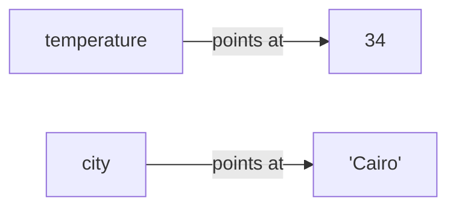

# Lesson 02 — Variables and Types

**Goal:** store values, and know what kind of value you are holding.

## What you will learn

- Variables and naming
- The four types you will use every day: `int`, `float`, `str`, `bool`
- `type()` and conversion
- Why `"5" + 5` is an error and not `10`

---

## A variable is a name for a value

```python
city = "Cairo"
temperature = 34
is_hot = True

print(city, temperature, is_hot)
```

```text
Cairo 34 True
```

The `=` is not "equals" in the maths sense. It means **put this value into this
name**. Right side first, then the name points at it.



Names can be reused, and the type can change with them:

```python
score = 10
print(score)
score = "ten"
print(score)
```

```text
10
ten
```

Python allows this. It is still usually a bad idea — a name should mean one
thing for its whole life.

---

## Naming rules, and naming taste

Rules Python enforces:

- letters, digits, underscore — no spaces, no dashes
- cannot start with a digit
- case sensitive: `Score` and `score` are two different names

Taste the language does not enforce but every team does:

```python
# Good
mean_temperature = 34.2
user_count = 1500

# Bad
x = 34.2          # meaningless in two weeks
meanTemp = 34.2   # that is JavaScript style, not Python
d = 1500          # what is d
```

Python style is `lower_case_with_underscores`. Write names a stranger can read.

---

## The four everyday types

```python
count = 42               # int    — whole number
ratio = 0.75             # float  — number with a decimal point
name = "Adam"            # str    — text
active = True            # bool   — True or False

print(type(count), type(ratio), type(name), type(active))
```

```text
<class 'int'> <class 'float'> <class 'str'> <class 'bool'>
```

`type()` answers "what am I holding?" — reach for it whenever something behaves
strangely.

One trap worth knowing early: floats are not exact.

```python
print(0.1 + 0.2)
```

```text
0.30000000000000004
```

This is not a Python bug. It is how computers store decimals, in every
language. Never compare floats with `==`; compare with a tolerance.

---

## Converting between types

```python
age_text = "25"
age = int(age_text)
print(age + 5)
```

```text
30
```

The three converters you need constantly: `int()`, `float()`, `str()`.

```python
n = 7
print("I have " + str(n) + " books")
```

```text
I have 7 books
```

And the one that fails:

```python
print("5" + 5)
```

```text
TypeError: can only concatenate str (not "int") to str
```

`+` means *add* for numbers and *join* for text. Python refuses to guess which
one you meant. This strictness is a feature: the alternative is a program that
silently produces nonsense.

---

## Common mistakes

| Mistake | What happens |
|---|---|
| `int("3.5")` | `ValueError` — convert to `float` first |
| `int("abc")` | `ValueError` — there is no number in there |
| `if 0.1 + 0.2 == 0.3` | Silently `False` — use `abs(a - b) < 1e-9` |
| `list = [1, 2]` | Works, but you just destroyed the built-in `list` |

---

## Exercises

1. Store your name, age, and height. Print them with their types.
2. Ask yourself what `int(9.99)` returns, then check. Is it rounding?
3. Fix this so it prints `The total is 15`: `print("The total is " + 15)`
4. Write a comparison of `0.1 + 0.2` and `0.3` that is correctly `True`.
