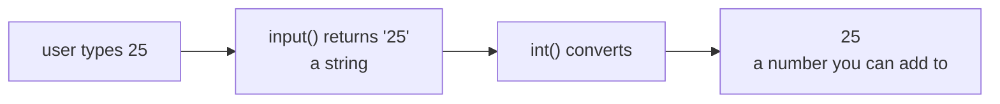

# Lesson 03 — Input and Output

**Goal:** take data from the user, and show results in a readable shape.

## What you will learn

- `input()` and the one thing everybody forgets about it
- f-strings — the only string formatting you need
- Controlling decimals, width, and alignment

---

## Input always gives you text

```python
name = input("What is your name? ")
print("Hello,", name)
```

```text
What is your name? Adam
Hello, Adam
```

`input()` stops the program, waits for the user to type and press Enter, and
hands back what they typed — **always as a string**, never as a number.

```python
age = input("Your age: ")
print(age + 1)
```

```text
Your age: 25
TypeError: can only concatenate str (not "int") to str
```

This is the single most common beginner bug. Convert it:

```python
age = int(input("Your age: "))
print("Next year you will be", age + 1)
```

```text
Your age: 25
Next year you will be 26
```



In a notebook, `input()` opens a box at the top of the screen. In a script it
waits in the terminal. Same behaviour either way.

---

## f-strings

Put an `f` before the quote, and anything in `{}` is evaluated and inserted.

```python
name = "Adam"
score = 87.5

print(f"{name} scored {score} points")
print(f"Doubled, that is {score * 2}")
```

```text
Adam scored 87.5 points
Doubled, that is 175.0
```

This replaces every older method you might see in old code (`+` joining,
`%` formatting, `.format()`). Use f-strings. They are shorter and they are
faster.

---

## Formatting numbers

The format spec goes after a colon inside the braces.

```python
pi = 3.14159265
ratio = 0.8734
big = 1234567

print(f"{pi:.2f}")        # 2 decimal places
print(f"{ratio:.1%}")     # as a percentage
print(f"{big:,}")         # thousands separator
```

```text
3.14
87.3%
1,234,567
```

Alignment, which is what turns output into a table:

```python
items = [("Espresso", 45), ("Latte", 60), ("V60", 85)]

for name, price in items:
    print(f"{name:<12}{price:>6}")
```

```text
Espresso        45
Latte           60
V60             85
```

- `<` left align, `>` right align, `^` centre
- the number after it is the total width

Numbers right-aligned, text left-aligned. That is the convention, and it is
the convention because it is easier to read.

---

## Printing without a newline

```python
print("Loading", end="")
print(".", end="")
print(".", end="")
print(".")
```

```text
Loading...
```

`print` ends with a newline unless you tell it otherwise.

---

## Common mistakes

| Mistake | Result |
|---|---|
| Forgetting `int(input(...))` | `TypeError` when you do maths |
| `print(f"{name}")` with no `f` | Prints the literal `{name}` |
| `int(input())` on `"abc"` | `ValueError` — lesson 10 shows how to handle it |

---

## Exercises

1. Ask for two numbers and print their sum, difference, and product.
2. Ask for a price and a quantity; print a receipt line, price to 2 decimals,
   right-aligned in a width of 10.
3. Ask for a name and print it centred inside 30 dashes.
4. Ask for a mark out of 50 and print it as a percentage with one decimal.
