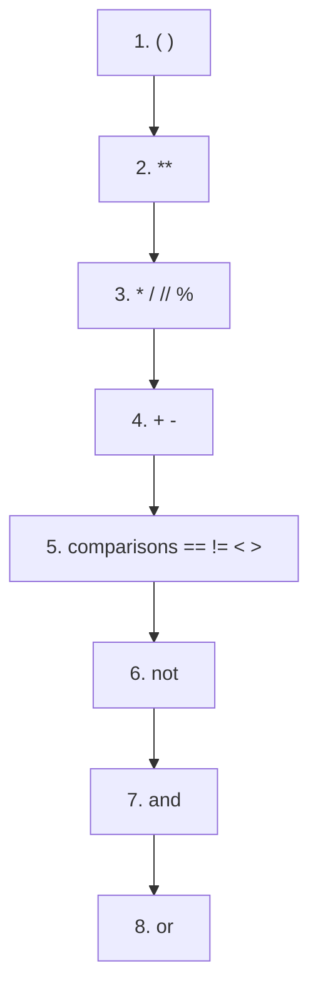

# Lesson 04 — Operators

**Goal:** calculate, compare, and combine conditions correctly.

## What you will learn

- Arithmetic, including the two division operators
- Comparison operators
- `and`, `or`, `not`
- Operator precedence, and when to stop trusting it

---

## Arithmetic

```python
a, b = 17, 5

print(a + b)    # add
print(a - b)    # subtract
print(a * b)    # multiply
print(a / b)    # divide  -> always a float
print(a // b)   # floor divide -> whole number, rounded down
print(a % b)    # modulo -> the remainder
print(a ** b)   # power
```

```text
22
12
85
3.4
3
2
1419857
```

Two of these deserve attention.

**`/` always gives a float**, even when it divides evenly:

```python
print(10 / 2)
```

```text
5.0
```

**`%` gives the remainder**, and it is more useful than it looks:

```python
print(14 % 2)    # 0 -> even
print(15 % 2)    # 1 -> odd
print(125 % 10)  # 5 -> last digit
```

```text
0
1
5
```

Every "is it even", "every 10th row", "which bucket does this hash into"
question is a modulo question.

---

## Comparison

These produce a `bool` — `True` or `False`.

```python
x, y = 10, 3

print(x > y)
print(x == y)     # equal?  two equals signs
print(x != y)     # not equal
print(x >= 10)
```

```text
True
False
True
True
```

`=` assigns. `==` asks. Confusing them is a rite of passage:

```python
x = 5     # x now holds 5
x == 5    # asks a question, answers True, changes nothing
```

Comparisons can be chained, which reads like maths:

```python
age = 25
print(18 <= age < 65)
```

```text
True
```

---

## Logical operators

```python
temp = 34
raining = False

print(temp > 30 and not raining)
print(temp > 40 or raining)
```

```text
True
False
```

| Operator | True when |
|---|---|
| `and` | both sides are true |
| `or` | at least one side is true |
| `not` | flips it |

Python **short-circuits**: in `A and B`, if `A` is false it never looks at `B`.
That is not a detail — it is how you write safe checks:

```python
values = []
if len(values) > 0 and values[0] > 10:
    print("big")
else:
    print("nothing to check")
```

```text
nothing to check
```

If Python had evaluated both sides, `values[0]` would have crashed on an empty
list. The order of your conditions is load-bearing.

---

## Precedence

Python evaluates in this order — highest first:



```python
print(2 + 3 * 4)
print((2 + 3) * 4)
```

```text
14
20
```

Knowing the table is useful. Relying on it is not. When an expression gets
long, add brackets — you are writing for the reader, and the reader is
guessing.

---

## Shorthand assignment

```python
total = 100
total += 20      # same as total = total + 20
total -= 5
total *= 2
print(total)
```

```text
230
```

---

## Common mistakes

| Mistake | What happens |
|---|---|
| `if x = 5:` | `SyntaxError` — you meant `==` |
| `10 / 0` | `ZeroDivisionError` — check the denominator first |
| `0.1 + 0.2 == 0.3` | `False` — compare floats with a tolerance |
| `if x > 5 and < 10` | `SyntaxError` — write `5 < x < 10` |

---

## Exercises

1. Ask for seconds, print it as hours, minutes, seconds (use `//` and `%`).
2. Ask for a number and print whether it is even, using `%`.
3. Write one condition that is true for a valid exam mark: a number from 0
   to 100 inclusive.
4. Predict the value of `2 ** 3 ** 2`, then check. Why is it not 64?
