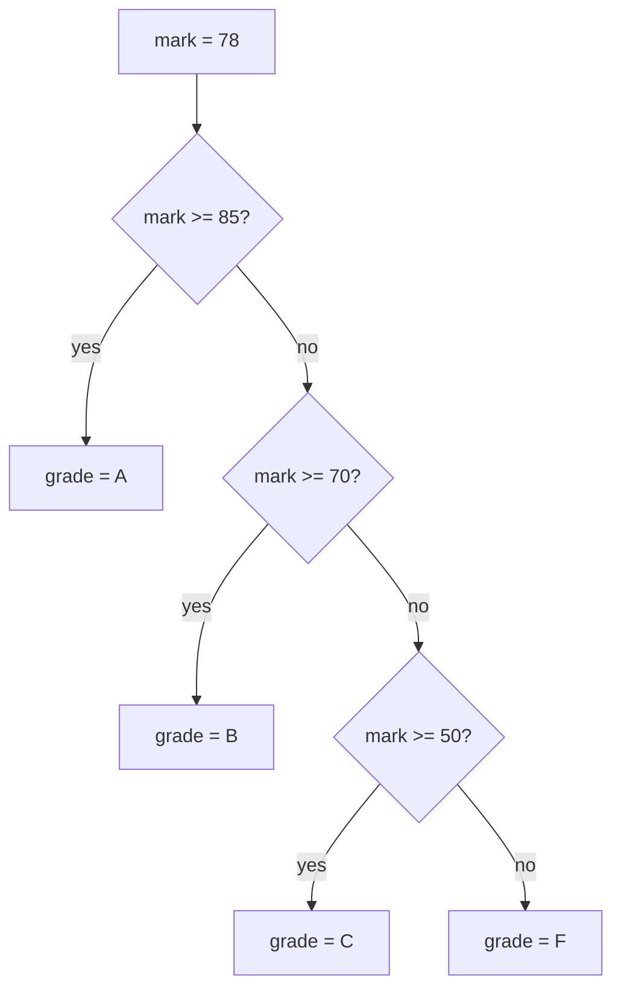

# Lesson 05 — Conditionals

**Goal:** make the program take different paths.

## What you will learn

- `if`, `elif`, `else`
- Indentation, which in Python is syntax and not decoration
- Truthiness
- `match` for clean multi-way choices

---

## if / elif / else

```python
mark = 78

if mark >= 85:
    grade = "A"
elif mark >= 70:
    grade = "B"
elif mark >= 50:
    grade = "C"
else:
    grade = "F"

print(f"Mark {mark} -> grade {grade}")
```

```text
Mark 78 -> grade B
```



Python checks the branches **in order** and stops at the first true one. That
is why the ladder is written high to low: if it started at `>= 50`, a mark of
90 would be graded C and never reach the other checks.

---

## Indentation is the syntax

Other languages use braces. Python uses the spaces at the start of the line.

```python
temperature = 40

if temperature > 35:
    print("It is hot")
    print("Drink water")       # inside the if — 4 spaces
print("Have a good day")       # outside — runs either way
```

```text
It is hot
Drink water
Have a good day
```

Four spaces per level. Be consistent — mixing tabs and spaces produces
`IndentationError`, and the two look identical on your screen.

---

## Truthiness

`if` does not need a comparison. Any value can be tested directly, and Python
already has an opinion about what counts as "nothing":

```python
values = []
name = ""
count = 0

print(bool(values), bool(name), bool(count))
```

```text
False False False
```

Empty list, empty string, zero, and `None` are all falsy. Everything else is
truthy. So this is the idiomatic check:

```python
names = ["Adam", "Sara"]

if names:
    print(f"{len(names)} names")
else:
    print("empty")
```

```text
2 names
```

Write `if names:`, not `if len(names) > 0:`. Both work; the first is what
Python code looks like.

---

## Nested conditions, and how to avoid them

```python
age = 22
has_id = True

if age >= 18:
    if has_id:
        print("Allowed")
    else:
        print("Need ID")
else:
    print("Too young")
```

```text
Allowed
```

Nesting past two levels gets hard to read. Flatten it when you can:

```python
if age < 18:
    print("Too young")
elif not has_id:
    print("Need ID")
else:
    print("Allowed")
```

```text
Allowed
```

Handle the rejections first, then the happy path. This pattern is called a
guard clause and it will keep your functions readable for the rest of your
career.

---

## The conditional expression

For a simple either/or assignment:

```python
temp = 34
label = "hot" if temp > 30 else "mild"
print(label)
```

```text
hot
```

Use it for one short choice. Do not chain them.

---

## match

Python 3.10 added `match` for multi-way branching on a value:

```python
status = 404

match status:
    case 200:
        print("OK")
    case 404:
        print("Not found")
    case 500:
        print("Server error")
    case _:
        print("Unknown")
```

```text
Not found
```

`case _` is the catch-all. Reach for `match` when you are comparing one value
against many constants; keep `if/elif` when the branches ask different
questions.

---

## Common mistakes

| Mistake | What happens |
|---|---|
| Missing `:` after the condition | `SyntaxError` |
| Body not indented | `IndentationError: expected an indented block` |
| `if x = 5:` | `SyntaxError` — use `==` |
| Ordering `elif` low to high | Wrong branch wins silently — the worst kind of bug |

---

## Exercises

1. Ask for a number and print positive, negative, or zero.
2. Ask for a year and print whether it is a leap year.
   (Divisible by 4, except centuries, unless divisible by 400.)
3. Rewrite exercise 2 using guard clauses, with no `else`.
4. Ask for a day number 1–7 and print the day name using `match`.
