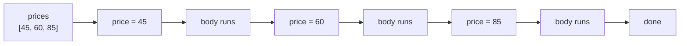

# Lesson 06 — Loops

**Goal:** repeat work without writing it twice.

## What you will learn

- `for` over a sequence, and `range()`
- `while` for "until something changes"
- `break`, `continue`
- `enumerate` and `zip`

---

## for

A `for` loop walks through a sequence, one item at a time.

```python
prices = [45, 60, 85]

for price in prices:
    print(f"Price: {price} EGP")
```

```text
Price: 45 EGP
Price: 60 EGP
Price: 85 EGP
```



`price` is a name you chose. It is re-pointed at the next item on every pass.

Strings are sequences too:

```python
for letter in "AI":
    print(letter)
```

```text
A
I
```

---

## range()

When you want to repeat a number of times rather than walk a collection:

```python
for i in range(5):
    print(i, end=" ")
```

```text
0 1 2 3 4
```

`range(5)` gives 0,1,2,3,4 — it **starts at 0 and stops before 5**. That
half-open behaviour is consistent everywhere in Python, and once you accept it,
off-by-one errors mostly disappear.

```python
print(list(range(2, 10, 2)))    # start, stop, step
print(list(range(5, 0, -1)))    # counting down
```

```text
[2, 4, 6, 8]
[5, 4, 3, 2, 1]
```

---

## while

A `while` loop repeats as long as a condition holds. Use it when you do not
know the number of repetitions in advance.

```python
balance = 100

while balance > 0:
    balance -= 30
    print(f"Balance: {balance}")
```

```text
Balance: 70
Balance: 40
Balance: 10
Balance: -20
```

Something inside the loop must eventually make the condition false. If nothing
does, the program runs forever — stop it with `Ctrl+C`.

Rule of thumb: **`for` when you know the collection, `while` when you are
waiting for a state to change.**

---

## break and continue

```python
for n in range(1, 10):
    if n == 4:
        continue        # skip this one, keep looping
    if n == 7:
        break           # leave the loop entirely
    print(n, end=" ")
```

```text
1 2 3 5 6
```

`continue` skips the rest of this pass. `break` ends the loop. Both are useful;
both become unreadable if you use three of them in one loop.

---

## enumerate — index and value together

```python
items = ["Espresso", "Latte", "V60"]

for i, name in enumerate(items, start=1):
    print(f"{i}. {name}")
```

```text
1. Espresso
2. Latte
3. V60
```

This replaces `for i in range(len(items))` followed by `items[i]`. If you find
yourself writing that, reach for `enumerate` instead.

---

## zip — two sequences at once

```python
names = ["Espresso", "Latte", "V60"]
prices = [45, 60, 85]

for name, price in zip(names, prices):
    print(f"{name:<10}{price:>5}")
```

```text
Espresso     45
Latte        60
V60          85
```

`zip` stops at the shorter sequence. No error, no warning — check your lengths.

---

## Nested loops

```python
for i in range(1, 4):
    for j in range(1, 4):
        print(f"{i}x{j}={i*j}", end="  ")
    print()
```

```text
1x1=1  1x2=2  1x3=3  
2x1=2  2x2=4  2x3=6  
3x1=3  3x2=6  3x3=9  
```

The inner loop runs completely for every single pass of the outer one. Two
nested loops over 1,000 items each is 1,000,000 passes — this is where slow
code comes from, and lesson 03 of the advanced track explains how to measure it.

---

## Common mistakes

| Mistake | What happens |
|---|---|
| Forgetting to change the `while` variable | Infinite loop |
| `range(1, 10)` expecting 10 | Stops at 9 — the end is exclusive |
| Modifying a list while looping over it | Items get skipped |
| `for i in range(len(x)): x[i]` | Works, but write `enumerate` |

---

## Exercises

1. Print the multiplication table of a number the user chooses.
2. Sum the numbers 1 to 100 with a loop, then check against `n*(n+1)/2`.
3. Ask repeatedly for a password with `while` until the user types `open`.
4. Given `names` and `marks`, print each student with their grade, numbered.
