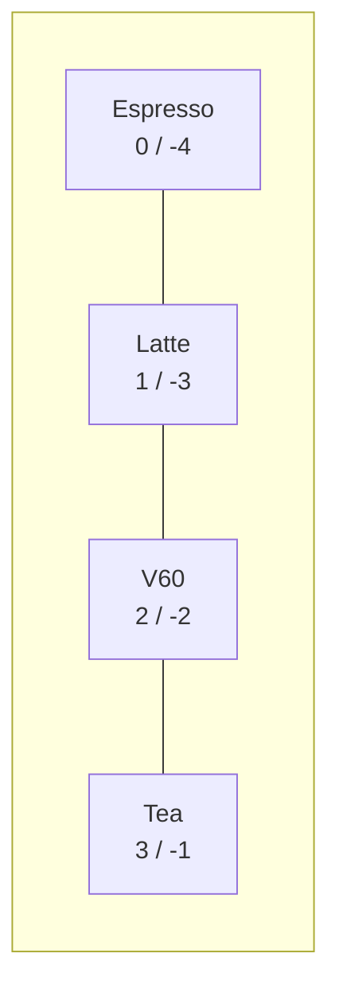

# Lesson 07 — Lists and Tuples

**Goal:** hold many values in order, and reshape them.

## What you will learn

- Creating, indexing, and slicing lists
- The methods you will actually use
- List comprehensions
- Tuples, and why immutability is a feature

---

## A list is an ordered, changeable collection

```python
prices = [45, 60, 85, 30]
print(prices)
print(len(prices))
```

```text
[45, 60, 85, 30]
4
```

A list can hold anything, including mixed types and other lists:

```python
row = ["Latte", 60, True]
matrix = [[1, 2], [3, 4]]
print(row, matrix)
```

```text
['Latte', 60, True] [[1, 2], [3, 4]]
```

---

## Indexing

Positions start at **0**. Negative indexes count from the end.

```python
items = ["Espresso", "Latte", "V60", "Tea"]

print(items[0])     # first
print(items[2])     # third
print(items[-1])    # last
```

```text
Espresso
V60
Tea
```



`items[-1]` is how you say "the last one" without knowing the length.

---

## Slicing

`list[start:stop:step]` — start included, stop excluded.

```python
nums = [0, 1, 2, 3, 4, 5, 6, 7]

print(nums[2:5])
print(nums[:3])
print(nums[5:])
print(nums[::2])
print(nums[::-1])
```

```text
[2, 3, 4]
[0, 1, 2]
[5, 6, 7]
[0, 2, 4, 6]
[7, 6, 5, 4, 3, 2, 1, 0]
```

A slice always returns a **new** list. `nums[::-1]` reversing a list is a
common idiom worth memorising.

---

## Changing a list

```python
items = ["Espresso", "Latte"]

items.append("V60")          # add one at the end
items.insert(0, "Tea")       # add at a position
items.remove("Latte")        # remove by value
last = items.pop()           # remove and return the last
items[0] = "Green Tea"       # replace in place

print(items, "| popped:", last)
```

```text
['Green Tea', 'Espresso'] | popped: V60
```

Sorting and counting:

```python
prices = [85, 45, 60, 45]

print(sorted(prices))            # returns a new list
print(sorted(prices, reverse=True))
print(prices.count(45))
print(sum(prices), min(prices), max(prices))

prices.sort()                    # sorts in place, returns None
print(prices)
```

```text
[45, 45, 60, 85]
[85, 60, 45, 45]
2
235 45 85
[45, 45, 60, 85]
```

`sorted(x)` gives you a new list. `x.sort()` changes `x` and returns `None`.
Writing `prices = prices.sort()` throws your data away — a classic.

---

## The copy trap

```python
a = [1, 2, 3]
b = a           # not a copy — a second name for the same list
b.append(4)
print(a)
```

```text
[1, 2, 3, 4]
```

Assignment copies the *reference*, not the data. To get a real copy:

```python
a = [1, 2, 3]
b = a.copy()        # or list(a), or a[:]
b.append(4)
print(a, b)
```

```text
[1, 2, 3] [1, 2, 3, 4]
```

This single behaviour causes more confusing bugs than anything else in this
lesson. When a list changes "by itself", you have two names on one list.

---

## List comprehensions

The Python way to build a list from another list.

```python
prices = [45, 60, 85, 30]

with_tax = [p * 1.14 for p in prices]
cheap = [p for p in prices if p < 50]

print([round(p, 2) for p in with_tax])
print(cheap)
```

```text
[51.3, 68.4, 96.9, 34.2]
[45, 30]
```

The shape is always the same:

```text
[ expression   for item in sequence   if condition ]
    what you        where it            which ones
    keep            comes from          you keep
```

Comprehensions are faster than the equivalent loop and much easier to read —
as long as they fit on one line. When one needs a second condition and a nested
loop, write the loop instead.

---

## Tuples

A tuple is a list that cannot be changed.

```python
point = (30.0444, 31.2357)
print(point[0])

point[0] = 0
```

```text
30.0444
TypeError: 'tuple' object does not support item assignment
```

Use a tuple when the group of values is one thing — coordinates, an RGB colour,
a database row, a function returning two results:

```python
def min_max(values):
    return min(values), max(values)

low, high = min_max([45, 60, 85])
print(low, high)
```

```text
45 85
```

That last line is **unpacking**, and it works for any sequence.

---

## Common mistakes

| Mistake | What happens |
|---|---|
| `items[len(items)]` | `IndexError` — the last index is `len - 1` |
| `x = x.sort()` | `x` becomes `None` |
| `b = a` expecting a copy | Both names change together |
| Removing items while looping | Items are skipped — loop over a copy |

---

## Exercises

1. From `[3, 8, 1, 9, 4]` print the largest, the smallest, and the average.
2. Use a comprehension to get the squares of the even numbers in `range(20)`.
3. Reverse a list two ways: with a slice and with a loop.
4. Given a list with duplicates, produce a list of unique values keeping order.
