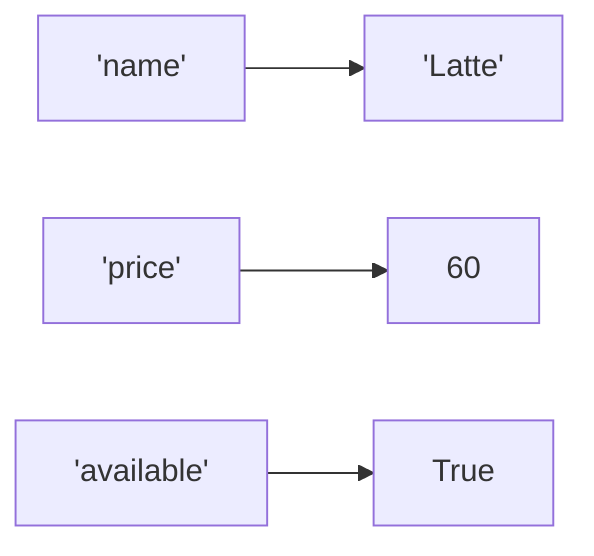

# Lesson 08 — Dictionaries and Sets

**Goal:** look values up by name instead of by position.

## What you will learn

- Dictionaries: create, read, update, loop
- Safe access with `.get()`
- Counting patterns
- Sets, and the operations that make them worth it

---

## A dictionary maps keys to values

```python
item = {
    "name": "Latte",
    "price": 60,
    "available": True,
}

print(item["name"])
print(item["price"])
```

```text
Latte
60
```

A list answers "what is in position 2?". A dictionary answers "what is the
price?". When your data has names, use a dictionary.



The lookup is effectively instant no matter how large the dictionary gets —
a hundred keys or a million, the cost is the same. The advanced track explains
why (hash tables).

---

## Reading safely

```python
item = {"name": "Latte", "price": 60}

print(item["size"])
```

```text
KeyError: 'size'
```

`.get()` returns `None` instead of crashing, or a default you choose:

```python
print(item.get("size"))
print(item.get("size", "regular"))
```

```text
None
regular
```

Use `[]` when a missing key means your data is broken and you want to know.
Use `.get()` when missing is normal.

---

## Changing a dictionary

```python
item = {"name": "Latte", "price": 60}

item["price"] = 65            # update
item["size"] = "large"        # add
del item["size"]              # remove
print(item)
print("price" in item)
```

```text
{'name': 'Latte', 'price': 65}
True
```

`in` checks **keys**, never values.

---

## Looping

```python
menu = {"Espresso": 45, "Latte": 60, "V60": 85}

for name in menu:
    print(name, end=" ")
print()

for name, price in menu.items():
    print(f"{name:<10}{price:>5}")
```

```text
Espresso Latte V60 
Espresso     45
Latte        60
V60          85
```

`.items()` gives key and value together — that is the loop you want 90% of the
time. `.keys()` and `.values()` exist for the other 10%.

Dictionaries keep insertion order (guaranteed since Python 3.7).

---

## Counting — the pattern you will use forever

```python
orders = ["Latte", "V60", "Latte", "Tea", "Latte", "V60"]

counts = {}
for item in orders:
    counts[item] = counts.get(item, 0) + 1

print(counts)
```

```text
{'Latte': 3, 'V60': 2, 'Tea': 1}
```

`counts.get(item, 0) + 1` means: whatever it was, or zero if new, plus one.

The standard library already has this:

```python
from collections import Counter

counts = Counter(orders)
print(counts.most_common(2))
```

```text
[('Latte', 3), ('V60', 2)]
```

---

## Nested dictionaries

Real data — JSON from an API, a config file — is usually nested:

```python
menu = {
    "Latte": {"price": 60, "sizes": ["S", "M", "L"]},
    "V60":   {"price": 85, "sizes": ["M"]},
}

print(menu["Latte"]["sizes"][-1])

for name, info in menu.items():
    print(f"{name}: {info['price']} EGP, {len(info['sizes'])} sizes")
```

```text
L
Latte: 60 EGP, 3 sizes
V60: 85 EGP, 1 sizes
```

Note the quote juggling inside the f-string: outer `"`, inner `'`.

---

## Dictionary comprehensions

```python
menu = {"Espresso": 45, "Latte": 60, "V60": 85}

with_tax = {name: round(price * 1.14) for name, price in menu.items()}
cheap = {n: p for n, p in menu.items() if p < 70}

print(with_tax)
print(cheap)
```

```text
{'Espresso': 51, 'Latte': 68, 'V60': 97}
{'Espresso': 45, 'Latte': 60}
```

---

## Sets

A set holds unique values, unordered.

```python
tags = {"ai", "python", "ai", "data"}
print(tags)
print(len(tags))
```

```text
{'python', 'ai', 'data'}
3
```

The duplicate disappeared on creation. The print order may differ on your
machine — sets have no order, so never rely on it.

Deduplicating a list is one line:

```python
values = [1, 2, 2, 3, 3, 3]
print(list(set(values)))
```

```text
[1, 2, 3]
```

And membership testing is instant, unlike a list:

```python
big = set(range(1_000_000))
print(999_999 in big)
```

```text
True
```

---

## Set operations

```python
a = {"python", "sql", "pandas"}
b = {"python", "spark", "sql"}

print(a & b)    # in both
print(a | b)    # in either
print(a - b)    # in a only
print(a ^ b)    # in exactly one
```

```text
{'python', 'sql'}
{'python', 'sql', 'pandas', 'spark'}
{'pandas'}
{'pandas', 'spark'}
```

"Which users did both?", "which columns are missing?", "what changed between
yesterday and today?" — all set questions.

---

## Picking the right one

| You need | Use |
|---|---|
| Ordered items, duplicates allowed | list |
| Fixed group of values | tuple |
| Lookup by name | dict |
| Uniqueness, or fast membership | set |

---

## Common mistakes

| Mistake | What happens |
|---|---|
| `d["missing"]` | `KeyError` — use `.get()` |
| `"Latte" in menu` expecting a value check | `in` tests keys |
| Using a list as a key | `TypeError` — keys must be immutable |
| `{}` expecting an empty set | That is an empty dict — use `set()` |

---

## Exercises

1. Build a dictionary of five items and prices; print the most expensive.
2. Count the letters in a word using the `.get()` pattern, then with `Counter`.
3. Given two lists of student names, print who is in both and who is in only one.
4. Invert a dictionary so values become keys. What breaks if values repeat?
