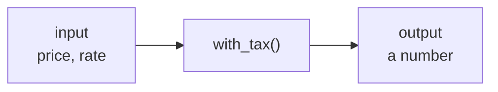

# Lesson 09 — Functions

**Goal:** name a piece of logic so you can use it without rereading it.

## What you will learn

- Defining and calling, parameters and return
- Default and keyword arguments
- Scope
- Docstrings, and the mutable default trap

---

## Why functions

Without one, this repeats:

```python
print(round(45 * 1.14, 2))
print(round(60 * 1.14, 2))
print(round(85 * 1.14, 2))
```

```text
51.3
68.4
96.9
```

The tax rate appears three times. When it changes, you will fix two of them.

```python
def with_tax(price, rate=0.14):
    return round(price * (1 + rate), 2)

print(with_tax(45))
print(with_tax(60))
print(with_tax(85, rate=0.20))
```

```text
51.3
68.4
102.0
```

One definition, one place to change, and a name that says what it means.



A good function is this diagram: inputs in, one result out, nothing surprising
in between.

---

## Anatomy

```python
def greet(name):              # def, name, parameters, colon
    """Return a greeting for name."""   # docstring
    return f"Hello, {name}"   # return sends a value back

message = greet("Adam")       # call it
print(message)
```

```text
Hello, Adam
```

`return` ends the function immediately and hands the value back. A function
with no `return` gives you `None`:

```python
def show(name):
    print(name)

result = show("Adam")
print(result)
```

```text
Adam
None
```

Printing and returning are different things. `print` shows a human something.
`return` gives your program a value it can use. Beginners print when they
should return, and then wonder why they cannot use the result.

---

## Arguments

```python
def order(item, size="M", quantity=1):
    return f"{quantity}x {item} ({size})"

print(order("Latte"))
print(order("Latte", "L"))
print(order("Latte", quantity=3))
print(order(item="V60", size="S", quantity=2))
```

```text
1x Latte (M)
1x Latte (L)
3x Latte (M)
2x V60 (S)
```

- Parameters without a default must come first.
- Passing by name (`quantity=3`) lets you skip the middle ones and makes the
  call site readable.

Any number of arguments:

```python
def total(*prices, **options):
    amount = sum(prices)
    if options.get("tax"):
        amount *= 1.14
    return round(amount, 2)

print(total(45, 60, 85))
print(total(45, 60, 85, tax=True))
```

```text
190
216.6
```

`*args` collects extra positional arguments into a tuple; `**kwargs` collects
named ones into a dict. You will see these constantly in library code.

---

## Returning several values

```python
def stats(values):
    return min(values), max(values), sum(values) / len(values)

low, high, mean = stats([45, 60, 85])
print(f"min={low} max={high} mean={mean:.1f}")
```

```text
min=45 max=85 mean=63.3
```

It is really one tuple, unpacked on arrival.

---

## Scope

Names created inside a function live only there.

```python
def calculate():
    internal = 10
    return internal

print(calculate())
print(internal)
```

```text
10
NameError: name 'internal' is not defined
```

This is protection, not an obstacle: a function cannot quietly break the rest
of your program.

A function can *read* an outer name but not reassign it unless you say
`global` — and needing `global` is almost always a sign the value should have
been a parameter instead.

---

## Docstrings

```python
def normalise(values):
    """Scale values to the range 0-1.

    Args:
        values: a list of numbers, not all identical.

    Returns:
        A new list of floats between 0 and 1.
    """
    low, high = min(values), max(values)
    return [(v - low) / (high - low) for v in values]

print(normalise([10, 20, 30]))
print(normalise.__doc__.splitlines()[0])
```

```text
[0.0, 0.5, 1.0]
Scale values to the range 0-1.
```

Write the docstring **before** the body. If you cannot describe the function in
one sentence, it is doing more than one thing.

---

## The mutable default trap

```python
def add_item(item, basket=[]):
    basket.append(item)
    return basket

print(add_item("Latte"))
print(add_item("V60"))
```

```text
['Latte']
['Latte', 'V60']
```

The second call was supposed to start empty. The default list is created
**once**, when the function is defined, and every call shares it. The fix:

```python
def add_item(item, basket=None):
    if basket is None:
        basket = []
    basket.append(item)
    return basket

print(add_item("Latte"))
print(add_item("V60"))
```

```text
['Latte']
['V60']
```

Never use a list, dict, or set as a default value. Use `None`.

---

## What a good function looks like

- Does one thing, and its name says which
- Short enough to read without scrolling
- Takes what it needs as parameters — no reaching for outside state
- Returns a value instead of printing one
- Same inputs, same output, every time

---

## Common mistakes

| Mistake | What happens |
|---|---|
| Forgetting `return` | You get `None` |
| `print` instead of `return` | The value cannot be reused |
| Mutable default argument | State leaks between calls |
| Calling before defining | `NameError` — define first, top to bottom |

---

## Exercises

1. Write `is_even(n)` returning a bool. Use it in a comprehension.
2. Write `grade(mark)` returning A/B/C/F, with guard clauses.
3. Write `summarise(values)` returning count, mean, min, max as a dict.
4. Write `clean_name(name)` that strips spaces and title-cases it. Add a
   docstring and three test calls proving it works.
