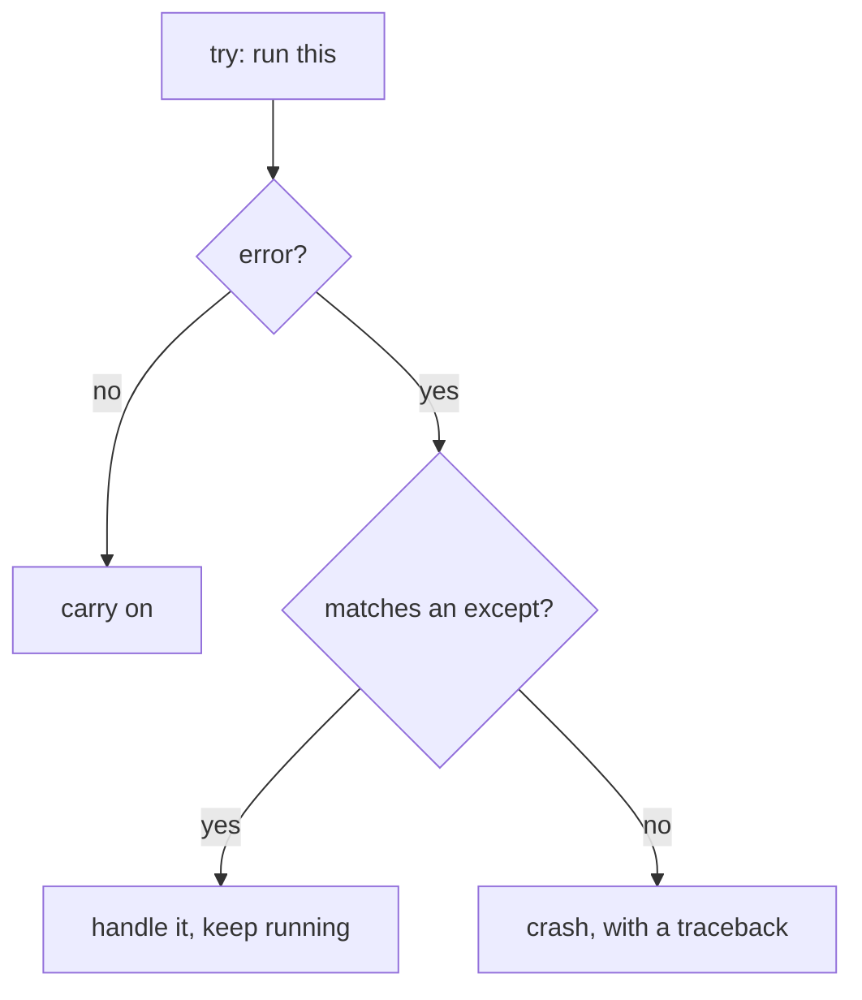

# Lesson 10 — Files and Errors

**Goal:** read real data from disk, and keep running when the data is wrong.

## What you will learn

- Reading and writing text files with `with`
- CSV and JSON
- `try` / `except` / `finally`
- Which errors to catch and which to let crash

---

## Reading a file

```python
with open("menu.txt", "r", encoding="utf-8") as f:
    content = f.read()

print(content)
```

```text
Espresso,45
Latte,60
V60,85
```

Three parts of that first line matter:

- `"r"` — read mode. `"w"` overwrites, `"a"` appends.
- `encoding="utf-8"` — always pass it. Without it you get the operating
  system's default, and your Arabic text arrives as nonsense on someone else's
  machine.
- `with` — closes the file for you, even if an error happens inside the block.
  Files opened without `with` stay open until Python feels like cleaning up.

Line by line, which is what you want for a large file:

```python
with open("menu.txt", encoding="utf-8") as f:
    for line in f:
        name, price = line.strip().split(",")
        print(f"{name:<10}{price:>5}")
```

```text
Espresso     45
Latte        60
V60          85
```

`.strip()` removes the trailing newline and any stray spaces. Forgetting it
is why your numbers turn into `'45\n'`.

---

## Writing a file

```python
rows = [("Espresso", 45), ("Latte", 60)]

with open("output.txt", "w", encoding="utf-8") as f:
    for name, price in rows:
        f.write(f"{name},{price}\n")

print("written")
```

```text
written
```

`f.write` does not add a newline. You do.

`"w"` destroys whatever was in the file — with no warning and no undo. Check
the mode twice before you run it on a file you care about.

---

## CSV

Real CSV files contain commas inside quoted fields, and splitting on `,` will
mangle them. Use the standard library:

```python
import csv

with open("menu.csv", newline="", encoding="utf-8") as f:
    reader = csv.DictReader(f)
    for row in reader:
        print(row["name"], row["price"])
```

```text
Espresso 45
Latte 60
V60 85
```

`DictReader` uses the header row as keys, so you refer to columns by name
rather than by position — your code then survives someone adding a column.

---

## JSON

JSON is how programs exchange data over the internet. It maps cleanly onto
Python dicts and lists.

```python
import json

item = {"name": "Latte", "price": 60, "sizes": ["S", "M", "L"]}

text = json.dumps(item, ensure_ascii=False)     # object -> string
back = json.loads(text)                          # string -> object

print(text)
print(back["sizes"][0])
```

```text
{"name": "Latte", "price": 60, "sizes": ["S", "M", "L"]}
S
```

To and from a file: `json.dump(obj, f)` and `json.load(f)` — same names, no `s`.

---

## Errors

An unhandled error stops the program at that line. Sometimes that is right.
Sometimes one bad row should not kill an import of a million rows.

```python
def to_number(text):
    try:
        return int(text)
    except ValueError:
        return None

print(to_number("45"))
print(to_number("forty five"))
```

```text
45
None
```



---

## Catching the right thing

```python
values = ["45", "abc", "60", ""]
total = 0

for v in values:
    try:
        total += int(v)
    except ValueError as e:
        print(f"skipping {v!r}: {e}")

print("total:", total)
```

```text
skipping 'abc': invalid literal for int() with base 10: 'abc'
skipping '': invalid literal for int() with base 10: ''
total: 105
```

Name the exception you expect. This is wrong:

```python
try:
    result = int(user_input)
except:                 # catches everything, including your own typos
    result = 0
```

A bare `except` hides `NameError` from a misspelt variable, hides
`KeyboardInterrupt` when you try to stop the program, and turns a five-second
bug into an afternoon. Catch what you can actually handle.

The errors you will meet most:

| Exception | Raised when |
|---|---|
| `FileNotFoundError` | The path is wrong |
| `ValueError` | Right type, impossible value — `int("abc")` |
| `TypeError` | Wrong type — `"5" + 5` |
| `KeyError` | Missing dictionary key |
| `IndexError` | Position past the end of a list |
| `ZeroDivisionError` | Dividing by zero |

---

## else and finally

```python
try:
    f = open("menu.csv", encoding="utf-8")
except FileNotFoundError:
    print("no such file")
else:
    print("opened fine")
    f.close()
finally:
    print("this always runs")
```

```text
opened fine
this always runs
```

`else` runs when nothing went wrong. `finally` runs either way — it is for
cleanup you cannot skip.

---

## Raising your own

```python
def set_price(price):
    if price < 0:
        raise ValueError(f"price cannot be negative: {price}")
    return price

try:
    set_price(-10)
except ValueError as e:
    print("rejected:", e)
```

```text
rejected: price cannot be negative: -10
```

Fail loudly and early, with a message that names the bad value. A function
that quietly accepts nonsense produces a wrong number three steps later, and
you will debug the wrong step.

---

## Common mistakes

| Mistake | What happens |
|---|---|
| `open(path, "w")` on real data | The file is emptied instantly |
| No `encoding="utf-8"` | Arabic text breaks on another machine |
| Bare `except:` | Real bugs get swallowed |
| Forgetting `.strip()` | `'45\n'` instead of `'45'` |
| `try` around 50 lines | You cannot tell what failed |

---

## Exercises

1. Write a file of five lines, read it back, and print the line count.
2. Read a CSV with `DictReader` and print the average of a numeric column.
3. Write `safe_divide(a, b)` returning `None` on division by zero.
4. Read a JSON file that does not exist, and print a clear message instead of
   a traceback.
