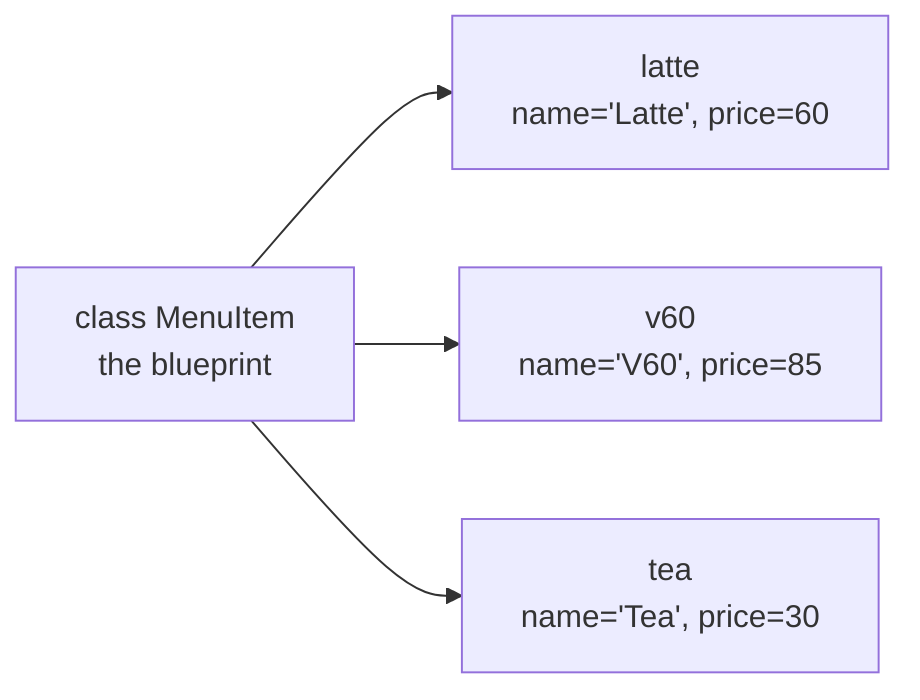

# Lesson 11 — Classes and Objects

**Goal:** model a thing, with its data and its behaviour together.

## What you will learn

- `class`, `__init__`, `self`
- Methods and attributes
- `__repr__` and `__str__`
- Inheritance, and `@dataclass`

---

## Why

Here is a coffee item as loose variables:

```python
name = "Latte"
price = 60
available = True
```

Now handle 150 items. You end up with parallel lists you must keep in sync,
and functions that take five arguments in a fixed order. A class ties the data
to the operations that belong with it.

```python
class MenuItem:
    def __init__(self, name, price, available=True):
        self.name = name
        self.price = price
        self.available = available

    def price_with_tax(self, rate=0.14):
        return round(self.price * (1 + rate), 2)

latte = MenuItem("Latte", 60)
print(latte.name, latte.price_with_tax())
```

```text
Latte 68.4
```



One class, many objects. Each object keeps its own values and shares the
behaviour.

---

## `__init__` and `self`

`__init__` runs automatically when you create an object. It is where you set
the starting state.

`self` is the object being worked on. Python passes it in for you — you never
write it at the call site:

```python
latte = MenuItem("Latte", 60)     # self is created and passed automatically
print(latte.price_with_tax())      # self is 'latte' inside the method
```

```text
68.4
```

Every method takes `self` as the first parameter, and every attribute you want
to keep must be assigned onto it. `self.price = price` stores it; plain
`price = price` throws it away when the method ends.

---

## Methods that change state

```python
class Basket:
    def __init__(self):
        self.items = []

    def add(self, item, quantity=1):
        self.items.append((item, quantity))
        return self                      # allows chaining

    def total(self):
        return sum(item.price * q for item, q in self.items)

    def __len__(self):
        return len(self.items)

basket = Basket()
basket.add(MenuItem("Latte", 60), 2).add(MenuItem("V60", 85))

print(len(basket), basket.total())
```

```text
2 205
```

Defining `__len__` made `len(basket)` work. Python's built-ins call these
"dunder" (double underscore) methods, and implementing them makes your class
behave like a native one.

---

## `__repr__` — do this every time

```python
class MenuItem:
    def __init__(self, name, price):
        self.name = name
        self.price = price

    def __repr__(self):
        return f"MenuItem(name={self.name!r}, price={self.price})"

    def __str__(self):
        return f"{self.name} — {self.price} EGP"

item = MenuItem("Latte", 60)
print(item)          # uses __str__
print([item])        # uses __repr__
```

```text
Latte — 60 EGP
[MenuItem(name='Latte', price=60)]
```

Without `__repr__` you get `<__main__.MenuItem object at 0x104f2a3d0>`, which
tells you nothing while debugging. `__str__` is for users; `__repr__` is for
you.

---

## Inheritance

A subclass gets everything the parent has, and can add or override.

```python
class Drink(MenuItem):
    def __init__(self, name, price, hot=True):
        super().__init__(name, price)     # let the parent do its part
        self.hot = hot

    def __str__(self):
        temp = "hot" if self.hot else "iced"
        return f"{self.name} ({temp}) — {self.price} EGP"

d = Drink("Latte", 60, hot=False)
print(d)
print(isinstance(d, MenuItem))
```

```text
Latte (iced) — 60 EGP
True
```

Inheritance is for "a Drink **is a** MenuItem". When you catch yourself saying
"is made of" or "uses", store the other object as an attribute instead — that
is composition, and it breaks less often.

---

## dataclass — less typing

When a class is mostly fields:

```python
from dataclasses import dataclass

@dataclass
class Item:
    name: str
    price: float
    available: bool = True

a = Item("Latte", 60)
b = Item("Latte", 60)

print(a)
print(a == b)
```

```text
Item(name='Latte', price=60, available=True)
True
```

`@dataclass` wrote `__init__`, `__repr__`, and `__eq__` for you. Two plain
objects with identical data are *not* equal by default; dataclasses compare by
value, which is nearly always what you want for data.

---

## When to use a class

Use one when data and behaviour belong together, when you need many instances
of the same shape, or when you are passing the same four variables into every
function.

Do **not** use one for a single group of functions with no state — that is what
a module is for. A class with no attributes and one method should have been a
function.

---

## Common mistakes

| Mistake | What happens |
|---|---|
| Forgetting `self` in a method signature | `TypeError: takes 0 positional arguments but 1 was given` |
| `price = price` instead of `self.price = price` | The value vanishes after `__init__` |
| Mutable class attribute shared by all instances | Every object edits the same list |
| No `__repr__` | Debugging shows a memory address |

---

## Exercises

1. Write a `Student` class with name and marks, and a `.average()` method.
2. Add `__repr__` and `__str__`, then print a list of three students.
3. Subclass it as `OnlineStudent` with a platform attribute, using `super()`.
4. Rewrite `Student` as a `@dataclass`. Which lines disappeared?
